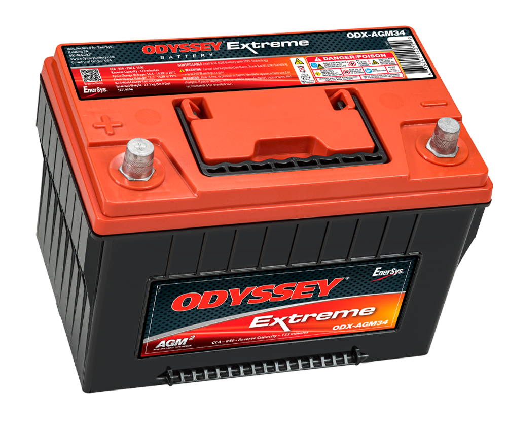
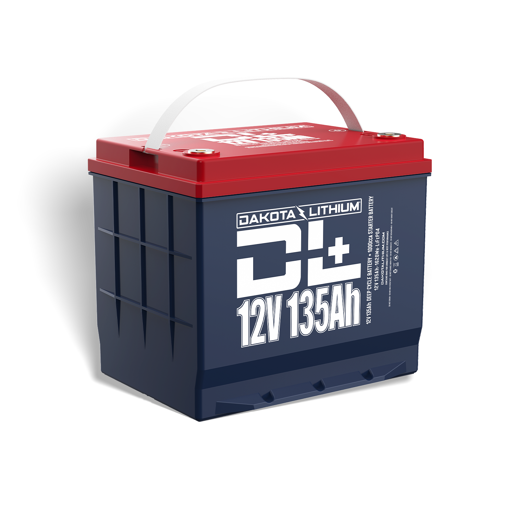

---
hide:
  - toc
tags:
  - product-details
  - power-generation
  - battery
---

# 1.1.1 Batteries {#batteries}

Dual battery system with AGM starter battery and LiFePO4 deep cycle auxiliary battery.

## START Battery - Odyssey PC1500

/// html | div.product-info
{ loading=lazy }

**Type:** AGM Deep Cycle Battery

**Model:** Odyssey ODX-AGM34 (PC1500)

**Manufacturer:** Odyssey Battery

**Product Page:** [Odyssey PC1500][odyssey-pc1500]

///

### Specifications

- **Capacity:** 68 Ah @ 20-hour rate
- **CCA:** 850A @ 0°F (-18°C)
- **PHCA:** 1500A (Pulse Hot Cranking Amps)
- **Dimensions:** 10.9" L × 6.8" W × 7.9" H
- **Weight:** 49.5 lbs
- **Cycle Life:** 400 cycles @ 80% DOD

### Purpose

Critical systems requiring high cranking amps and reliable starting:

- Engine starting (Cummins R2.8)
- PMU power (all engine bay loads)
- SafetyHub circuits
- HVAC, radiator fan

## AUX Battery - Dakota Lithium 135Ah

/// html | div.product-info
{ loading=lazy }

**Type:** LiFePO4 Deep Cycle with Heated BMS

**Model:** DL+ 12V 135Ah Dual Purpose

**Manufacturer:** Dakota Lithium

**Product Page:** [Dakota Lithium 135Ah][dakota-135ah]

///

### Specifications

- **Capacity:** 135 Ah (108 Ah usable at 80% DOD)
- **Voltage:** 12.8V nominal
- **CCA:** 1,000A equivalent
- **Max Continuous Discharge:** 135A
- **Peak Discharge:** 1,000A (2 sec)
- **Dimensions:** 9.5" L × 6.9" W × 8.2" H (Group 24)
- **Weight:** 27.2 lbs
- **Cycle Life:** 5,000 cycles @ 80% DOD
- **Operating Temp:** -4°F to 158°F (-20°C to 70°C)
- **Heated BMS:** Internal even-heat technology enables charging down to -4°F

### Purpose

Accessories and high-draw auxiliary loads:

- SwitchPros lighting (up to 68A full offroad lighting)
- BODY PDU (audio, USB, heated seats)
- Winch (400A peak)
- ARB compressor (90A)

### Why LiFePO4

| Factor | Odyssey AGM | Dakota LiFePO4 |
|:-------|------------:|---------------:|
| Capacity | 68Ah | 135Ah |
| **Usable capacity** | 34Ah (50% DOD) | **108Ah (80% DOD)** |
| Weight | 49.5 lbs | **27.2 lbs** |
| Cycle life | 400 | **5,000** |
| Cold charging | Any temp | **Heated BMS** |

**3× usable capacity** enables 6+ hours of full night offroad lighting vs ~2 hours with AGM.

## System Configuration

- **START battery (Driver Wheel Well):** Odyssey PC1500 - critical systems
- **AUX battery (Passenger Wheel Well):** Dakota Lithium 135Ah - accessories
- **Isolation:** BCDC Alpha 50 (independent operation when engine off)
- **Jump Start:** BCDC jump start assist can parallel batteries if START fails
- **Redundancy:** Vehicle operates on START battery alone if AUX system fails

## Mounting

- **START battery:** Driver wheel well - enclosed compartment with access panel
- **AUX battery:** Passenger wheel well - Barnes 4WD battery box (Group 24 compatible)

## Outstanding Items

- [x] ~~Order Dakota Lithium DL+ 135Ah battery (~$999)~~ → Purchased
- [ ] Backorder Barnes 4WD battery box (Group 24 compatible, ~$67)
- [ ] Powdercoat or paint battery box before installation

**Installation Tasks:** See [Section 1 Installation Checklist][installation-checklist]

[odyssey-pc1500]: https://www.odysseybattery.com/products/odx-agm34-battery-34-pc1500t/
[dakota-135ah]: https://dakotalithium.com/product/dl-plus-12v-135ah-dual-purpose-1000cca-starter-car-truck-battery-plus-deep-cycle-performance/
[installation-checklist]: ../../09-installation/01-power-systems-checklist.md#phase-1-foundations
