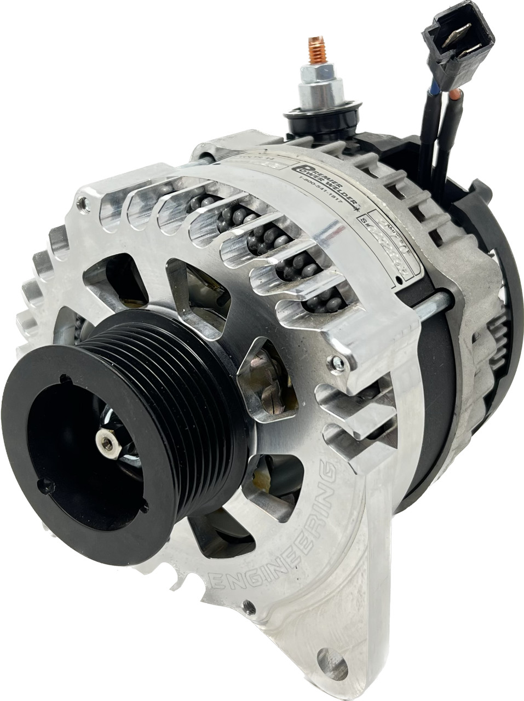

---
hide:
  - toc
tags:
  - product-details
  - power-generation
  - alternator
---

# 1.1.2 Alternator {#alternator}

/// html | div.product-info
{ loading=lazy }

**Type:** High-Output Welding Alternator

**Model:** Premier Power Welder HO-C28

**Manufacturer:** Premier Power Welder

**Product Page:** [Cummins R2.8 270A Alternator][premier-alternator]

**Rating:** 270 amps

**Application:** Cummins R2.8 Turbo Diesel

**Price:** $899.95

///

## Specifications

- **Output:** 270A continuous
- **Voltage:** 12V (standard automotive)
- **Application:** Cummins R2.8 engines
- **Type:** High-output welding alternator
- **SKU:** HO-C28

## System Configuration

**Primary Function:** Charges START battery and powers vehicle electrical systems

**Output Capacity:** 270A continuous (exceeds system maximum draw of ~326A with margin)

**Mounting:** Direct bolt-on replacement for Cummins R2.8

## Wiring

| Connection | Destination | Notes |
|:-----------|:------------|:------|
| Positive Output | START battery+ (driver wheel well) | See [START Battery Distribution][starter-battery] for wire specs |
| Ground | Engine block | Bonded via alternator mounting bolts |

**Ground Path:** Alternator case → Engine block → Frame rail → START battery-

See [START Battery Distribution][starter-battery] for complete wire specifications (gauge, distance, voltage drop calculations).

[starter-battery]: ../02-starter-battery-distribution/index.md

## Load Analysis

**Alternator Capacity:** 270A continuous

**Worst Realistic Load:** 218A (offroad scenario) = 52A margin (19% headroom)

The alternator supplies START battery loads plus BCDC charging. AUX battery loads (SwitchPros, ARB compressor, winch) do NOT draw from alternator.

See [START Battery Load Analysis][start-load-analysis] for complete scenario details.

## Outstanding Items

- [ ] Determine alternator positive output terminal size (for 1/0 AWG lug selection)
- [ ] Verify alternator voltage regulator set point (14.2-14.4V for AGM batteries)

## Related Documentation

- [Batteries][batteries] - START battery specifications (850 CCA)
- [START battery Distribution][starter-battery] - Alternator charging destination
- [Grounding Architecture][grounding] - Alternator ground path
- [Wire Distance Reference][wire-distance] - Alternator to battery routing distance

[premier-alternator]: https://premierpowerwelder.com/shop/high-output-welding-alternators/cummins-alternators/cummins-r2-8-270-amps-high-output-welding-alternator/
[batteries]: 01-batteries.md
[starter-battery]: ../02-starter-battery-distribution/index.md
[start-load-analysis]: ../02-starter-battery-distribution/02-load-analysis.md
[grounding]: ../05-grounding/index.md
[wire-distance]: 05-wire-distance-reference.md
