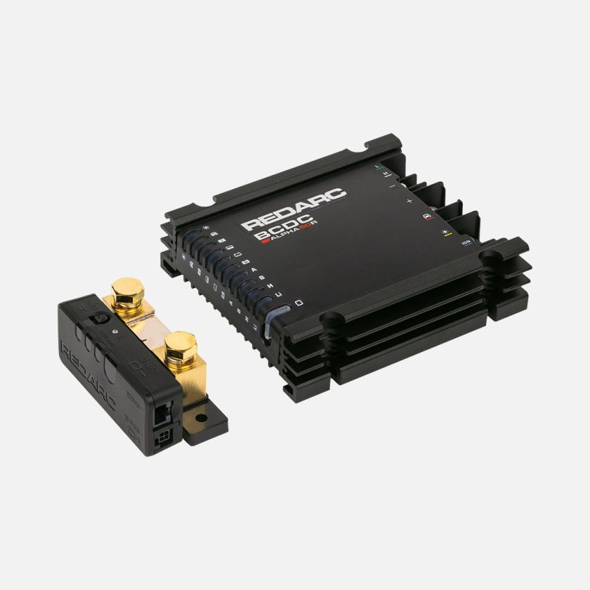

---
hide:
  - toc
tags:
  - product-details
  - power-generation
  - battery-charger
  - dc-dc-charger
---

# 1.1.3 BCDC Alpha 50 {#bcdc-alpha-50}

/// html | div.product-info
{ loading=lazy }

**Type:** Battery Isolator and DC-DC Charger

**Model:** RedArc BCDC Alpha 50 (BCDC1250R)

**Manufacturer:** RedArc Electronics

**Product Page:** [BCDC Alpha 50][redarc-bcdc]

**Installation Guide:** [BCDC Alpha Installation Manual][bcdc-install]

**Instruction Manual:** [BCDC Alpha Instruction Manual][bcdc-manual]

///

## Specifications

- **Output:** 50A DC-DC charging, multi-stage AGM compatible (0.74C charge rate for 68Ah battery)
- **Inputs:** 9-32V primary (alternator), 9-48V solar (up to 350W)
- **Features:** Auto isolation, jump start assist, Green Power Priority, ignition-triggered
- **Dimensions:** 260mm L × 160mm W × 70mm H
- **Full Specs:** [Installation Manual][bcdc-install] | [Instruction Manual][bcdc-manual]

## Wiring

| Connection | Terminal Label | Wire Gauge | Terminal Size | Source/Destination | Notes |
|:-----------|:---------------|:-----------|:--------------|:-------------------|:------|
| Start Battery (+) | Red | 4 AWG | M8 | START battery positive (driver wheel well) | INPUT from alternator-charged battery - via 80A CB  see [STARTER BATTERY CIRCUIT BREAKERS][starter-cbs] |
| Auxiliary Battery (+) | Brown | 4 AWG | M8 | AUX battery positive (passenger wheel well) | OUTPUT to AUX battery - 50A charging |
| Solar (+) | Yellow | Per solar panel | TBD | Cascadia 4x4 80W panel | See [Solar Charging][solar] |
| Ground (-) | Black | 4 AWG | M8 | AUX battery negative | Direct connection per BCDC spec |
| Ignition | Blue | 18 AWG | Spade | PMU ignition sense tap | Activates charging when engine running - see [PMU Inputs][pmu-inputs] |
| Battery Temp Sensor | +/- (reversible) | Per sensor | 2-pin plug | AUX battery (AGM sensor) | **REQUIRED** - critical for AGM temperature-compensated charging, polarity reversible |

**Inter-Battery Cable Routing:** START battery (driver wheel well) → under vehicle along frame rail → AUX battery (passenger wheel well) - 5-6 ft measured routing (see [Wire Distance Reference][wire-distance]). Use proper cable protection for under-vehicle routing.

**Wire Gauge Analysis (50A @ 5-6 ft measured routing):**

- 6 AWG @ 50A, 6 ft: 1.5% voltage drop (0.18V) - Marginal
- **4 AWG @ 50A, 6 ft: 0.94% voltage drop (0.11V)** - **Recommended** ✅

**Recommendation:** 4 AWG required for 50A BCDC to maintain <1% voltage drop. Provides excellent charging efficiency and minimizes heat buildup during sustained high-current charging.

**Ground Reference:** Starter-to-AUX battery ground cable (1/0 AWG) is **REQUIRED** for BCDC operation - provides reference ground for charging logic and fault current path. See [Grounding Architecture][grounding].

**Critical:** Verify solar input polarity before connection - reverse polarity damages unit.

## Function

The BCDC manages charging and isolation between starter and aux batteries:

- **Normal Operation:** Charges AUX battery from START battery/alternator at up to 50A
- **Solar Priority:** Uses solar input first when available (Green Power Priority)
- **Jump Start Assist:** Parallels batteries if START battery voltage drops critically
- **Isolation:** Prevents AUX battery from draining START battery when engine off

## AUX Battery Charging Impact

**Upgrade from 25A to 50A BCDC provides significant improvement for high-draw scenarios:**

| Scenario | AUX Draw | 25A BCDC | 50A BCDC | Improvement |
|:---------|:---------|:---------|:---------|:------------|
| Night Offroad (full lights) | 70A | -45A drain | **-20A drain** | 2.3× longer runtime |
| Airing Up Tires | 110A | -85A drain | **-60A drain** | 30% less battery impact |
| Recovery after air-up | - | 34 min to recover 10Ah | **17 min** | Half the recovery time |

See [AUX Battery Load Analysis][aux-load-analysis] for complete scenario details.

## Mounting

- **Location:** Passenger wheel well near AUX battery (water-protected, accessible for LED visibility)
- **Installation:** See [Section 1 Installation Checklist][installation-checklist]

**Critical:** Verify solar input polarity before connection - reverse polarity damages unit.

[redarc-bcdc]: https://www.redarcelectronics.com/products/the-manager30
[bcdc-install]: https://cdn.intelligencebank.com/au/share/yE9N/zJpl/NNRlJ/original/Install+Guide+BCDC+Alpha+50R+EN
[bcdc-manual]: https://cdn.intelligencebank.com/au/share/yE9N/zJpl/l7ZzG/original/Instruction+Manual+BCDC+Alpha+50R+EN
[starter-cbs]: ../02-starter-battery-distribution/01-circuit-breakers.md
[solar]: 04-solar.md
[pmu-inputs]: ../04-pmu/02-pmu-inputs.md
[grounding]: ../05-grounding/index.md
[installation-checklist]: ../installation-checklist.md#phase-2-power-distribution
[wire-distance]: 05-wire-distance-reference.md
[tbd-tracker]: ../../08-installation/01-tbd-tracker.md
[aux-load-analysis]: ../03-aux-battery-distribution/05-load-analysis.md
