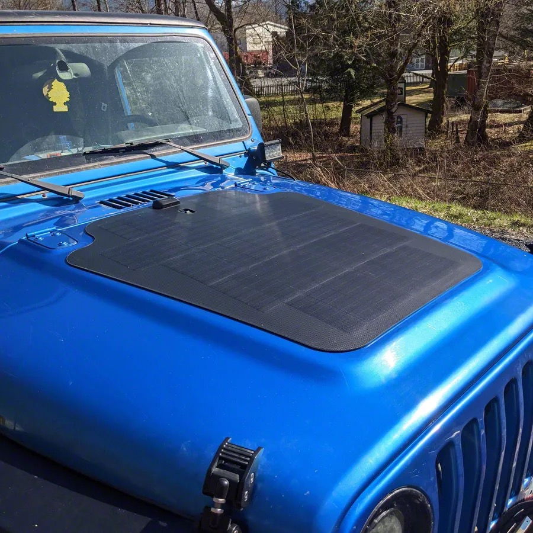

---
hide:
  - toc
tags:
  - product-details
  - power-generation
  - solar-panel
---

# 1.1.4 Solar Charging {#solar-charging}

/// html | div.product-info
{ loading=lazy }

**Type:** Flexible Monocrystalline Solar Panel

**Model:** Cascadia 4x4 80W Hood Solar Panel (VSS System for TJ/LJ 2003-2006)

**Manufacturer:** Cascadia 4x4

**Product Page:** [Cascadia 4x4 VSS System][cascadia-solar]

**Note:** VSS System includes MPPT controller, but using BCDC's built-in solar MPPT instead (panel only from VSS kit)

///

## Electrical Specifications

**Power Output:**
- **Maximum Power @ STC:** 80W
- **Optimum Operating Voltage (Vmp):** 40.1V
- **Optimum Operating Current (Imp):** 1.95A
- **Open Circuit Voltage (Voc):** 46.8V
- **Short Circuit Current (Isc):** 2.23A

**BCDC Compatibility:** ✅ Voc 46.8V within BCDC solar input range (9-48V, just under 48V upper limit)

## Physical Specifications

- **Dimensions:** 68 × 66 × 5 cm (27 × 26 × 2 in)
- **Weight:** 2.6 kg (5.7 lb)
- **Top Sheet Material:** ETFE (fluoropolymer)
- **Mounting Method:** SolarClasp™ adhesive system
- **Connector Type:** MC4 (standard solar connectors)
- **Cable Length:** 190 cm (74.8 in)
- **Mounting:** Permanently adhered to hood surface
- **Connection:** Wired to BCDC Alpha 50 solar input

## Wiring

**Solar Panel Connections:**

- **Positive (+):** Panel output → BCDC Alpha 50 solar input positive terminal
- **Negative (-):** Panel output → Chassis ground (NOT to BCDC negative)
- **Wire Gauge:** 10 AWG minimum (for 2.23A Isc with safety margin)
- **Routing:** Hood → Firewall → BCDC location in wheel well
- **Maximum Current:** 2.23A (Isc) - well within BCDC solar input capacity

**VSS System Note:** VSS kit includes standalone MPPT controller - **not used**. BCDC has built-in MPPT on solar input, providing Green Power Priority and unified charge control.

**Important:** Solar negative connects to chassis ground per REDARC specifications. The BCDC requires a common ground system where all batteries and components share the same ground reference (vehicle chassis).

## Function

80W panel maintains AUX battery during extended stops via BCDC solar input. Full sun output at optimal conditions: 80W (1.95A @ 40V), variable in partial sun/clouds.

**BCDC Green Power Priority:** Solar input used first when available, alternator supplements to reach 50A total charging current. In full sun, solar contributes ~1.95A, reducing alternator load by same amount.

**Charging Contribution:**
- **Full sun:** ~1.95A to AUX battery (reduces alternator load from 50A to ~48A)
- **Partial sun:** Variable 0.8-1.5A depending on conditions
- **Overcast/Night:** 0A (BCDC uses alternator only)

**Alternator Load Relief:** Minimal but measurable - reduces worst-case alternator load by ~1.95A during sunny daytime operation

See [BCDC Alpha 50][bcdc] for complete charging system details.

**Installation:** See [Section 1 Installation Checklist][installation-checklist]

**Critical:** Verify polarity before connection - reverse polarity damages BCDC.

[cascadia-solar]: https://www.cascadia4x4.com/
[extremeterrain-solar]: https://www.extremeterrain.com/cascadia-4x4-jeep-wrangler-vss-complete-hood-mounted-solar-system-80-watt-chf132cv.html
[bcdc]: 03-bcdc.md
[installation-checklist]: ../installation-checklist.md#phase-4-integration-wiring
