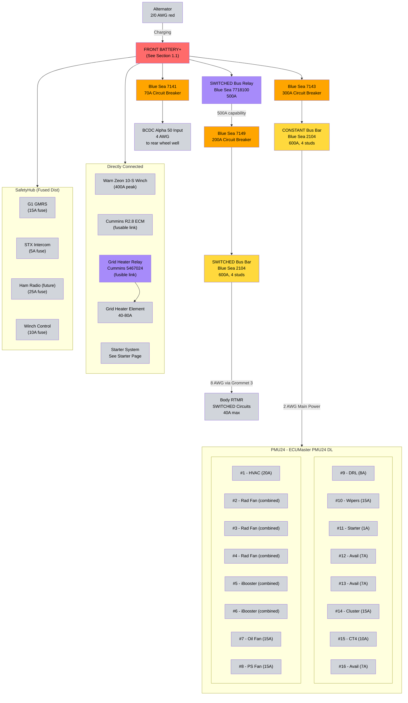

# 1.2 Front Battery Distribution (Engine Bay) {#zone-1-front-battery-tray--primary-distribution-engine-bay}

## Power Flow Architecture (Front Battery - Engine Bay)

!!! info "Battery Specifications"
    For complete battery specifications (capacity, dimensions, terminals, etc.), see [Section 1.1 - Battery System][11-power-generation-storage].

### ⚡ POSITIVE SIDE (+)

### ⚡ NEGATIVE SIDE (-)

```mermaid
flowchart TB
    BATTNEG["FRONT BATTERY-"]
    NEGBUS["NEGATIVE Bus Bar<br/>Blue Sea 2107<br/>600A, 8 studs<br/><b>PRIMARY INFRASTRUCTURE HUB</b>"]
    CHASSIS_GND["Main Chassis Ground<br/>2/0 AWG<br/><b>Bonds all factory ground posts</b>"]
    BLOCK_GND["Engine Block Ground<br/>2/0 AWG"]
    REAR_GND["Ground Reference to Rear Battery<br/>2/0 AWG to rear wheel well"]
    STARTER_GND["Starter Motor Ground<br/>via engine block mount"]
    ERTMR_GND["PMU Ground"]
    SWBUS_RELAY_GND["SWITCHED Bus Relay<br/>Coil Ground"]
    STARTER_RELAY_GND["Starter Control Relay<br/>Coil Ground"]
    HORN_RELAY_GND["Horn Relay<br/>Coil Ground"]
    HORN_GND["Horn<br/>Ground"]
    HEADLIGHTS_GND["Headlights<br/>Ground"]
    TAIL_LIGHTS_GND["Tail/Brake/Reverse Lights<br/>Ground"]
    ECM_GND["ECM Ground<br/>12 AWG - Cummins Harness<br/><b>⚠️ SEPARATE from starter/alt</b>"]
    GRID_GND["Grid Heater Ground<br/>Cummins Harness"]
    WINCH_GND["Winch Negative Return<br/>2/0 AWG"]
    BCDC_GND["BCDC Negative<br/>4 AWG"]
    G1_GND["G1 GMRS Ground<br/>14 AWG - Direct to Battery-"]
    STX_GND["STX Intercom Ground<br/>14 AWG - Direct to Battery-"]
    HAM_GND["Ham Radio Ground (future)<br/>10 AWG - Direct to Battery-"]

    BATTNEG -->|"2/0 AWG<br/>Stud #1"| NEGBUS
    BATTNEG -->|"14 AWG - via Grommet 6"| G1_GND
    BATTNEG -->|"14 AWG - via Grommet 6"| STX_GND
    BATTNEG -->|"10 AWG (future)"| HAM_GND
    BATTNEG -->|"12 AWG<br/>Cummins Harness"| ECM_GND
    BATTNEG -->|"Cummins Harness"| GRID_GND
    NEGBUS -->|"2/0 AWG<br/>Stud #3"| CHASSIS_GND
    NEGBUS -->|"2/0 AWG<br/>Stud #2"| BLOCK_GND
    BLOCK_GND --> STARTER_GND
    NEGBUS -->|"2/0 AWG<br/>Stud #4"| REAR_GND
    NEGBUS -->|"Stud #7"| ERTMR_GND
    NEGBUS -->|"Stud #8"| SWBUS_RELAY_GND
    NEGBUS -->|"Stud #8"| STARTER_RELAY_GND
    CHASSIS_GND --> HORN_RELAY_GND
    CHASSIS_GND --> HORN_GND
    CHASSIS_GND --> HEADLIGHTS_GND
    CHASSIS_GND --> TAIL_LIGHTS_GND
    NEGBUS -->|"2/0 AWG<br/>Stud #5"| WINCH_GND
    NEGBUS -->|"4 AWG<br/>Stud #6"| BCDC_GND

    %% Simplified Color Coding:
    %% Red (#ff6b6b) = Battery
    %% Yellow (#ffd93d) = Bus Bars
    %% Gray (#d1d5db) = All Components

    style BATTNEG fill:#ff6b6b,color:#000
    style NEGBUS fill:#ffd93d,color:#000,stroke:#f59e0b,stroke-width:3px
    style CHASSIS_GND fill:#d1d5db,color:#000
    style BLOCK_GND fill:#d1d5db,color:#000
    style REAR_GND fill:#d1d5db,color:#000
    style STARTER_GND fill:#d1d5db,color:#000
    style ERTMR_GND fill:#d1d5db,color:#000
    style SWBUS_RELAY_GND fill:#d1d5db,color:#000
    style STARTER_RELAY_GND fill:#d1d5db,color:#000
    style ECM_GND fill:#d1d5db,color:#000
    style GRID_GND fill:#d1d5db,color:#000
    style WINCH_GND fill:#d1d5db,color:#000
    style BCDC_GND fill:#d1d5db,color:#000
    style G1_GND fill:#d1d5db,color:#000
    style STX_GND fill:#d1d5db,color:#000
    style HAM_GND fill:#d1d5db,color:#000
    style HORN_RELAY_GND fill:#d1d5db,color:#000
    style HORN_GND fill:#d1d5db,color:#000
    style HEADLIGHTS_GND fill:#d1d5db,color:#000
    style TAIL_LIGHTS_GND fill:#d1d5db,color:#000
```

### Diagram Color Coding Legend

- 🔴 **Red** - Battery (power source)
- 🟠 **Orange** - Circuit Breakers (protection)
- 🟡 **Yellow** - Bus Bars (distribution)
- 🟣 **Purple** - Relays/Solenoids (switching)
- ⚪ **Gray** - All Components (loads, switches, grounds)

### Main Circuit Breakers (Front Battery)

- **SWITCHED Bus Protection:** Blue Sea 7149 200A surface mount circuit breaker from Front Battery+ → SWITCHED bus relay → SWITCHED bus bar
  - Feeds: Body RTMR (SWITCHED circuits only)
  - Total continuous load: ~40A maximum
    - Body RTMR SWITCHED circuits: ~40A maximum (WolfBox 10A, heated seats 30A)
    - Radio amplifier (15A) on CONSTANT (remote wire from deck triggers amp)
  - Sized at ~400% of maximum load for ample headroom (40A × 5 = 200A capacity)
  - **NOTE:** PMU is powered from CONSTANT bus, not SWITCHED bus (uses Pin 7 ignition sense signal for logic)
  - Surface mount with 187 quick connect terminals for clean installation
  - Mounted in engine bay near front battery
- **CONSTANT Bus Protection:** Blue Sea 7143 300A surface mount circuit breaker
  - Source: Front Battery+ → Blue Sea 7143 300A breaker → CONSTANT bus bar
  - Feeds: PMU main power (ALL PMU outputs including radiator fan and iBooster)
  - Maximum theoretical load: ~220A (all outputs on simultaneously)
    - Radiator Fan: OUT2+3+4 combined (60A peak)
    - iBooster: OUT5+6 combined (40A peak during braking, 0.25A idle)
    - HVAC blower: OUT1 (20A)
    - Other PMU outputs: ~100A (lights, fans, accessories)
  - Realistic continuous load: ~100-140A (typical usage, iBooster idle, radiator fan 30-40A average)
  - Sized at 136% of maximum load (220A × 1.36 = 300A breaker)
  - Provides adequate protection and headroom for worst-case scenario
  - Surface mount with 187 quick connect terminals for clean installation
  - Mounted in engine bay near front battery
- **Starter Main Power:** Direct connection from Front Battery+ → Main Starter Solenoid (no fuse/breaker)
  - See [Starter System][starter-system-cummins-r28] for complete two-stage starter wiring details
- **Winch Main Power:** Direct connection from Front Battery+ ’ Warn Zeon 10-S (no fuse/breaker)
  - Warn Zeon 10-S: 10,000 lb capacity, 400A peak draw
  - Front-mounted winch powered from front battery for short cable run
  - Dual 2/0 AWG cables (positive and negative) per Warn specifications
- **BCDC Input Feed:** Blue Sea 7141 70A surface mount circuit breaker from Front Battery+ → BCDC Alpha 50 input
  - Long cable run from engine bay to rear wheel well (~10-12 ft)
  - Wire gauge: 4 AWG (per Redarc specifications for this cable length)
  - Protection: Blue Sea 7141 70A surface mount circuit breaker with 187 quick connect terminals (per Redarc specifications)
  - Reference: [BCDC Alpha BT Instruction Manual](https://cdn.intelligencebank.com/au/share/yE9N/zJpl/Dra9X/original/BCDC+Alpha+BT+Instruction+Manual+EN)

### Bus Bar Configuration (Front Battery)

- **SWITCHED Bus Bar:** Firewall-mounted (engine bay side)
  - **Model:** Blue Sea 2104 PowerBar - 600A BusBar (4x 3/8"-16 studs)
  - Powered when ignition is on
  - Feeds: Body RTMR SWITCHED circuits (40A max - WolfBox 10A, heated seats 30A) - routed through firewall to cabin
  - **Note:** PMU is NOT powered from SWITCHED bus - it receives CONSTANT power only
  - **Note:** Radio amplifier (15A) on CONSTANT power (remote wire from deck triggers amp)
  - Location: Firewall (engine bay side) - accessible for routing to cabin
  - **Specifications:**
    - Rating: 600A DC continuous (adequate for ~40A max load with ample headroom)
    - Terminals: 4x 3/8"-16 studs (compact design, matches CONSTANT bus bar)
    - Material: Tin-plated copper bus bar, glass-reinforced nylon base
    - Voltage: 50V DC max
  - **Wire Gauge:** 2/0 AWG for entire power path (Battery → Relay → Breaker → Bus Bar)
    - Total cable run: ~8-12 ft
    - Voltage drop: <1% at 55A maximum load
    - Good for 195A at 10 ft with 3% drop
  - **Power Control Architecture:**
    - **SWITCHED Bus Relay:** Blue Sea 7718100 ML-Series Remote Battery Switch with Manual Control
      - **Model:** Blue Sea 7718100 ML-Series solenoid
      - **Rating:** 500A continuous, 5000A surge (5 seconds)
      - **Voltage:** 12V DC coil
      - **Coil Current:** ~2.5A (verify ignition switch RUN circuit can handle this current)
      - **Terminals:**
        - Power: DTM 3/8"-16 studs (matches bus bar studs)
        - Trigger: ATM M10 terminals
      - **Mounting:** Engine bay near front battery for short cable runs
      - **Manual Override:** Push button on solenoid body for emergency manual activation
      - Power: Front Battery+ → relay DTM power terminal
      - Trigger: Ignition switch "RUN" output → relay ATM coil terminals (~2.5A)
      - Output: Relay closes battery+ to SWITCHED bus bar (500A capability, 166A actual load)
      - **Why needed:** Same principle as starter control relay - ignition switch cannot handle 200A+ bus current
      - Similar to starter system: low-current ignition switch (~2.5A) controls high-current relay (500A capability) which energizes bus
    - Wire from ignition "RUN" through firewall (Grommet 2) to relay coil (14 AWG minimum for 2.5A coil current)
    - See [Starter System][starter-system-cummins-r28] for similar two-stage control architecture

- **CONSTANT Bus Bar:** Firewall-mounted (engine bay side)
  - **Model:** Blue Sea 2104 PowerBar - 600A BusBar (4x 3/8"-16 studs)
  - Always powered (not switched by ignition)
  - Feeds: PMU main power (powers ALL PMU outputs including radiator fan and iBooster)
    - PMU receives CONSTANT power via 2 AWG from bus bar
    - Pin 7 receives 18 AWG ignition sense signal for output control logic
    - Total maximum PMU load: ~220A (all outputs simultaneously including iBooster braking peak)
    - Radiator Fan: OUT2+3+4 combined (3x25A = 75A capacity for 60A peak GM 84100128 fan)
    - iBooster: OUT5+6 combined (2x25A = 50A capacity for 40A peak braking, 0.25A idle)
    - Realistic continuous load: ~100-140A (typical usage, iBooster idle, radiator fan 30-40A average)
    - **See [PMU Output Wiring Diagram][142-pmu-outputs] for detailed output breakdown**
  - Location: Firewall (engine bay side) - near PMU for short cable runs
  - **Specifications:**
    - Rating: 600A DC continuous (adequate for PMU maximum load with headroom)
    - Terminals: 4x 3/8"-16 studs (compact design for future expansion)
    - Material: Tin-plated copper bus bar, glass-reinforced nylon base
    - Voltage: 50V DC max
  - **Wire Gauge:** 2 AWG for entire power path (Battery → Breaker → Bus Bar → PMU)
    - Total cable run: ~7-10 ft from battery to PMU
    - Voltage drop: <2% at 220A maximum load
    - Good for 185A at 10 ft with 3% drop (220A may require 1 AWG for <3% drop)
  - **Ignition Control:** PMU receives 18 AWG ignition sense signal (Pin 7) from ignition switch RUN
    - PMU uses Pin 7 logic to enable/disable SWITCHED outputs (Out 10, 11, 14, etc.)
    - CONSTANT outputs (Out 5-6 iBooster, etc.) work regardless of Pin 7 state
  - **Separation of Concerns:** Front battery CONSTANT circuits limited to PMU only
    - All other CONSTANT power accessories are fed from rear battery CONSTANT bus

- **NEGATIVE Bus Bar:** Firewall-mounted (engine bay side)
  - **Model:** Blue Sea 2107 PowerBar - 600A BusBar (8x 3/8"-16 studs)
  - Central grounding point for all engine bay circuits
  - Location: Firewall (engine bay side) - near positive bus bars and PMU

!!! info "Complete Grounding Architecture"
    See [Section 1.1 - Grounding Architecture][11-power-generation-storage] for complete grounding system design, wire gauges, and architecture details.

**NEGATIVE Bus Bar Stud Assignment:**

| Stud | Connection | Wire Gauge | Notes |
|:-----|:-----------|:-----------|:------|
| 1 | Front Battery- | 2/0 AWG | Primary power return |
| 2 | Engine block ground | 2/0 AWG | Starter/alternator return path |
| 3 | Main chassis ground | 2/0 AWG | Bonds all factory ground posts |
| 4 | Rear battery reference | 2/0 AWG | To rear wheel well |
| 5 | Winch negative | 2/0 AWG | Warn Zeon 10-S return |
| 6 | BCDC negative | 4 AWG | BCDC Alpha 50 ground |
| 7 | PMU ground | 10 AWG | Per PMU Pin 25 spec |
| 8 | Relay coil grounds | 14-16 AWG | SWITCHED bus relay, starter relay |

**Direct Battery Grounds (Bypass Bus Bar):**
- ECM & Grid Heater: Via Cummins harness (prevents starter/alternator spike damage)
- G1 GMRS, STX Intercom, Ham Radio: Via Grommet 6 (prevents ground loop noise)

## Outstanding Items

**Completed Specifications:**

- Bus bars:
  - SWITCHED: Blue Sea 2104 PowerBar (600A, 4x 3/8"-16 studs)
  - CONSTANT: Blue Sea 2104 PowerBar (600A, 4x 3/8"-16 studs)
  - NEGATIVE: Blue Sea 2107 PowerBar (600A, 8x 3/8"-16 studs)
- Wire gauges: 2/0 AWG (SWITCHED path), 2 AWG (CONSTANT path - may require 1 AWG for PMU 220A load)
- SWITCHED bus relay: Blue Sea 7718100 (500A continuous, 12V 2.5A coil)
- Circuit breakers: 200A (SWITCHED), 300A (CONSTANT), 70A (BCDC input)

### Installation Steps

**Mounting Locations:**

- [ ] Confirm SWITCHED bus bar firewall mounting location (engine bay side, near PMU)
- [ ] Confirm CONSTANT bus bar firewall mounting location (engine bay side, near SWITCHED bus bar)
- [ ] Confirm NEGATIVE bus bar firewall mounting location (engine bay side, near positive bus bars)
- [ ] Confirm Blue Sea 7149 200A surface mount breaker mounting location for SWITCHED bus (near front battery in engine bay)
- [ ] Confirm Blue Sea 7143 300A surface mount breaker mounting location for CONSTANT bus (near front battery in engine bay)
- [ ] Confirm SWITCHED bus relay mounting location (engine bay, near front battery)
- [ ] Confirm Blue Sea 7141 70A surface mount breaker mounting location for BCDC Alpha 50 input feed (near front battery in engine bay)

**Wiring Tasks:**

- [ ] Run main power cable from Front Battery+ to SWITCHED bus relay (2/0 AWG, ~3-4 ft)
- [ ] Run output cable from SWITCHED bus relay to Blue Sea 7149 200A breaker (2/0 AWG, ~1-2 ft) - use 187 quick connect terminal
- [ ] Run cable from Blue Sea 7149 200A breaker to SWITCHED bus bar (2/0 AWG, ~4-6 ft) - use 187 quick connect terminal
- [ ] Run cable from SWITCHED bus bar to Body RTMR SWITCHED input (8 AWG, ~10-12 ft through Grommet 3) - 50A inline fuse/breaker recommended
- [ ] Run main power cable from Front Battery+ to Blue Sea 7143 300A breaker (2 AWG, ~3-4 ft) - use 187 quick connect terminal
- [ ] Run output cable from Blue Sea 7143 300A breaker to CONSTANT bus bar (2 AWG, ~4-6 ft) - use 187 quick connect terminal
- [ ] Run cable from CONSTANT bus bar to PMU main power input (2 AWG or 1 AWG for ~220A max load including radiator fan and iBooster)
- [ ] Wire radiator fan (GM 84100128) to PMU outputs OUT2+OUT3+OUT4 combined (3 outputs paralleled for 75A capacity)
- [ ] Wire iBooster main power to PMU outputs OUT5+OUT6 combined (2 outputs paralleled for 50A capacity)
- [ ] Run ignition sense signal from ignition switch RUN terminal to PMU Pin 7 (18 AWG through Grommet 2)
  - Low current <500mA, splits to: PMU Pin 7, PMU In 6, CT4, SwitchPros, Fusion Radio, BCDC Alpha 50
- [ ] Run main ground cable from Front Battery- to NEGATIVE bus bar (2/0 AWG)
- [ ] Run ground cable from NEGATIVE bus bar to engine block (2/0 AWG)
- [ ] Run ground cable from NEGATIVE bus bar to chassis ground (2/0 AWG)
- [ ] Run ground cable from NEGATIVE bus bar to rear battery (2/0 AWG, to rear wheel well)
- [ ] Connect ECM power and ground wires from Cummins harness directly to Front Battery terminals (12 AWG, supplied with harness)
- [ ] Run grid heater relay main power cable direct from Front Battery+ to relay (6-8 AWG for 40-80A, via integrated fusible link)
- [ ] Connect grid heater element ground from Cummins harness directly to Front Battery- (supplied with harness)
- [ ] Connect PMU ground to NEGATIVE bus bar
- [ ] Connect all relay coil grounds to NEGATIVE bus bar (SWITCHED bus relay, starter control relay, horn relay)
- [ ] Connect winch negative return to NEGATIVE bus bar (2/0 AWG)
- [ ] Connect BCDC negative to NEGATIVE bus bar (4 AWG)
- [ ] Route ignition "RUN" wire through firewall (Grommet 2) to SWITCHED bus relay coil (14 AWG minimum for 2.5A coil current)
- [ ] Run cable from Front Battery+ to Blue Sea 7141 70A breaker (BCDC feed) - use 187 quick connect terminal
- [ ] Run 4 AWG cable from Blue Sea 7141 70A breaker to rear wheel well (BCDC input) - use 187 quick connect terminal

**Testing & Verification:**

- [ ] Verify SWITCHED bus energizes when ignition in RUN position
- [ ] Verify SWITCHED bus de-energizes when ignition in OFF position
- [ ] Verify CONSTANT bus always powered (ignition OFF and ON)
- [ ] Verify continuity from all engine bay circuit grounds to NEGATIVE bus bar
- [ ] Measure voltage drop across all main power cables under load
- [ ] Measure ground resistance from NEGATIVE bus bar to battery negative (<0.1 ohms)
- [ ] Verify all bus bar connections are tight and properly torqued

## Related Documentation

- [Power Generation & Storage][11-power-generation-storage] - Battery and alternator specifications
- [Rear Battery Distribution][13-rear-battery-distribution-wheel-well] - Rear battery bus bars and circuits
- [Engine Systems][pmu-power-distribution] - PMU power distribution and circuits
- [Starter System][starter-system-cummins-r28] - Two-stage starter system wiring and specifications
- [Firewall Ingress][firewall-penetrations-ingress-points] - Firewall penetrations and bus bar mounting
