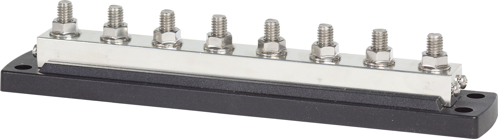

---
hide:
  - toc
tags:
  - product-details
  - power-distribution
  - bus-bar
---

# 1.2.2 START battery CONSTANT Bus Bar {#front-constant-bus}

/// html | div.product-info
{ loading=lazy }

**Type:** Bus Bar

**Model:** Blue Sea 2107 PowerBar

**Manufacturer:** Blue Sea Systems

**Product Page:** [PowerBar 600A BusBar][product-link]

///

## Overview

Eliminates battery terminal crowding by providing central distribution for all circuit breaker-protected engine bay loads.

**Location:** Engine bay firewall (near PMU)

**Power Source:** START battery via 2×1/0 AWG (~5 ft) - see [START battery Distribution][front-battery]

## Specifications

- **Rating:** 600A continuous
- **Terminals:** 8× 3/8"-16 studs
- **Wire Range:** Up to 4/0 AWG
- **Features:** Tin-plated copper, corrosion resistant
- **Full Specs:** [Blue Sea 2107][product-link]

## Load Distribution

| Stud | Connection | Wire Gauge | Distance | Voltage @ Load | Protection | Load | Notes |
|:-----|:-----------|:-----------|:---------|:---------------|:-----------|:-----|:------|
| 1 | **START battery+ (INPUT #1)** | **1/0 AWG ✓** | **~5 ft** | **13.82V (1.26% @ 60°C)** | **None** | **~356A max** | **First parallel feed - see [START battery][front-battery]** |
| 2 | PMU24 | 1 AWG ✓ | ~2 ft | 13.76V (1.0% @ 60°C) | 300A CB | ~220A max | Always-on power management - see [PMU][pmu] |
| 3 | SafetyHub 100 | 4 AWG ✓ | ~3 ft | 13.73V (1.2% @ 60°C) | 150A CB | ~111A max | Fused high-current accessories - see [SafetyHub][safetyhub] |
| 4 | BCDC Input | 4 AWG ✓ | ~5 ft | 13.84V (0.4% @ 60°C) | 40A CB | 25A charging | Charges AUX battery - see [BCDC][bcdc] |
| 5 | **START battery+ (INPUT #2)** | **1/0 AWG ✓** | **~5 ft** | **13.82V (1.26% @ 60°C)** | **None** | **~356A max** | **Second parallel feed - see [START battery][front-battery]** |
| 6-8 | **[Available]** | - | - | - | - | - | Future expansion (3 studs available) |

**Stud Utilization:** 5 of 8 used (3 available)

**Total Load:** ~356A max (PMU 220A + SafetyHub 111A + BCDC 25A)

**Wire Sizing (Engine Bay @ 60°C):**
- **Input Feed:** 2×1/0 AWG @ 356A, 5 ft, 60°C: **1.26% voltage drop** (0.18V) ✅ Excellent performance
  - 2×1/0 AWG combined: 211,200 circular mils (60% more than single 2/0)
  - 2×1/0 AWG rated: 500A+ @ 60°C (2× 250A per conductor)
  - Safety margin: 500A / 356A = 140% ✅ Substantial headroom
  - Voltage at bus: 14.0V - 0.18V = **13.82V**
- **Temperature derating:** 1.2× resistance increase at 60°C vs 20°C (copper wire)
- **Previous design (single 2/0 AWG):** 2.0% drop @ 60°C - upgraded for improved performance

!!! info "Circuit Protection"
    No circuit breaker between battery and CONSTANT bus. Each load has individual CB protection: PMU (300A), SafetyHub (150A), BCDC (40A). See [Circuit Breakers][circuit-breakers].

## Related Documentation

**Power Systems:**

- [START battery Distribution][front-battery] - Complete overview
- [Circuit Breakers][circuit-breakers] - CB specifications

**Connected Systems:**

- [PMU24][pmu] - Power management unit
- [SafetyHub 100][safetyhub] - Fused distribution
- [BCDC Alpha 25][bcdc] - DC-DC charger
- [Installation Checklist][installation] - Bus bar mounting procedure

[product-link]: https://www.bluesea.com/products/2107/PowerBar_600A_BusBar_with_Four_5_16inch-18_Studs_and_Four_1_4inch-20_Studs
[front-battery]: index.md
[circuit-breakers]: 01-circuit-breakers.md
[pmu]: ../04-pmu/index.md
[safetyhub]: 04-safetyhub.md
[bcdc]: ../01-power-generation/03-bcdc.md
[installation]: ../installation-checklist.md#phase-2-power-distribution
