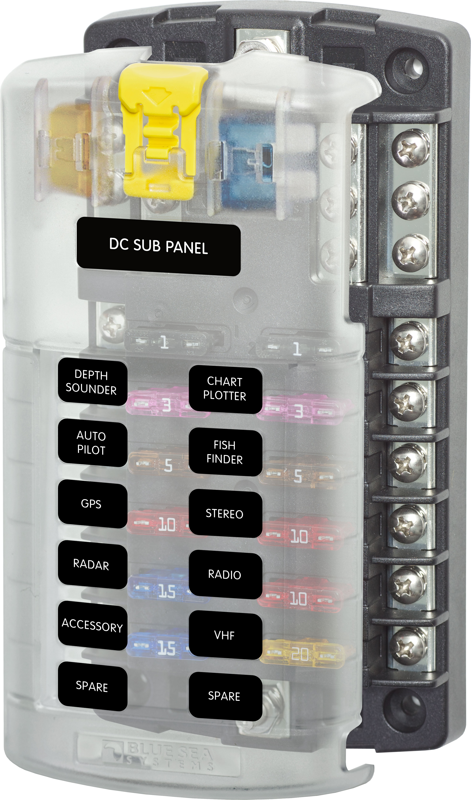

---
hide:
  - toc
tags:
  - product-details
  - power-distribution
  - fuse-block
---

# 1.2.3 Critical Cabin PDU {#critical-cabin-pdu}

/// html | div.product-info
{ loading=lazy }

**Type:** Fuse Block with Negative Bus

**Model:** Blue Sea 5026

**Manufacturer:** Blue Sea Systems

**Product Page:** [ST Blade Fuse Block - 12 Circuits][product-link]

///

## Overview

Provides fused distribution for critical cabin electronics and Dakota Digital instrumentation modules.

**Location:** Cabin side firewall (near Dakota Digital HDPE panel)

**Power Source:** START battery CONSTANT bus via 40A CB - see [Circuit Breakers][circuit-breakers]

## Specifications

- **Rating:** 100A max combined, 30A per circuit
- **Fuse Types:** 12× ATO/ATC (1-30A per circuit)
- **Negative Bus:** Integrated ground bus
- **Positive Feed:** #10-32 stud (4-6 AWG recommended)
- **Branch Circuits:** #8-32 screws (10-16 AWG)
- **Dimensions:** 5.91" W × 4.9" H × 1.52" D
- **Features:** Cover with spare fuse storage, write-on circuit labels
- **Full Specs:** [Blue Sea 5026][product-link]

## Circuit Configuration

| Slot | Fuse | Circuit | Wire Gauge | Load | Notes |
|:-----|:-----|:--------|:-----------|:-----|:------|
| 1 | 5A | [PAC-2800BT Fan Controller][fan-controller] | 16 AWG ✓ | <1A | Dakota Digital fan controller |
| 2 | 20A | [Dakota Digital HDX Control + Cluster][gauge-cluster] | 16 AWG ✓ | <20A | HDX control box + dashboard cluster (5-20A fuse spec) |
| 3 | 5A | [BIM-01-2 J1939 Module][bim-j1939] | 18 AWG ✓ | <5A | BIM CONSTANT power |
| 4 | 5A | [GPS-50-2 Module][bim-gps] | 18 AWG ✓ | <5A | BIM CONSTANT power |
| 5 | 5A | [BIM-22-3 TPMS Module][bim-tpms] | 18 AWG ✓ | <5A | BIM CONSTANT power |
| 6 | 5A | [BIM-17-2 Compass/Temp Module][bim-compass] | 18 AWG ✓ | <5A | BIM CONSTANT power |
| 7 | - | **[Available]** | - | - | - |
| 8 | - | **[Available]** | - | - | - |
| 9 | - | **[Available]** | - | - | - |
| 10 | - | **[Available]** | - | - | - |
| 11 | - | **[Available]** | - | - | - |
| 12 | - | **[Available]** | - | - | - |

**Slot Utilization:** 6 of 12 used (6 available for expansion)

**Total Load:** TBD (PAC-2800BT <1A + Dakota Digital TBD)

**Load Notes:**

- PAC-2800BT: <1A confirmed
- Dakota Digital HDX Control + Cluster: <20A (manufacturer specifies 5-20A fused input, using 20A fuse for headroom)
- Each BIM module: <5A (BIM CONSTANT power only, Key power via BIM/IO cable)
- **Total maximum:** <30A worst-case (10A HDX + 4×5A BIM + 1A PAC = 31A max)

## Wiring

| Connection | Wire Gauge | Source | Destination | Distance | Voltage @ Load | Notes |
|:-----------|:-----------|:-------|:------------|:---------|:---------------|:------|
| **Positive Feed (+)** | 6 AWG ✓ | CONSTANT bus via 40A CB | PDU input stud | ~8 ft | TBD | Through firewall from engine bay |
| **Negative Bus (-)** | 6 AWG ✓ | PDU ground bus | Firewall stud bus | <1 ft | - | Shared cabin ground (Dakota Digital, PAC-2800BT, etc.) |

## Outstanding Items

- [ ] Source product image for Blue Sea 5026
- [x] Confirm Dakota Digital fuse rating (5-20A per HDX manual - using 20A fuse for headroom)
- [ ] Confirm 40A circuit breaker sizing based on total load
- [ ] Determine exact mounting location on firewall
- [ ] Test voltage at PDU under load

## Related Documentation

**Power Systems:**

- [START battery Distribution Overview][front-battery]
- [Circuit Breakers][circuit-breakers] - 40A CB protection
- [CONSTANT Bus][constant-bus] - Power source
- [Grounding Architecture][grounding] - Firewall stud bus

**Connected Systems:**

- [PAC-2800BT Fan Controller][fan-controller] - Radiator fan controller
- [Dakota Digital HDX System][gauge-cluster] - HDX control + dashboard cluster + 4 BIM modules
  - [BIM-01-2 J1939][bim-j1939] - J1939 CAN interface
  - [GPS-50-2][bim-gps] - GPS speedometer/compass
  - [BIM-22-3 TPMS][bim-tpms] - Tire pressure monitoring
  - [BIM-17-2 Compass/Temp][bim-compass] - Compass/outside temperature

[product-link]: https://www.bluesea.com/products/5026/ST_Blade_Fuse_Block_-_12_Circuits_with_Negative_Bus_and_Cover
[circuit-breakers]: 01-circuit-breakers.md
[constant-bus]: 02-constant-bus.md
[front-battery]: index.md
[grounding]: ../05-grounding/index.md
[fan-controller]: ../../02-engine-systems/06-radiator-fan/02-fan-controller.md
[gauge-cluster]: ../../04-control-interfaces/04-gauge-cluster/index.md
[bim-j1939]: ../../04-control-interfaces/04-gauge-cluster/03-bim-j1939.md
[bim-gps]: ../../04-control-interfaces/04-gauge-cluster/04-bim-gps.md
[bim-tpms]: ../../04-control-interfaces/04-gauge-cluster/05-bim-tpms.md
[bim-compass]: ../../04-control-interfaces/04-gauge-cluster/06-bim-compass.md
