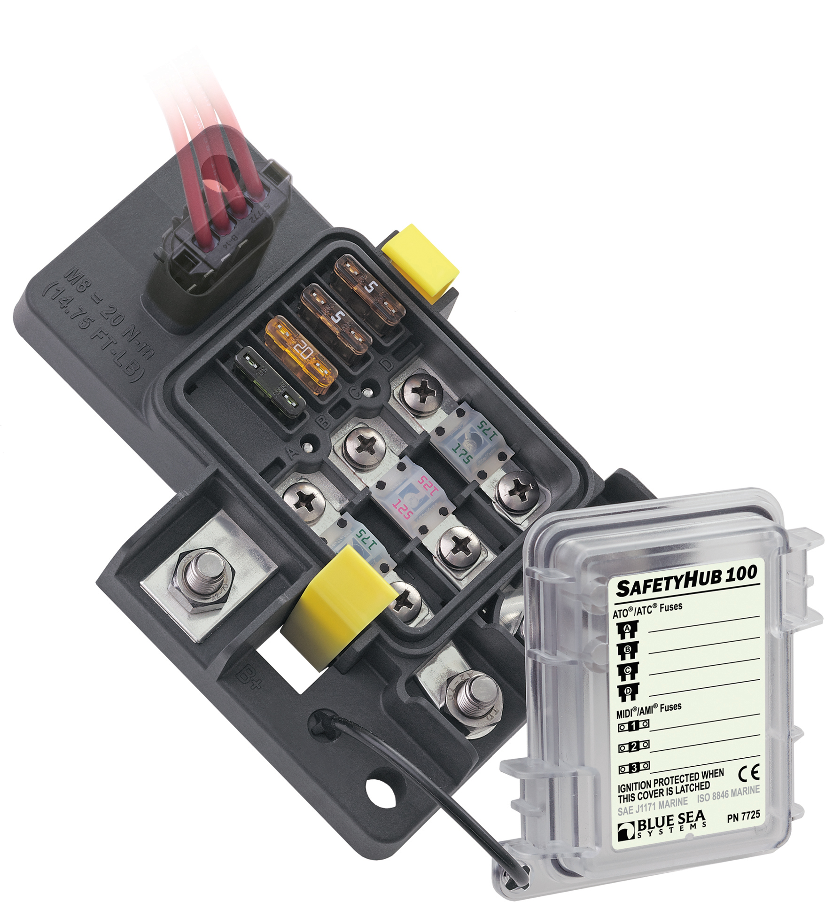

---
hide:
  - toc
tags:
  - product-details
  - power-distribution
  - fuse-block
---

# 1.2.2 SafetyHub 100 {#safetyhub-100}

/// html | div.product-info
{ loading=lazy }

**Type:** Fuse Block

**Model:** Blue Sea 7725 SafetyHub 100

**Manufacturer:** Blue Sea Systems

**Product Page:** [SafetyHub 100 Fuse Block][bluesea-7725]

///

## Overview

Provides high-current fused distribution for heavy-load accessories.

**Location:** Engine bay

**Power Source:** Starter battery via 150A CB - see [Circuit Breakers][circuit-breakers]

## Specifications

- **Rating:** 100A max combined (400A bus rating)
- **Fuse Types:** 3x MIDI (AMI/MIDI), 4x ATC (ATO/ATC)
- **Fuse Range:** MIDI: 30-200A, ATC: 1-20A per circuit
- **Features:** Ignition protected, negative ground bus, ISO 8846, SAE J1171, IP66
- **Full Specs:** [Blue Sea 7725][bluesea-7725]

## Circuit Configuration

| Slot | Fuse | Circuit | Wire Gauge | Distance | Voltage @ Load | Load | Notes |
|:-----|:-----|:--------|:-----------|:---------|:---------------|:-----|:------|
| MIDI-1 | 60A | [ARB Compressor][air-system] Motor 1 | 10 AWG ✓ | ~12 ft | 13.53V (2.0%) | 45A | Engine bay → firewall → under passenger seat |
| MIDI-2 | 60A | [ARB Compressor][air-system] Motor 2 | 10 AWG ✓ | ~12 ft | 13.53V (2.0%) | 45A | Engine bay → firewall → under passenger seat |
| MIDI-3 | - | **[Reserved]** | - | - | - | - | **Reserved for Ham Radio** |
| ATC-1 | 10A | [Winch][recovery-systems] Contactor Trigger | 14 AWG ✓ | ~4 ft | 13.79V (0.1%) | ~1A | Engine bay → front bumper (short run) |
| ATC-2 | 15A | [G1 GMRS Radio][comms] | 14 AWG ✓ | ~3 ft | 13.71V (0.7%) | 15A | Engine bay → firewall → behind dash |
| ATC-3 | 10A | [STX Intercom][comms] | 16 AWG ✓ | ~3 ft | 13.76V (0.3%) | ~5A | Engine bay → firewall → under dash |
| ATC-4 | - | **[Available]** | - | - | - | - | - |

**Slot Utilization:** 5 of 7 used (2 MIDI + 3 ATC, 2 available - 1 reserved for Ham Radio)

**Total Load:** ~111A maximum (ARB 90A + GMRS 15A + Intercom 5A + Winch contactor 1A)

!!! warning "Winch Motor Power"
    Warn Zeon 10-S winch motor draws 400A peak directly from starter battery positive (no CB). Only the 1A contactor coil trigger is powered through SafetyHub ATC-1. See [Starter Battery Distribution][front-battery] for winch main power connection.

## Related Documentation

**Power Systems:**

- [Starter Battery Distribution Overview][front-battery]
- [Circuit Breakers][circuit-breakers] - 150A CB protection

**Connected Systems:**

- [Air System][air-system] - ARB twin compressor specifications
- [Recovery Systems][recovery-systems] - Winch specifications
- [Communication Systems][comms] - GMRS, Ham, Intercom specifications

[bluesea-7725]: https://www.bluesea.com/products/7725/SafetyHub_100_Fuse_Block
[circuit-breakers]: 01-circuit-breakers.md
[air-system]: ../../07-exterior-systems/02-air-system.md
[recovery-systems]: ../../07-exterior-systems/01-recovery-systems.md
[comms]: ../../06-communication-systems/01-communication.md
[front-battery]: index.md
