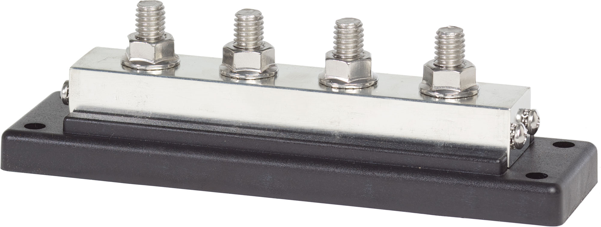

---
hide:
  - toc
tags:
  - product-details
  - power-distribution
  - bus-bar
---

# 1.3.2 AUX battery CONSTANT Bus Bar {#rear-constant-bus}

/// html | div.product-info
{ loading=lazy }

**Type:** Bus Bar

**Model:** Blue Sea 2104 PowerBar

**Manufacturer:** Blue Sea Systems

**Product Page:** [PowerBar 225A BusBar][product-link]

///

## Overview

Provides organized distribution for accessory circuits in the rear wheel well compartment.

**Location:** Rear wheel well compartment (near battery)

**Power Source:** AUX battery via 1/0 AWG (~3 ft) - see [AUX battery Distribution][rear-battery]

## Specifications

- **Rating:** 225A continuous
- **Terminals:** 4× 3/8"-16 studs
- **Wire Range:** Up to 4/0 AWG
- **Features:** Tin-plated copper, corrosion resistant
- **Full Specs:** [Blue Sea 2104][product-link]

## Load Distribution

| Stud | Connection | Wire Gauge | Distance | Voltage @ Load | Protection | Load | Notes |
|:-----|:-----------|:-----------|:---------|:---------------|:-----------|:-----|:------|
| 1 | **AUX battery+ (INPUT)** | **1/0 AWG ✓** | **~3 ft** | **13.68V (0.9%)** | **None** | **~169A max** | **Power feed from battery - see [AUX battery][rear-battery]** |
| 2 | SwitchPros RCR-Force 12 | 4 AWG ✓ | ~2 ft | 13.58V (0.7%) | 150A CB | ~100A max | Auxiliary lighting control - see [SwitchPros][switchpros] |
| 3 | Body RTMR | 6 AWG ✓ | ~12 ft | 13.03V (4.9% @ 20°C) | 100A CB | ~69A max | Cabin convenience circuits - see [Body RTMR][body-rtmr] |
| 4 | **[Available]** | - | - | - | - | - | Future expansion (1 stud available) |

**Stud Utilization:** 3 of 4 used (1 available)

**Total Load:** ~169A max (SwitchPros 100A + Body RTMR 69A)

**Wire Sizing:** 1/0 AWG feed rated 325A continuous - 0.9% voltage drop @ 169A max load (13.68V at bus)

!!! info "Circuit Protection"
    No circuit breaker between battery and CONSTANT bus. Each load has individual CB protection: SwitchPros (150A), Body RTMR (100A). See [Circuit Breakers][circuit-breakers].

## Related Documentation

**Power Systems:**

- [AUX battery Distribution][rear-battery] - Complete overview
- [Circuit Breakers][circuit-breakers] - CB specifications

**Connected Systems:**

- [SwitchPros RCR-Force 12][switchpros] - Auxiliary lighting controller
- [Body RTMR][body-rtmr] - Cabin convenience circuits
- [Installation Checklist][installation] - Bus bar mounting procedure

[product-link]: https://www.bluesea.com/products/2104/PowerBar_225A_BusBar_with_Four_1_4inch-20_Studs
[rear-battery]: index.md
[circuit-breakers]: 01-circuit-breakers.md
[switchpros]: ../../04-control-interfaces/02-switchpros-sp1200.md
[body-rtmr]: 04-body-rtmr.md
[installation]: ../installation-checklist.md#phase-2-power-distribution
