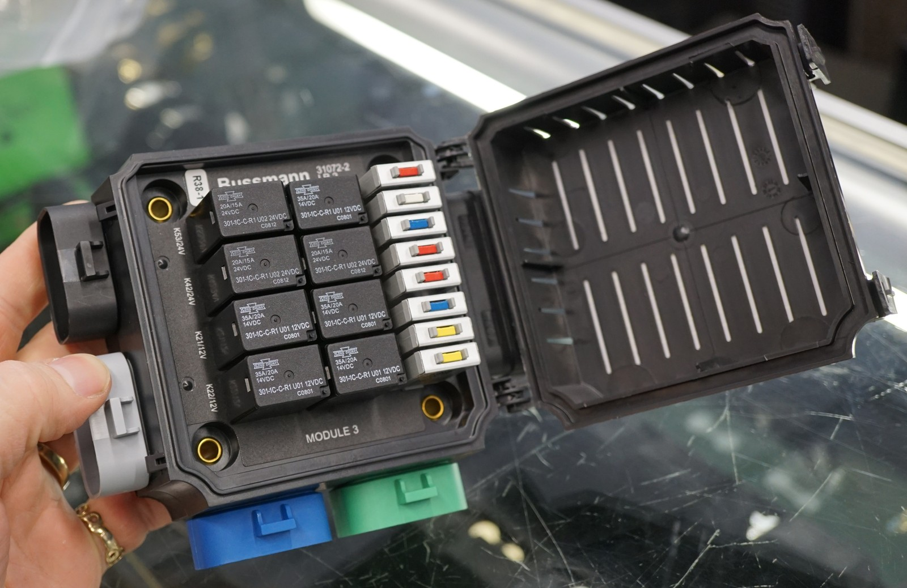

---
hide:
  - toc
---

# 1.3.2 BODY PDU {#body-rtmr}

/// html | div.product-info
{ loading=lazy }

**Type:** Military-Spec Relay/Circuit Breaker Panel

**Model:** Bussmann LR-2

**Part Number:** 301-1C-C-R1 (NSN: 6110-01-523-6374)

**Manufacturer:** Bussmann (Eaton)

**Source:** Military surplus (MRAP/LMTV truck)

**eBay Listing:** [Bussmann LR-2 Relay Breaker Block][ebay-listing]

**Mounting:** Firewall - body side (cabin), passenger side

**Power Source:** CONSTANT power from AUX battery via 6 AWG feed

**Configuration:** 8 circuit breaker positions + 8 relay positions

**Input:** Military-spec power studs (accepts up to 6 AWG wire)

**Output:** J301-J306 Metri-Pack connectors (military-spec sealed)

**Protection:** IP65+ sealed military-grade enclosure

**Temperature Rating:** Military spec (-40°F to 221°F typical)

**Voltage:** 12V DC (originally 12V/24V dual voltage)

///

## Circuit Breaker Configuration

| CB Position | Original Military Label | Repurposed Circuit | Size | Gauge | Load | Relay | Notes |
|:------------|:-----------------------|:-------------------|:-----|:------|:-----|:------|:------|
| CB30 | CHEM DETECT | Fusion Radio (memory) | 10A | 18AWG | ~1A | - | Memory/clock retention only |
| CB44 | TRLR LIGHT | Fusion Radio (amplifier) | 15A | 14AWG | ~15A | - | Remote wire from deck triggers on/off |
| CB48 | ARCT CRAN | USB Charging Ports | 20A | 14AWG | ~13A | - | 2x Powerwerx PanelUSB-75W always-on |
| CB39 | TRLR BO STOP | WolfBox Camera/Mirror | 10A | 16AWG | ~10A | - | Dash cam + backup camera |
| CB45 | IGNITION | Driver Heated Seat | 15A | 14AWG | 15A | K21 | Manual switch → relay K21 → seat element |
| CB42 | 2WAY INTRCM | Passenger Heated Seat | 20A | 14AWG | 15A | K22 | Manual switch → relay K22 → seat element |
| CB20 | RADIO | **[Available]** | 25A | - | - | - | High-current spare (future ham radio) |
| CB43 | TRANS ECU | **[Available]** | 10A | - | - | - | Future expansion |

**Circuit Breaker Utilization:** 6 of 8 used, 2 available

## Relay Configuration

| Relay Position | Original Military Label | Repurposed Function | Voltage | Control | Notes |
|:---------------|:-----------------------|:-------------------|:--------|:--------|:------|
| K21 | REAR LEFT LIGHT | Driver Heated Seat | 12V | Dash switch | Controls CB45 output to driver seat |
| K22 | REAR RIGHT LIGHT | Passenger Heated Seat | 12V | Dash switch | Controls CB42 output to passenger seat |
| K27 | TRAILER BO STOP | **[Available]** | 12V | - | Future expansion |
| K30 | TRAILER REAR LEFT | **[Available]** | 12V | - | Future expansion |
| K31 | TRAILER REAR RIGHT | **[Available]** | 12V | - | Future expansion |
| K53 | RADIO | **[Available]** | 24V | - | Not usable (24V coil) |
| K40 | START DISABEL | **[Available]** | 24V | - | Not usable (24V coil) |
| K42 | ENGINE PTO | **[Available]** | 24V | - | Not usable (24V coil) |

**Relay Utilization:** 2 of 8 used, 5 available (3 are 24V only)

**Total Load:** ~69A maximum (Radio 16A + USB 13A + Camera 10A + Seats 30A)

**Control:** All circuits on CONSTANT power with trigger-wire or manual switch control for on/off

## Heated Seat Relay Configuration

**Design:** Military-spec integrated relays K21 (driver) and K22 (passenger) for independent seat control

**Relay Specifications:**
- **Quantity:** 2 relay positions (K21 driver, K22 passenger)
- **Contact Rating:** 20-30A @ 12VDC (military-spec)
- **Coil Voltage:** 12VDC
- **Type:** Military-standard plug-in relays (original equipment)
- **Mounting:** Integrated inside Bussmann LR-2 sealed enclosure

**Circuit Breaker Protection:**
- **Driver Seat:** CB45 (15A) → Relay K21 → Driver seat element
- **Passenger Seat:** CB42 (20A) → Relay K22 → Passenger seat element

**Control Flow:**
```
AUX battery CONSTANT Power (via 6 AWG) → LR-2 Internal Bus
                              ↓
                    Circuit Breaker (CB45/CB42)
                              ↓
Dash Switch (manual) ───────→ Relay Coil (K21/K22)
                              ↓
                        Relay Contacts Close
                              ↓
                J301-J306 Output → Heated Seat Element (15A)
```

**Benefits of Military-Spec LR-2:**
- Independent driver/passenger control via K21/K22
- IP65+ military-grade sealed enclosure
- No external relay mounting required
- Military-spec Metri-Pack sealed connectors (J301-J306)
- Proven reliability (MRAP/LMTV combat vehicle service)
- Better fault isolation (one seat failure doesn't affect other)

!!! info "Communication Devices"
    G1 GMRS Radio, STX Intercom, and Ham Radio are powered from [SafetyHub 100][safetyhub] (START battery) as critical infrastructure, with direct grounds to START battery to minimize RF noise.

## Power Feed Wire Sizing

**Recommended Specification:** 6 AWG feed from AUX battery (passenger wheel well)

**Routing:** Passenger wheel well → through firewall → cabin side mounting (~10-12 ft estimated)

**Voltage Drop Analysis (69A max load, ~12 ft routing):**
- 8 AWG @ 69A: **7.8% voltage drop** ❌ Too high for CONSTANT power circuits
- 6 AWG @ 69A: **4.9% voltage drop** ✓ Acceptable for accessories
- 4 AWG @ 69A: **3.1% voltage drop** ✓ Ideal

**Recommendation:** **6 AWG provides best balance** for this application
- Reduces voltage drop to 4.9% (acceptable for non-critical CONSTANT loads)
- Provides margin for heated seat load variation (15A assumption, could be 20A)
- Fits VEC M8 input terminal spec (#10-14 AWG with wire seals)
- Cost increase: ~$15-20 over 8 AWG
- Improves reliability of all VEC circuits

**If seats verify at 20A each (worst case):**
- Total load: 79A max
- 6 AWG @ 79A: 5.6% voltage drop (still acceptable)
- 4 AWG @ 79A: 3.5% voltage drop (better, but doesn't fit VEC input terminal with seals)

## Bussmann LR-2 Specifications

**Model:** Bussmann LR-2 (Military Surplus)

**Part Number:** 301-1C-C-R1

**NSN:** 6110-01-523-6374

**Original Application:** MRAP/LMTV military trucks

**Configuration Details:**
- **Circuit Breaker Positions:** 8 total (6 active + 2 spare)
  - CB20 (25A), CB30 (10A), CB39 (10A), CB42 (20A), CB43 (10A), CB44 (15A), CB45 (15A), CB48 (20A)
- **Relay Positions:** 8 total (2 active + 3 spare 12V + 3 unusable 24V)
  - K21 (12V), K22 (12V), K27 (12V), K30 (12V), K31 (12V), K40 (24V), K42 (24V), K53 (24V)
- **Input:** Military-spec power studs (accepts up to 6 AWG wire)
- **Output Connectors:** J301-J306 Metri-Pack military-spec sealed connectors
- **Cover:** IP65+ military-grade sealed enclosure
- **Mounting:** Military-standard mounting feet with holes
- **Labeling:** Original military markings (CB/relay positions labeled)

**Circuit Breaker Mapping (Repurposed):**
- CB30 (10A): Fusion Radio memory
- CB44 (15A): Fusion Radio amplifier
- CB48 (20A): USB charging ports
- CB39 (10A): WolfBox camera/mirror
- CB45 (15A): Driver heated seat (relay K21)
- CB42 (20A): Passenger heated seat (relay K22)
- CB20 (25A): Available (future ham radio)
- CB43 (10A): Available

**Relay Usage:**
- K21 (12V): Driver heated seat control
- K22 (12V): Passenger heated seat control
- K27, K30, K31 (12V): Available for future expansion
- K40, K42, K53 (24V): Not usable in 12V system

## Outstanding Items

- [ ] Verify all circuit breakers and relays are functional in LR-2 unit
- [ ] Identify pinout for J301-J306 Metri-Pack connectors (military TM manual or reverse engineering)
- [ ] Determine LR-2 ground connection location (chassis ground or direct to AUX battery)
- [ ] **Route CONSTANT power feed from AUX battery to LR-2** - **6 AWG** (4.7% voltage drop @ 69A)
- [ ] **100A circuit breaker installed at AUX battery** (145% of max load) - see [Circuit Breakers](01-circuit-breakers.md)
- [ ] Mount LR-2 on firewall (body side, passenger side)
- [ ] Create custom wiring harnesses to adapt J301-J306 military connectors to civilian loads
- [ ] Route heated seat dash switches to LR-2 relay control inputs (K21, K22)
- [ ] Verify 12V relays (K21, K22, K27, K30, K31) function correctly - replace if needed
- [ ] Label repurposed circuits on LR-2 enclosure (match CB positions to new functions)
- [ ] Test 24V relays (K40, K42, K53) - confirm not usable in 12V system

**Design Assumptions:**
- Heated seat current: 15A per seat (conservative estimate - typical seats draw 5-10A)
- Total heated seat load: 30A (both seats on simultaneously)
- Military relays K21/K22 provide fault isolation and independent operation
- J301-J306 connectors require custom harness fabrication

## Related Documentation

- [AUX battery Distribution][house-battery] - Power source and circuit breaker (passenger wheel well)
- [Circuit Breakers][circuit-breakers] - 100A CB protection for LR-2 power feed
- [Dashboard Controls][dashboard] - Physical switch panel layout
- [Audio Systems][audio] - Fusion radio specifications
- [Firewall Ingress][firewall] - Power feed routing through firewall

[ebay-listing]: https://www.ebay.com/itm/224625878742
[safetyhub]: ../02-starter-battery-distribution/04-safetyhub.md
[house-battery]: index.md
[circuit-breakers]: 01-circuit-breakers.md
[dashboard]: ../../04-control-interfaces/05-dashboard-controls.md
[audio]: ../../05-audio-systems/01-audio.md
[firewall]: ../../02-engine-systems/07-firewall-ingress.md
