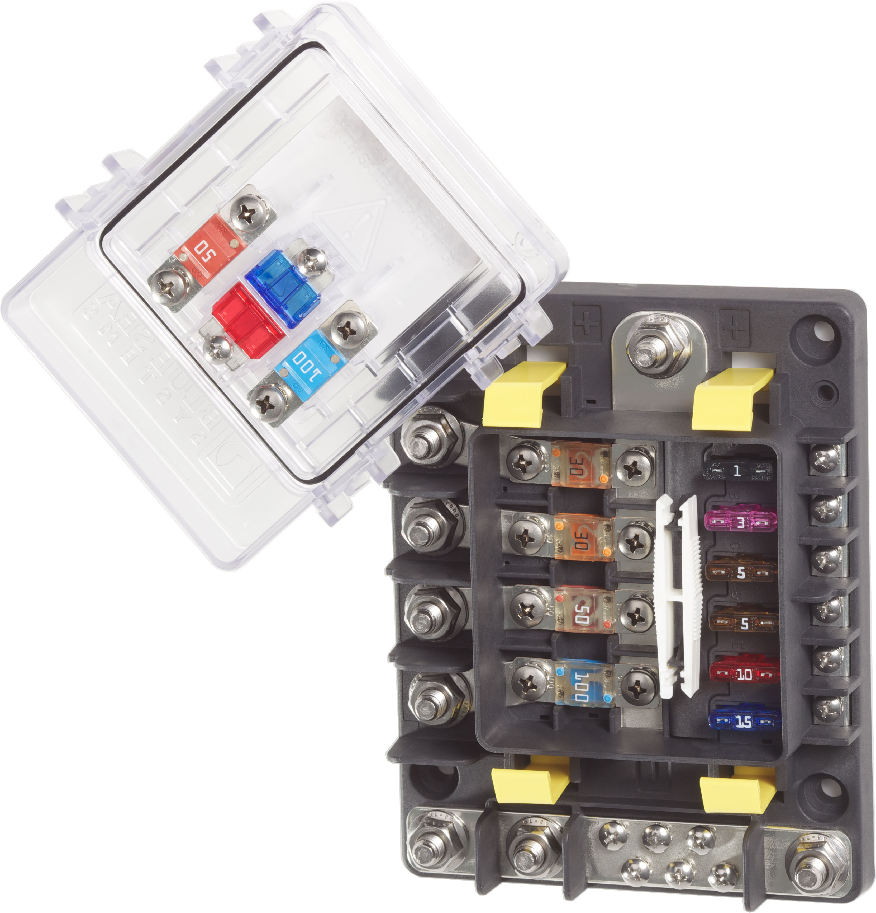

---
hide:
  - toc
tags:
  - product-details
  - power-distribution
  - fuse-block
---

# 1.3.4 SafetyHub 150 (AUX Battery) {#aux-safetyhub-150}

/// html | div.product-info
{ loading=lazy }

**Type:** Fuse Block

**Model:** Blue Sea 7748 SafetyHub 150

**Manufacturer:** Blue Sea Systems

**Product Page:** [SafetyHub 150 Fuse Block][bluesea-7748]

///

## Overview

Provides fused distribution for recovery and auxiliary systems powered by the AUX battery.

**Location:** Passenger wheel well (co-located with AUX battery and circuit breakers)

**Power Source:** AUX battery via 150A CB - see [Circuit Breakers][circuit-breakers]

**Note:** Communications systems (GMRS, Intercom, Ham Radio) are powered via PMU outputs - see [PMU Outputs][pmu-outputs]

!!! note "Future-Proof Capacity"
    Wire and CB sized for full 150A SafetyHub capacity (current load 100A). Provides 50A headroom for additional recovery or auxiliary systems.

## Specifications

- **Rating:** 150A max combined (400A bus rating)
- **Fuse Types:** 3x MIDI (AMI/MIDI), 4x ATC (ATO/ATC)
- **Fuse Range:** MIDI: 30-200A, ATC: 1-20A per circuit
- **Features:** Ignition protected, negative ground bus, ISO 8846, SAE J1171, IP66
- **Full Specs:** [Blue Sea 7748][bluesea-7748]

## Circuit Configuration

| Slot | Fuse | Circuit | Wire Gauge | Distance | Voltage @ Load | Load | Notes |
|:-----|:-----|:--------|:-----------|:---------|:---------------|:-----|:------|
| MIDI-1 | 60A | [ARB Compressor][air-system] Motor 1 | 6 AWG ✓ | ~12 ft | 11.56V (3.6%) | 45A | Passenger wheel well → cargo → under passenger seat |
| MIDI-2 | 60A | [ARB Compressor][air-system] Motor 2 | 6 AWG ✓ | ~12 ft | 11.56V (3.6%) | 45A | Passenger wheel well → cargo → under passenger seat |
| MIDI-3 | - | **[Available]** | - | - | - | - | - |
| ATC-1 | 15A | Winch Contactor Trigger | 14 AWG ✓ | ~13 ft | 13.70V (0.8%) | 10A | Passenger wheel well → front bumper via frame rail |
| ATC-2 | - | **[Available]** | - | - | - | - | - |
| ATC-3 | - | **[Available]** | - | - | - | - | - |
| ATC-4 | - | **[Available]** | - | - | - | - | - |

**Slot Utilization:** 3 of 7 used (2 MIDI + 1 ATC, 4 available)

**Total Load:** 100A maximum (ARB 90A + Winch Trigger 10A)

**Utilization:** 100A / 150A = 67%

**Future Capacity:** 50A additional capacity available (150A max - 100A current = 50A headroom)

!!! info "Winch Main Power"
    Winch motor power (400A peak) connects directly to AUX battery positive terminal with no external circuit breaker per WARN manufacturer specifications. See [STANDARDS-EXCEPTIONS.md][standards-exceptions] and [Recovery Systems][recovery-systems] for complete protection strategy.

## Related Documentation

**Power Systems:**

- [AUX Battery Distribution Overview][aux-battery]
- [Circuit Breakers][circuit-breakers] - 150A CB protection
- [PMU Outputs][pmu-outputs] - Communications system power (GMRS, Intercom, Ham Radio)
- [Standards Exceptions][standards-exceptions] - Winch protection strategy documentation

**Connected Systems:**

- [Air System][air-system] - ARB twin compressor specifications
- [Recovery Systems][recovery-systems] - Winch control and protection details

[bluesea-7748]: https://www.bluesea.com/products/7748/SafetyHub_150_Fuse_Block
[circuit-breakers]: 01-circuit-breakers.md
[air-system]: ../../07-exterior-systems/02-air-system.md
[recovery-systems]: ../../07-exterior-systems/01-recovery-systems.md
[aux-battery]: index.md
[pmu-outputs]: ../04-pmu/03-pmu-outputs.md
[standards-exceptions]: ../STANDARDS-EXCEPTIONS.md
