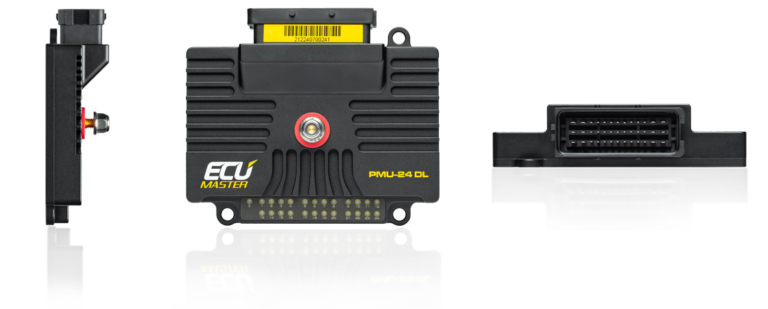

---
hide:
  - toc
tags:
  - product-details
  - power-distribution
  - pmu
  - controller
---

# 1.4.1 PMU Overview {#pmu-overview}

/// html | div.product-info
{ loading=lazy }

**Type:** Programmable Power Management Unit with Data Logging

**Model:** ECUMaster PMU24 DL

**Manufacturer:** ECUMaster

**Product Page:** [ECUMaster PMU24 DL][ecumaster-pmu24]

**Installation Manual:** [PMU User Manual v101.1.5 (PDF)][pmu-manual]

**Pinout Diagram:** [PMU-24 Pinout v1.1 (PDF)][pmu-pinout]

**Wiring Diagram:** See Installation Manual (pinout diagrams for PMU24)

///

## Specifications

**Outputs:**

- 24 programmable high-side outputs (10×25A, 6×15A, 8×7A)
- **Total capacity:** 170A continuous (power supply limited, not sum of outputs)
- **Constraint:** Only same-rated outputs can be combined (e.g., 25A + 25A ✓, 25A + 15A ✗)
- **Out 17-24:** Dual-purpose - configurable as 7A outputs OR 0-20V analog inputs

**Key Features:**

- Dedicated 12V switched input (Pin 7), up to 16 analog inputs, 9 digital inputs
- 256MB data logger (500 Hz), real-time clock, IMU, inertia switch
- 2× CAN 2.0 A/B (J1939 compatible), 24× tricolor LED indicators
- PC config via USB ([USB to CAN adapter][usb-to-can] required)

**Physical:** 131×112×33mm, 385g, -40°C to +125°C operating range

**Configuration Software:** [PMU Setup v101.2.1][pmu-setup] | **Full Specs:** [PMU Manual][pmu-manual]

## Capacity Analysis

| Outputs   |  Rating  | Total  |  Used  | Available |
| :-------- | :------: | :----: | :----: | :-------: |
| 1-10      | 25A each |   10   |   10   |     0     |
| 11-16     | 15A each |   6    |   6    |     0     |
| 17-24     | 7A each  |   8    |   6    |     2     |
| **Total** |    -     | **24** | **22** |   **2**   |

**Utilization:** 22 of 24 outputs used (92%)

**Primary loads:** Radiator fan (OUT2+3+4: 3×25A combined), iBooster (OUT1+10: 2×25A non-adjacent), HVAC (OUT5: 25A), GMRS radio (OUT6: 25A), aux fans (OUT7+8: 2×15A), Dakota Digital (OUT9: 25A), wipers (OUT11: 15A), Ham radio (OUT12: 15A), CT4 (OUT13: 15A), DRL (OUT14: 15A), winch trigger (OUT15: 15A), A/C clutch (OUT17: 7A), horn (OUT18: 7A), iBooster ignition (OUT19: 7A), intercom (OUT20: 7A), brake lights (OUT21: 7A), reverse lights (OUT22: 7A)

**Load:** ~253A theoretical peak (all radios transmitting + full radiator fan + iBooster braking), ~106A typical PMU circuits continuous (excluding radiator fan which varies 16-53A via PWM), total typical load ~140-170A (well within 300A PMU capacity)

**Mounting:** Engine bay, accessible for LED diagnostics and USB configuration

## Related Documentation

- [PMU Inputs][pmu-inputs] - Input configuration and CAN bus integration
- [PMU Outputs][pmu-outputs] - 24-output configuration and load details
- [PMU Programming][pmu-programming] - Logic examples and configuration
- [START battery Distribution][starter-battery-distribution] - PMU power source (2/0 AWG, 7 ft) and circuit breaker (250A)
- [Wire Distance Reference][wire-distance] - PMU to battery routing distance

[pmu-inputs]: 02-pmu-inputs.md
[pmu-outputs]: 03-pmu-outputs.md
[pmu-programming]: 04-pmu-programming.md
[starter-battery-distribution]: ../02-starter-battery-distribution/index.md
[wire-distance]: ../01-power-generation/05-wire-distance-reference.md
[ecumaster-pmu24]: https://www.ecumaster.com/products/pmu24/
[pmu-manual]: https://www.ecumaster.com/files/PMU/PMU_Manual.pdf
[pmu-pinout]: https://www.ecumaster.com/files/PMU/PMU-24_Pinout_v1.1.pdf
[usb-to-can]: https://www.ecumaster.com/products/usb-to-can/
[pmu-setup]: https://www.ecumaster.com/files/PMU/PMUSetup_101_2_1.exe
