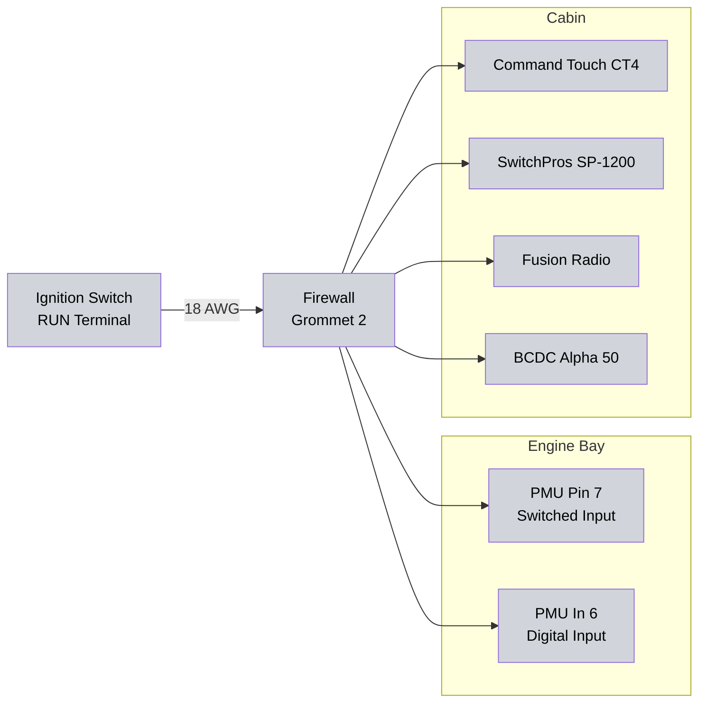

# 1.4.3 PMU Inputs {#143-pmu-inputs}
PMU input configuration including digital inputs, analog inputs, CAN bus integration, and ignition signal distribution.

## 12V Switched Input (Dedicated Input)

**Pin 7:** Dedicated 12V switched input (ignition-controlled power source)

**Function:** Provides switched power reference for PMU logic

**Source:** Ignition switch RUN output

**Implementation:**
- Independent of digital inputs (In 1-9)
- Used for ignition-aware output control (enables/disables outputs based on ignition state)
- Wire gauge: 18 AWG from ignition switch
- Splits to: PMU Pin 7, PMU In 6, CT4, SwitchPros, Fusion Radio, BCDC Alpha 50
- Low current: <500mA total for all ignition sense inputs

See [Ignition Signal Distribution](#ignition-signal-distribution) below for complete wiring.

## Digital Inputs (Trigger Sources)

| Input    | Function             | Source                       | Connected to Output       | Notes                                                                           |
|:---------|:---------------------|:-----------------------------|:--------------------------|:--------------------------------------------------------------------------------|
| **In 1** | Horn Button          | Steering wheel button        | Out 18 (Horn)             | Normally open, closes when pressed                                              |
| **In 2** | Brake Switch         | Brake pedal switch           | Out 21 (Brake Lights)     | Normally open, closes when pedal pressed                                        |
| **In 3** | Reverse Switch       | AX15 trans switch            | Out 22 (Reverse Lights)   | Normally open, closes in reverse gear                                           |
| **In 4** | Clutch Switch        | Clutch pedal switch          | Out 23 (Starter) logic    | Normally open, closes when clutch depressed                                     |
| **In 5** | Ignition START       | Ignition switch START        | Out 23 (Starter) logic    | 12V when ignition in START position                                             |
| **In 6** | Ignition RUN Status  | Ignition switch RUN (same as Pin 7) | Out 11, Out 14 logic | Digital input monitoring ignition state (Pin 7 provides actual switched power) |
| **In 7** | CT4 SW3 (Headlights) | CT4 lever pull               | Out 14 (DRL) logic        | 12V when headlights active, disables DRL                                        |
| **In 8** | **[Available]**      | -                            | -                         | Available for future expansion  |
| **In 9** | A/C Request          | Factory TJ A/C button signal | Out 17 (A/C Clutch)       | 12V when factory dash A/C button pressed                                        |

## Analog Inputs

| Input    | Function        | Sensor Type    | Connected to Output    | Notes                                |
|:---------|:----------------|:---------------|:-----------------------|:-------------------------------------|
| **An 1-16** | **[Available]** | - | - | All 16 analog inputs available for custom sensors |

**Note:** Engine oil temperature and coolant temperature are monitored via J1939 CAN bus from ECM (no analog inputs needed).

## CAN Bus Integration (J1939)

The PMU24 taps into the existing J1939 CAN bus as a stub connection (no termination needed).

### Bus Topology

```
[ECM 120Ω] ←--+--+--→ [Cummins Body Harness End 120Ω]
               |  |
               |  [PMU24 - stub tap, no termination]
               |
          [Dakota Digital 01-2-J1939 - stub tap, no termination]
```

### Physical Connection

- **Tap Location:** Cummins body harness (same location as Dakota Digital tap)
- **CAN High:** T-tap from existing CAN High → PMU Pin 23 or 24
- **CAN Low:** T-tap from existing CAN Low → PMU Pin 36 or 37
- **Stub Length:** Keep under 12 inches from tap point to PMU (minimize signal reflections)
- **Wire Gauge:** 18-20 AWG twisted pair for stub
- **Termination:** None needed at PMU - bus already terminated at both ends (ECM + harness end)
- **PMU Setting:** Disable internal CAN termination in PMU software

### Available J1939 Data from ECM

**Engine Parameters (SAE J1939 SPNs):**

- **SPN 100:** Engine Oil Pressure
- **SPN 175:** Engine Oil Temperature
- **SPN 110:** Engine Coolant Temperature
- **SPN 190:** Engine Speed (RPM)
- **SPN 94:** Fuel Delivery Pressure
- **SPN 108:** Barometric Pressure
- **SPN 1637:** Engine Intake Manifold Pressure
- Many other engine parameters per SAE J1939 standard

### PMU24 Uses for J1939 Data

- Trigger oil cooler fan (OUT 7) based on engine oil temp (SPN 175)
- Trigger PS cooler fan (OUT 8) based on coolant temp (SPN 110) or oil temp
- Log engine parameters alongside electrical data (256MB logger)
- Display engine data via PMU software or external displays
- Create custom logic based on engine conditions

See [PMU Programming][# 1.4.4 PMU Programming {#144-pmu-programming}] for CAN-based logic examples.

## Ignition Signal Distribution

**Source:** Ignition switch RUN terminal

**Wire Gauge:** 18 AWG from ignition switch (sufficient for <500mA total draw)

**Destinations:**

1. PMU Pin 7 (dedicated 12V switched input)
2. PMU In 6 (digital input for ignition status monitoring)
3. Command Touch CT4 (ignition sense)
4. SwitchPros Pin 3 (Lt Blue - ignition sense)
5. Fusion Radio (ignition sense - yellow wire)
6. BCDC Alpha 50 (ignition sense for charge management)

**Implementation:**

- Single 18 AWG wire from ignition switch RUN terminal
- Route through firewall (Grommet 2)
- Split to PMU Pin 7 and In 6 in engine bay
- Continue to cabin for CT4, SwitchPros, Fusion, BCDC splits
- Use junction block or solder + heat shrink for splits

**Wiring Diagram:**



## Related Documentation

- [PMU Overview][# 1.4.1 PMU Overview {#141-pmu-overview}] - Product specifications and capacity
- [PMU Outputs][# 1.4.2 PMU Outputs {#142-pmu-outputs}] - Output configuration and load details
- [PMU Programming][# 1.4.4 PMU Programming {#144-pmu-programming}] - Logic examples using inputs and CAN data
- [Firewall Ingress][# Firewall Penetrations & Ingress Points {#firewall-penetrations-ingress-points}] - Grommet 2 specifications for ignition wire
- [Gauge Cluster][# Dakota Digital Gauge Cluster {#dakota-digital-gauge-cluster}] - Dakota Digital J1939 integration
