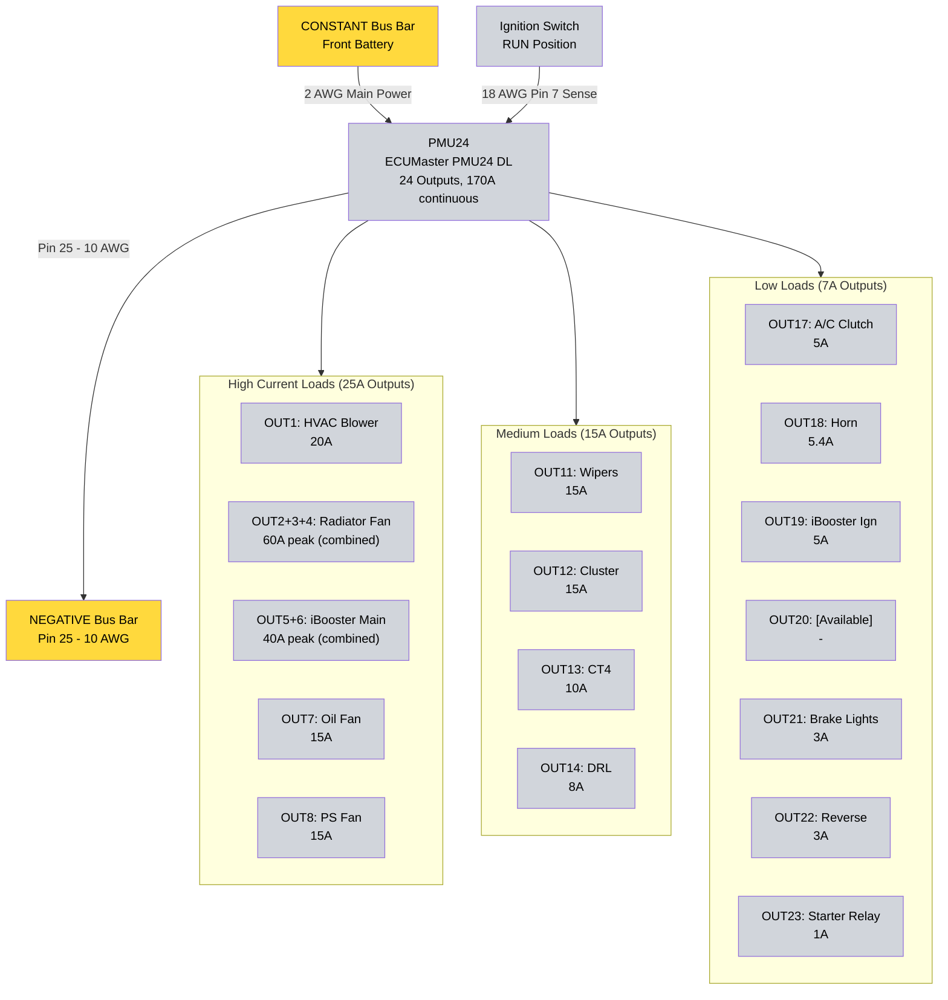

# 1.4.2 PMU Outputs {#142-pmu-outputs}
Complete configuration of all 24 PMU outputs, load allocations, and combined output configurations.

## PMU24 Output Configuration {#pmu-output-wiring-diagram}

### 25A High-Side Outputs (OUT1-OUT10)

| Output           | Circuit                      | Load      | Control Type                   | Trigger/Input                       | Notes                                             |
|:-----------------|:-----------------------------|:----------|:-------------------------------|:------------------------------------|:--------------------------------------------------|
| **Out 1**        | HVAC Blower Motor            | ~20A      | Auto (ignition ON)             | Constant power when ignition on     | See [HVAC System][hvac-system] - highest single load |
| **Out 2**        | **Radiator Fan (combined)**  | Combined  | Auto (ECM PWM control)         | Combined with OUT3 + OUT4           | GM 84100128 - 30-60A, requires 3x 25A outputs     |
| **Out 3**        | **Radiator Fan (combined)**  | Combined  | Auto (ECM PWM control)         | Combined with OUT2 + OUT4           | GM 84100128 - 30-60A, requires 3x 25A outputs     |
| **Out 4**        | **Radiator Fan (combined)**  | Combined  | Auto (ECM PWM control)         | Combined with OUT2 + OUT3           | GM 84100128 - 30-60A, requires 3x 25A outputs     |
| **Out 5**        | **iBooster Main (combined)** | Combined  | CONSTANT (always on)           | Combined with OUT6                  | Bosch iBooster - 40A peak, requires 2x 25A outputs|
| **Out 6**        | **iBooster Main (combined)** | Combined  | CONSTANT (always on)           | Combined with OUT5                  | Bosch iBooster - 40A peak, requires 2x 25A outputs|
| **Out 7**        | Oil Cooler Fan               | ~15A      | Auto (CAN temp monitoring)     | ECM J1939 engine oil temp (SPN 175) | Programmable temp thresholds via CAN              |
| **Out 8**        | PS Cooler Fan                | ~15A      | Auto (CAN temp monitoring)     | ECM J1939 coolant temp (SPN 110)    | Programmable temp thresholds via CAN              |
| **Out 9**        | **[Available]**              | -         | -                              | -                                   | Future expansion (25A high-current)               |
| **Out 10**       | **[Available]**              | -         | -                              | -                                   | Future expansion (25A high-current)               |

### 15A High-Side Outputs (OUT11-OUT16)

| Output           | Circuit                      | Load      | Control Type                   | Trigger/Input                       | Notes                                             |
|:-----------------|:-----------------------------|:----------|:-------------------------------|:------------------------------------|:--------------------------------------------------|
| **Out 11**       | WS-51C Wiper Controller      | 15A       | Auto (ignition ON)             | Ignition signal (In 6)              | See [Wipers][windshield-wiper-control-system]                        |
| **Out 12**       | Dakota Digital Cluster       | ~15A      | Auto (ignition RUN)            | Ignition signal (Pin 7/In 6)        | See [Gauge Cluster][dakota-digital-gauge-cluster]          |
| **Out 13**       | Command Touch CT4            | ~10A      | CONSTANT (always on)           | Works with ignition off (hazards)   | Critical safety system - hazards/turn signals     |
| **Out 14**       | DRL/Parking Lights           | ~8A       | Auto (ignition) with logic     | Ignition ON + headlight status      | See [DRL & Parking Lights][drl-parking-lights]    |
| **Out 15**       | **[Available]**              | -         | -                              | -                                   | Future expansion (15A)                            |
| **Out 16**       | **[Available]**              | -         | -                              | -                                   | Future expansion (15A)                            |

### 7A High-Side Outputs (OUT17-OUT24)

| Output           | Circuit                      | Load      | Control Type                   | Trigger/Input                       | Notes                                             |
|:-----------------|:-----------------------------|:----------|:-------------------------------|:------------------------------------|:--------------------------------------------------|
| **Out 17**       | A/C Clutch                   | 3-5A      | Auto (A/C request)             | Factory TJ A/C button signal (In 9) | See [HVAC System][hvac-system]                     |
| **Out 18**       | Horn                         | 5.4A      | External input                 | Horn button (steering wheel)        | PIAA horns (2.7A × 2), works with ignition off    |
| **Out 19**       | iBooster Ignition Signal     | ~5A       | Auto (ignition RUN)            | Ignition signal (Pin 7/In 6)        | Gen 2 iBooster - See [Brake Booster][brake-booster-system-bosch-ibooster-gen-2] |
| **Out 20**       | **[Available]**              | -         | -                              | -                                   | Gen 2 iBooster doesn't need secondary power       |
| **Out 21**       | Brake Lights                 | ~3A       | External input                 | Brake switch signal (In 2)          | See [Tail, Brake & Reverse][tail-brake-reverse-lights]    |
| **Out 22**       | Reverse Lights               | ~3A       | External input                 | Trans reverse switch (In 3)         | See [Tail, Brake & Reverse][tail-brake-reverse-lights]    |
| **Out 23**       | Starter Control Relay Coil   | ~1A       | Auto (ignition START + clutch) | Ignition switch + clutch switch     | See [Starter System][starter-system-cummins-r28]               |
| **Out 24**       | **[Available]**              | -         | -                              | -                                   | Future expansion (7A output)                      |

## Output Summary

| Output Tier | Total | Used | Available | Notes |
|-------------|-------|------|-----------|-------|
| 25A (OUT1-10) | 10 | 8 | 2 | Radiator fan (3), iBooster main (2), HVAC (1), fans (2) |
| 15A (OUT11-16) | 6 | 4 | 2 | Wipers, cluster, CT4, DRL |
| 7A (OUT17-24) | 8 | 6 | 2 | iBooster ignition (1), A/C, horn, lights (3), starter (1) |
| **Total** | **24** | **18** | **6** | **Peak load: ~215A theoretical** |

## Combined Output Configurations

### Radiator Fan (OUT2+OUT3+OUT4)

**Load:** GM 84100128 Camaro radiator fan
**Current:** 30-60A (peak), 30-40A average
**Configuration:** 3x 25A outputs paralleled = 75A capacity

See [Radiator Fan][radiator-fan-system] for complete specifications.

### iBooster Main Power (OUT5+OUT6)

**Load:** Bosch iBooster Gen 2 main power
**Current:** 40A peak, 0.25A idle, 12mA standby
**Configuration:** 2x 25A outputs paralleled = 50A capacity
**Power Type:** CONSTANT (always on for safety)

See [Brake Booster][brake-booster-system-bosch-ibooster-gen-2] for complete specifications.

### Output Combining Rules

**Key constraint:** Only outputs with same rating can be combined
- 25A + 25A = ✅ Valid (e.g., OUT5 + OUT6)
- 25A + 15A = ❌ Invalid (different output classes)
- Outputs must be configured in PMU software as combined

## Load Analysis

**Peak theoretical load:** ~220A (all outputs at max simultaneously)
- Radiator fan: 60A peak
- iBooster: 40A peak (during braking)
- HVAC blower: 20A
- All other loads: ~100A

**Realistic continuous load:** ~120-150A (typical operation)
- iBooster idles at 0.25A (only 40A during active braking)
- Radiator fan: 30-40A average
- HVAC and accessories: ~80-110A

**Peak with braking:** ~190A (iBooster at 40A during braking, radiator fan at 40A average)

**PMU24 Capacity: 170A continuous**
- Adequate with proper load management
- Brief peaks above 170A acceptable (iBooster braking events short duration)
- Realistic continuous load well within 170A limit

## Output Wiring Diagram (Simplified - High Current Loads)

**Note:** This diagram shows major loads only. Outputs 9, 10, 15, 16, 20, 24 available for future expansion.

## Additional Notes

- Engine RTMR eliminated - PMU provides all engine bay power distribution
- PSC Full Hydro Steering uses belt-driven mechanical pump (no electrical power required)
- Grid heater controlled directly by ECM - no PMU involvement (See [Grid Heater][29-grid-heater-system])
- iBooster requires CONSTANT power for safety (brake assist works with engine off)

## Related Documentation

- [PMU Overview][141-pmu-overview] - Product specifications and capacity
- [PMU Inputs][143-pmu-inputs] - Input configuration and triggers
- [PMU Programming][144-pmu-programming] - Logic configuration for outputs
- [Front Battery Distribution][zone-1-front-battery-tray--primary-distribution-engine-bay] - CONSTANT bus and power architecture
