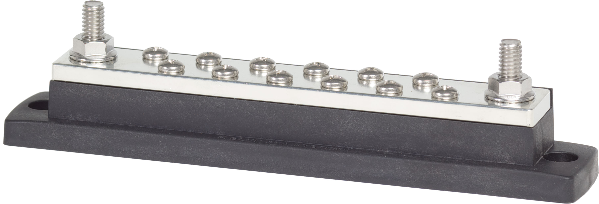

---
hide:
  - toc
tags:
  - product-details
  - power-distribution
  - signal-distribution
---

# 1.6 Ignition Signal Distribution {#ignition-signal-distribution}

/// html | div.product-info
{ loading=lazy }

**Type:** Common BusBar

**Model:** Blue Sea 2105 MaxiBus

**Manufacturer:** Blue Sea Systems

**Product Page:** [MaxiBus 250A BusBar][bluesea-2105]

///

## Overview

Distributes low-current 12V ignition sense signal to non-critical convenience devices. With the keyswitch removed (see [Keyless Ignition][keyless-ignition]), the bus bar input is now sourced from the **ECM Ignition Relay** — a switched relay driven by PMU OUT24 whenever the state machine is in RUN or CRANK.

**Location:** Cabin side of firewall

**Function:** Signal distribution only (not a power bus)

!!! info "Critical Systems Use Dedicated Wires"
Critical engine and power management systems take their own switched supply directly from the ECM Ignition Relay (or PMU OUT24 tap), NOT through this bus bar, for maximum reliability. This includes:

    - **PMU 12V Switched Input (Physical Pin 7):** Direct wire from ECM Ignition Relay output - see [PMU Inputs][pmu-inputs]
    - **Starter Control:** Hardware crank chain (push button → brake → P/N relay → engine-running lockout → Cole Hersee) supplied by PMU OUT24 - see [Starter System][starter-system] and [Keyless Ignition][keyless-ignition]

    **Note:** PMU "Pin 7" (physical connector pin for 12V switched power) is different from PMU "In 7" (digital input channel #7 used for CT4 headlight status).

## Specifications

- **Rating:** 250A AC/DC continuous, 300V AC / 48V DC max
- **Terminals:** 12x #10-24 screws, 2x 5/16"-18 studs
- **Dimensions:** 7.93" L x 1.50" W
- **Accessories:** Insulating cover (Part 2718)
- **Full Specs:** [Blue Sea 2105][bluesea-2105]

## Stud/Terminal Assignment

| Stud/Terminal           | Connection                | Wire Gauge   | Distance              | Max Current     | Notes                                              |
| :---------------------- | :------------------------ | :----------- | :-------------------- | :-------------- | :------------------------------------------------- |
| **Stud 1 (5/16")**      | **ECM Ignition Relay output (INPUT)** | **18 AWG ✓** | **Through firewall (engine bay → cabin)** | **~80mA total** | **5A inline fuse at relay**                     |
| Stud 2 (5/16")          | **[Available]**           | -            | -                     | -               | Future high-current signal                         |
| Terminal 1 (#10-24)     | Command Touch CT4         | 18 AWG ✓     | ~3 ft                 | ~20mA           | Ignition sense for turn signal auto-cancel         |
| Terminal 2 (#10-24)     | SwitchPros SP-1200        | 18 AWG ✓     | ~4 ft                 | ~20mA           | Pin 3 (Lt Blue) - ignition sense                   |
| Terminal 3 (#10-24)     | Fusion MS-RA670 Radio     | 18 AWG ✓     | ~2 ft                 | ~20mA           | Yellow wire - ignition sense                       |
| Terminal 4 (#10-24)     | BCDC Alpha 50             | 18 AWG ✓     | ~12 ft                | ~20mA           | Blue wire - activates charging when engine running |
| Terminal 5 (#10-24)     | **[Available]**           | -            | -                     | -               | Future ignition-switched device                    |
| Terminals 6-12 (#10-24) | **[Available]**           | -            | -                     | -               | Future expansion (7 terminals)                     |

**Utilization:** 5 of 14 used (1 stud + 4 terminals used, 1 stud + 8 terminals available)

## Mounting

**Location:** Cabin side of firewall, behind dash (former keyswitch location now repurposed)

**Benefits:** Single firewall penetration (input only — from ECM Ignition Relay in engine bay), all outputs routed within cabin

## Related Documentation

- [Power Systems Overview][power-overview]
- [PMU Inputs][pmu-inputs] - Pin 7 ignition sense and signal distribution diagram
- [Firewall Ingress][firewall-ingress] - Grommet 2 specifications
- [BCDC Alpha 50][bcdc] - Charging activation

[bluesea-2105]: https://www.bluesea.com/products/2105/MaxiBus_250A_BusBar_-_Two_5_16in-18_Studs_and_Twelve_10-24_Screws
[power-overview]: ../index.md
[pmu-inputs]: ../04-pmu/02-pmu-inputs.md
[firewall-ingress]: ../07-wire-routing/02-firewall-ingress.md
[bcdc]: ../01-power-generation/03-bcdc.md
[keyless-ignition]: ../../05-control-interfaces/06-keyless-ignition.md
[starter-system]: ../../02-engine-systems/01-starter.md
