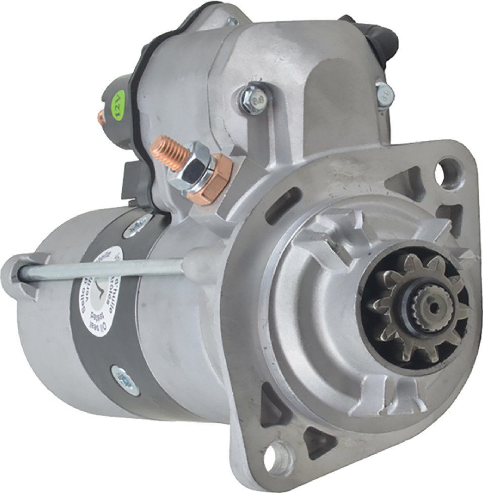

---
hide:
  - toc
tags:
  - product-details
  - engine-systems
  - starter
---

# 2.1 Starter System {#starter-system-cummins-r28}

/// html | div.product-info
{ loading=lazy }

**Type:** High-Torque Diesel Starter

**Model:** DB Electrical 410-52442

**Manufacturer:** DB Electrical

**Product Page:** [DB Electrical 410-52442][db-starter]

**Voltage:** 12V

**Power:** 2.7 kW

**Rotation:** Clockwise (CW)

**Teeth:** 10-tooth pinion

**Mount Type:** PLGR (Planetary Gear Reduction)

**Weight:** 19 lbs

**OEM Cross-Reference:**
- Cummins: 4996706
- Denso: 428000-7090, 438000-3110
- Isuzu: 5-128000-980

///

## System Configuration

**Control Method:** Two-stage relay system

**Main Power Source:** START battery+ direct connection (see [START Battery Distribution][starter-battery] for wire specs)

**Control Solenoid:** Cole Hersee 24213 (85A continuous-duty)

**Safety Interlock:** Clutch pedal switch (normally open)

**Battery Requirement:** 800 CCA minimum (Odyssey PC1500 provides 850 CCA)

## Wiring

| Circuit | Source | Destination | Current | Notes |
|:--------|:-------|:------------|:--------|:------|
| Main Power | START battery+ | Starter solenoid battery post | 400-600A | See [START Battery Distribution][starter-battery] for wire specs |
| Solenoid Power Tap | START battery post | Cole Hersee 24213 input | 30-75A | 10 AWG, ~2 ft |
| Ignition Control | Ignition switch START | Clutch safety switch | ~1A | 16 AWG, ~10 ft |
| Clutch Switch Output | Clutch switch | Cole Hersee 24213 coil+ | ~1.6A | 16 AWG, ~3 ft |
| Solenoid Coil Ground | Cole Hersee 24213 coil- | Engine bay ground bus | ~1.6A | 16 AWG, ~3 ft |
| Solenoid Output | Cole Hersee 24213 output | Starter solenoid switch post | 30-75A | 10 AWG, ~2 ft |
| Ground Return | Starter case | Engine block → START battery- | 400-600A | Via engine bay ground bus |

## Control Flow

```
Ignition START → Clutch Switch → Cole Hersee 24213 Coil → Ground
                                         ↓
                              Solenoid Closes (when clutch depressed)
                                         ↓
                    START battery Post → Cole Hersee Output → Starter Switch Post
                                         ↓
                              Main Solenoid Engages
                                         ↓
                                   Starter Cranks
```

## Starter Motor Terminals

**Battery Post (M8 x 1.25 thread, qty 2):**
- Main power from START battery (2/0 AWG)
- Power tap for control solenoid (10 AWG)

**Switch Post (6.3mm flat male push-on):**
- Trigger from Cole Hersee 24213 output (10 AWG, 30-75A)

**Ground:**
- Via starter mounting bolts to engine block

## Cole Hersee 24213 Solenoid

**Specifications:**
- Rating: 85A continuous duty
- Coil Voltage: 12V DC
- Coil Draw: ~1.6A
- Mounting: Firewall (engine bay side)

**Terminals:**
- Large Stud 1 (Input): From START battery post (M8 terminal, 10 AWG)
- Large Stud 2 (Output): To starter switch post (6.3mm female push-on, 10 AWG)
- Small Terminal 1 (Coil+): From clutch switch (16-18 AWG)
- Small Terminal 2 (Coil-): To engine bay ground bus (16-18 AWG)

## Outstanding Items

- [ ] Determine ignition START wire routing through firewall (Grommet 2)
- [ ] Verify exact firewall mounting location for Cole Hersee 24213 solenoid

## Related Documentation

- [START battery Distribution][starter-battery-distribution] - Main power source
- [Firewall Ingress][firewall-ingress] - Ignition START wire routing
- [Engine Bay Ground Bus][engine-bay-ground-bus] - Ground connections
- [Power Generation][power-generation] - Battery specifications
- [Wire Distance Reference][wire-distance] - Starter to battery routing distances

[db-starter]: https://www.dbelectrical.com/products/starter-for-2-8-cummins-isf2-8-qsb3-9-30-qsb4-5-4996706-428000-7090.html
[starter-battery-distribution]: ../01-power-systems/02-starter-battery-distribution/index.md
[starter-battery]: ../01-power-systems/02-starter-battery-distribution/index.md
[firewall-ingress]: 07-firewall-ingress.md
[engine-bay-ground-bus]: ../01-power-systems/05-grounding/01-engine-bay-ground-bus.md
[power-generation]: ../01-power-systems/01-power-generation/index.md
[wire-distance]: ../01-power-systems/01-power-generation/05-wire-distance-reference.md
