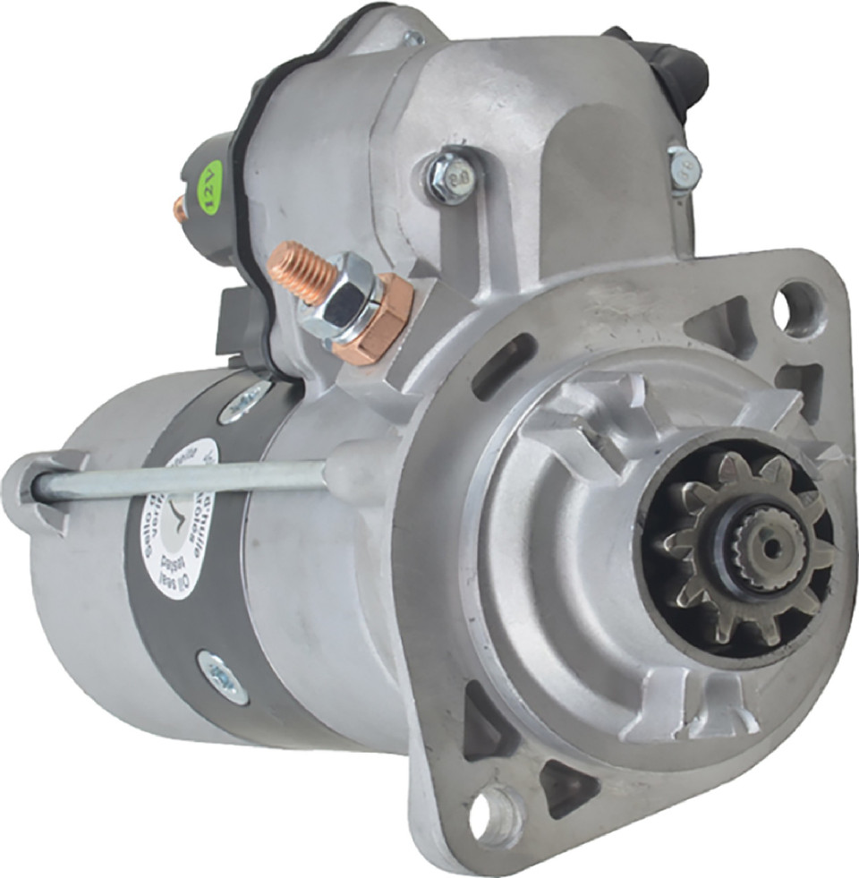

---
hide:
  - toc
tags:
  - product-details
  - engine-systems
  - starter
---

# 2.1 Starter System {#starter-system-cummins-r28}

/// html | div.product-info
{ loading=lazy }

**Type:** High-Torque Diesel Starter

**Model:** DB Electrical 410-52442

**Manufacturer:** DB Electrical

**Product Page:** [DB Electrical 410-52442][db-starter]

**Voltage:** 12V

**Power:** 2.7 kW

**Rotation:** Clockwise (CW)

**Teeth:** 10-tooth pinion

**Mount Type:** PLGR (Planetary Gear Reduction)

**Weight:** 19 lbs

**Mounting:** Engine block (PLGR mount)

**Power Source:** START battery+ direct connection (2/0 AWG)

**OEM Cross-Reference:**

- Cummins: 4996706
- Denso: 428000-7090, 438000-3110
- Isuzu: 5-128000-980

///

## System Configuration

**Control Method:** Two-stage relay system

**Main Power Source:** START battery+ direct connection (see [START Battery Distribution][starter-battery] for wire specs)

**Control Solenoid:** Cole Hersee 24213 (85A continuous-duty)

**Safety Interlock:** PBS-I keyless ignition module sources the crank signal (60A PURPLE START output). Brake interlock and RFID authorization are inside the PBS-I. A single external SPST WAIT-gate relay blocks cranking while the Cummins WAIT-to-Start lamp is on (cold-start grid heater preheat). See [Keyless Ignition][keyless-ignition] for the full architecture.

**Battery Requirement:** 800 CCA minimum (Odyssey PC1500 provides 850 CCA)

## Wiring

| Circuit               | Source                          | Destination                       | Wire Gauge | Current  | Notes                                                            |
| :-------------------- | :------------------------------ | :-------------------------------- | :--------- | :------- | :--------------------------------------------------------------- |
| Main Power            | START battery+                  | Starter solenoid battery post     | 2/0 AWG    | 400-600A | See [START Battery Distribution][starter-battery] for wire specs |
| Solenoid Power Tap    | START battery post              | Cole Hersee 24213 input           | 10 AWG     | 30-75A   | ~2 ft                                                            |
| Start Signal (cabin)  | PBS-I PURPLE START output       | WAIT-gate relay COM (NC input)    | 14 AWG     | ~1.6A    | PBS-I output rated 60A but only Cole Hersee coil downstream      |
| Gated Start (firewall)| WAIT-gate relay NC contact      | Firewall pin TBD → Cole Hersee coil+ | 16 AWG  | ~1.6A    | Open while WAIT-to-Start lamp on; closed otherwise               |
| Solenoid Coil Ground  | Cole Hersee 24213 coil-         | Engine bay ground bus             | 16 AWG     | ~1.6A    | ~3 ft                                                            |
| Solenoid Output       | Cole Hersee 24213 output        | Starter solenoid switch post      | 10 AWG     | 30-75A   | ~2 ft                                                            |
| Ground Return         | Starter case                    | Engine block → START battery-     | 2/0 AWG    | 400-600A | Via engine bay ground bus                                        |

See [Keyless Ignition][keyless-ignition] for PBS-I power, brake input, and WAIT-gate relay coil wiring.

## Control Flow

```text
Driver presses brake + holds Start Button (PBS-I-mounted)
            ↓
PBS-I (cabin) authenticates fob → asserts PINK IGN (ECM powers up) and PURPLE START
            ↓
WAIT-gate relay (NC): closed if WAIT lamp off → start signal passes through
                       open  if WAIT lamp on  → wait for grid heater to finish
            ↓
PBS-I PURPLE START → Firewall pin → Cole Hersee 24213 coil → Ground
            ↓
Cole Hersee main contacts close
            ↓
START battery → Cole Hersee output → Starter switch post → Bendix engages → cranks
            ↓
Engine starts → driver releases button → Cole Hersee de-energizes → Bendix retracts
```

## Starter Motor Terminals

**Battery Post (M8 x 1.25 thread, qty 2):**

- Main power from START battery (2/0 AWG)
- Power tap for control solenoid (10 AWG)

**Switch Post (6.3mm flat male push-on):**

- Trigger from Cole Hersee 24213 output (10 AWG, 30-75A)

**Ground:**

- Via starter mounting bolts to engine block

## Cole Hersee 24213 Solenoid

**Specifications:**

- Rating: 85A continuous duty
- Coil Voltage: 12V DC
- Coil Draw: ~1.6A
- Mounting: Firewall (engine bay side)

**Terminals:**

- Large Stud 1 (Input): From START battery post (M8 terminal, 10 AWG)
- Large Stud 2 (Output): To starter switch post (6.3mm female push-on, 10 AWG)
- Small Terminal 1 (Coil+): From WAIT-gate relay NC contact (16 AWG, gated PBS-I PURPLE START)
- Small Terminal 2 (Coil-): To engine bay ground bus (16-18 AWG)

## Outstanding Items

Starter-circuit-specific items are tracked in the [Keyless Ignition][keyless-ignition] doc and the [TBD Tracker][tbd-tracker], since the crank chain is sourced from the keyless ignition design.

See [installation checklist][install-checklist] for build tasks.

[install-checklist]: ../09-installation/02-engine-systems-checklist.md

## Related Documentation

- [START battery Distribution][starter-battery-distribution] - Main power source
- [Firewall Ingress][firewall-ingress] - Ignition START wire routing
- [Engine Bay Ground Bus][engine-bay-ground-bus] - Ground connections
- [Power Generation][power-generation] - Battery specifications
- [Wire Distance Reference][wire-distance] - Starter to battery routing distances
- [Keyless Ignition][keyless-ignition] - PBS-I sources PURPLE START; WAIT-gate relay gates on grid heater lamp

[db-starter]: https://www.dbelectrical.com/products/starter-for-2-8-cummins-isf2-8-qsb3-9-30-qsb4-5-4996706-428000-7090.html
[starter-battery-distribution]: ../01-power-systems/02-starter-battery-distribution/index.md
[starter-battery]: ../01-power-systems/02-starter-battery-distribution/index.md
[firewall-ingress]: ../01-power-systems/07-wire-routing/02-firewall-ingress.md
[engine-bay-ground-bus]: ../01-power-systems/05-grounding/01-engine-bay-ground-bus.md
[power-generation]: ../01-power-systems/01-power-generation/index.md
[wire-distance]: ../01-power-systems/01-power-generation/05-wire-distance-reference.md
[keyless-ignition]: ../05-control-interfaces/06-keyless-ignition.md
[tbd-tracker]: ../09-installation/00-tbd-tracker.md
