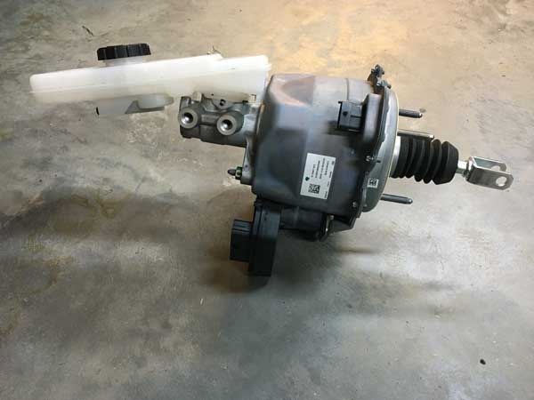

---
hide:
  - toc
tags:
  - product-details
  - engine-systems
  - brake-system
  - ibooster
---

# 2.2 Brake Booster - Bosch iBooster Gen 2 {#brake-booster-system-bosch-ibooster-gen-2}

/// html | div.product-info
{ loading=lazy }

**Type:** Electric vacuum-independent brake booster

**Model:** Bosch iBooster Gen 2

**Manufacturer:** Bosch Mobility

**Product Page:** [Bosch iBooster][bosch-ibooster]

**Mounting:** Factory brake booster location on firewall

**Power Source:** PMU OUT1+10 (40A main), OUT19 (5A ignition signal)

**Wiring Harness:** [Tulay's Wire Werks Gen 2 Universal Harness][tulays-harness]

///

## Overview

Electromechanical brake booster that eliminates the need for engine vacuum. Required for Cummins R2.8 diesel conversions which produce minimal vacuum.

**Donor Vehicle:** Tesla Model 3

## Specifications

- **Current:** 40A peak (braking), 0.25A idle, 12mA standby
- **Mounting Bolt Torque:** 16.5 Nm (12 ft-lb) - 2x nyloc nuts, 13mm
- **Master Cylinder:** Gen 2 specific (not interchangeable with Gen 1)

## Wiring

| Circuit         | Wire Gauge | Source          | Destination             | Notes                          |
| :-------------- | :--------- | :-------------- | :---------------------- | :----------------------------- |
| Main Power      | 10 AWG     | PMU OUT1+10     | iBooster main connector | CONSTANT (safety requirement)  |
| Ignition Signal | 20 AWG     | PMU OUT19       | iBooster ignition input | SWITCHED (ignition RUN)        |
| Ground          | 10 AWG     | iBooster ground | Engine Bay Bus Stud 7   | Same stud as main power ground |

See [PMU Outputs][pmu-outputs] for complete PMU configuration and thermal analysis.

## Installation Resources

- [Wiring the iBooster - EVcreate][evcreate-wiring]
- [Installing the iBooster - EVcreate][evcreate-install]
- [iBooster Donor Vehicles - EVcreate][evcreate-donors]

## Outstanding Items

None - design complete. See [installation checklist][install-checklist] for build tasks.

## Related Documentation

- [PMU Outputs][pmu-outputs] - OUT1+10 and OUT19 configuration
- [Engine Bay Ground Bus][ground-bus] - Stud 7 ground connection
- [Firewall Ingress][firewall-ingress] - Mounting and wire routing

[install-checklist]: ../09-installation/03-engine-systems-checklist.md
[bosch-ibooster]: https://www.bosch-mobility.com/en/solutions/driving-safety/ibooster/
[tulays-harness]: https://tulayswirewerks.com/product/bosch-ibooster-gen-2-universal-wire-harness/
[evcreate-wiring]: https://www.evcreate.com/wiring-the-ibooster/
[evcreate-install]: https://www.evcreate.com/installing-the-ibooster/
[evcreate-donors]: https://www.evcreate.com/ibooster-donor-vehicles/
[pmu-outputs]: ../01-power-systems/04-pmu/03-pmu-outputs.md
[ground-bus]: ../01-power-systems/05-grounding/01-engine-bay-ground-bus.md
[firewall-ingress]: ../01-power-systems/07-wire-routing/02-firewall-ingress.md
