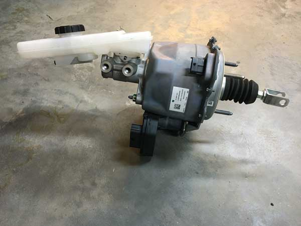
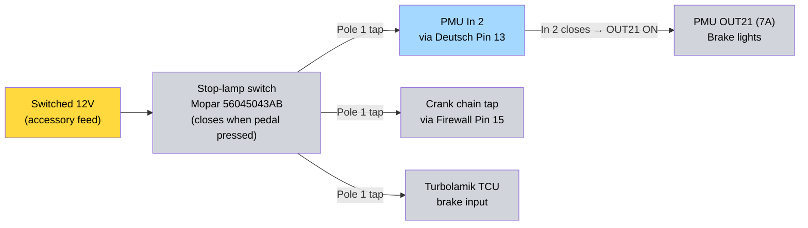

---
hide:
  - toc
tags:
  - product-details
  - engine-systems
  - brake-system
  - ibooster
---

# 2.2 Brake Booster - Bosch iBooster Gen 2 + Wilwood MC {#brake-booster-system-bosch-ibooster-gen-2}

/// html | div.product-info
{ loading=lazy }

**Type:** Electric vacuum-independent brake booster + Wilwood tandem master

**iBooster:** Bosch iBooster Gen 2

**iBooster Donor:** 2018-2022 Honda Accord Hybrid (2.0L, 10th-gen) — Bosch iBooster **Gen 2**[^donor-year]

**Honda OEM Part Numbers:** ⚠️ verify on donor — `46680-T3Z-A00` (booster module) appears to be a **9th-gen** ("T3Z") number, which conflicts with the 10th-gen donor; the 10th-gen Accord booster is the `01469-TVA-` family. `01469-TWA-A58` (MC/reservoir kit). Confirm both against the actual donor before ordering parts or harness.[^donor-year]

[^donor-year]: Donor framing (Gen 2 Honda Accord, 2.0L Hybrid) corroborated by vendors: [EVcreate's donor list](https://www.evcreate.com/ibooster-donor-vehicles/) lists the Honda Accord under **Gen 2**, and Back Bay Customs' adapter is **Honda-Accord-iBooster-only** (vendor, 2026-05-30). The 10th-gen Accord (2.0L Hybrid) runs **2018-2022**, so the earlier "2017" start was corrected to 2018 (2017 is the 9th gen, which used a different — `T3Z`-series — booster). No vendor confirms the specific OEM **part numbers**, and `46680-T3Z-A00` carries a 9th-gen "T3Z" chassis code that conflicts with a 10th-gen donor (10th-gen boosters are `01469-TVA-`), so the part numbers are flagged for first-party verification on the donor in hand rather than asserted. Tulay's Gen 2 harness is universal (year-agnostic), so it does not constrain the part number. Verified 2026-05-30.

**Master Cylinder:** Wilwood Tandem Compact — ⛔ bore TBD, recalc pending (260-15541 1.125" vs 260-15542 1.00")

**MC Adapter:** [Back Bay Customs Wilwood iBooster Adapter][backbay-adapter] — Honda Accord iBooster only (not Tesla); confirmed compatible with Wilwood 260-15542 (vendor, 2026-05-30)

**Reservoirs:** 2× Wilwood 260-16392 (4 oz anodized, remote) — vendor-confirmed OK with adapter[^mc-reservoir]

[^mc-reservoir]: Wilwood 260-16392 confirmed: **4.0 oz** capacity, **9/16-18 × -3 AN** hose connector (the -3 AN feed matches the Plumbing section). Source: [Summit Racing](https://www.summitracing.com/parts/wil-260-16392) / JEGS (checked 2026-05-30; thread figure is retailer-sourced).

**Mounting:** Direct firewall mount via booster's integral 4-stud flange (60×80mm M8, **80mm oriented vertical**) + SendCutSend cabin-side backing plate

**Power Source:** PMU OUT1+10 (40A main), OUT19 (5A ignition signal)

**Wiring Harness:** TBD - [Tulay's Gen 2][tulays-harness] vs [EVcreate Gen 2 kit][evcreate-donors]

///

## Overview

Electromechanical brake booster required for the Cummins R2.8 diesel (minimal manifold vacuum). The Honda Accord Hybrid donor delivers the same Bosch Gen 2 unit as the Tesla Model 3 with better DIY documentation and sourcing. The Honda variant also ships with a factory **remote-mounted** reservoir (Honda solved the angled-reservoir issue at the OEM level) — moot for this build since the MC + reservoir are discarded in favor of the Wilwood ecosystem, but useful context.

The factory Tesla/Honda master cylinder is discarded. The Back Bay Customs adapter mates a Wilwood Tandem Compact master directly to the iBooster, eliminating the angled-reservoir problem on a vertical firewall and putting the brake hydraulics on Wilwood's remote-reservoir ecosystem. (MC bore is pending recalculation — see the Master Cylinder section.)

**Vendor compatibility (Back Bay Customs / Adam, email 2026-05-30):**

- Wilwood 260-15542 Tandem Compact **is compatible** with the adapter. (Note: 260-15542 is the **1.00"** bore unit; the MC bore is now pending recalculation — see the Master Cylinder section.)
- The adapter is designed for the **Honda Accord iBooster only**, *not* the Tesla variant. This build uses the Honda Accord Hybrid donor, so it matches.
- The 2× remote Wilwood reservoirs are fine with the adapter.
- The booster's 60×80mm firewall pattern[^bbc-firewall] must be mounted with the **80mm dimension vertical**. Back Bay offers a separate adapter for an 80mm-horizontal orientation, but it is **out of stock** as of this writing — design around the 80mm-vertical orientation.

## Specifications

### iBooster

- **Current:** 40A peak (braking), 0.25A idle, 12mA standby
- **Mounting Bolt Torque:** 13 Nm (115 in-lb) - 2× nyloc nuts, 13mm (M8)[^ibooster-torque]

### Master Cylinder

!!! danger "⛔ ON HOLD — bore to be recalculated before MC selection"
    Wilwood **260-15542 is a 1.00" bore** master cylinder, not the 1-1/8" stated throughout this doc.[^mc-bore] The 1-1/8" (1.125") Tandem Compact is a **different part — 260-15541**. Rather than assume which is right, the **MC bore is being recalculated** from the brake-system hydraulics before the part is selected. Until then, **do not order the master cylinder.**

    Inputs the recalc needs: caliper piston count + bore (total piston area, front & rear), rotor effective radius, desired pedal effort and travel, pedal ratio, and the iBooster's assist output. Output: required MC bore → selects **260-15541 (1.125")** vs **260-15542 (1.00")**. Note: Adam confirmed adapter fitment against *260-15542*; if the calc lands on 260-15541, re-confirm fitment with him (both are "Tandem Compact," so the mount is almost certainly identical — bore differs internally).

- **Bore:** ⛔ TBD — pending recalculation (1.00" / 260-15542 vs 1.125" / 260-15541)[^mc-bore]
- **Stroke:** 1.100" (260-15542)[^mc-stroke]
- **Outlets:** Tandem (independent front/rear circuits); outlet thread **1/2-20**[^mc-ports]
- **Reservoir Ports:** 11/16-20 (2× - one per circuit, remote feed) — ⚠️ verify[^mc-ports]

[^ibooster-torque]: Honda does not publish a Gen 2 iBooster-specific firewall-mount torque, but the booster mounts on **M8** studs (confirmed M8 by [EVcreate's iBooster install guide](https://www.evcreate.com/installing-the-ibooster/)), and Honda's published **power-brake-booster mounting-nut** torque is consistently **~115 in-lb / 13 Nm** across Accord generations (e.g. 115 in-lb on 2003-2007, 110 in-lb on 6th-gen). Corrected from the earlier unsourced 16.5 Nm estimate to the sourced **13 Nm** — also the conservative direction into the firewall + cabin-side backing plate. Do **not** confuse with the Bosch **16 Nm M12×1 brake-line** nut spec (a different fastener). Sources: [TorqueSpec Database — Accord 2003-2007](https://torque-spec-database.com/honda-accord-2003-2007/) (Power Brake Booster Mounting Nuts 115 in-lb); EVcreate (M8 confirmation). Verified 2026-05-30.
[^mc-bore]: Wilwood [260-15542-BK official page](https://www.wilwood.com/MasterCylinders/MasterCylinderProd?itemno=260-15542-BK) lists **1.00" bore**; the 1-1/8" Tandem Compact is part **260-15541**. Corroborated by multiple retailers (checked 2026-05-30). High confidence the documented "260-15542 = 1-1/8\"" pairing is an error.
[^mc-stroke]: Wilwood 260-15542 official page lists **stroke 1.10"** — matches (checked 2026-05-30).
[^mc-ports]: ⚠️ Wilwood's 260-15542 page lists **1/2-20 outlets**, not 11/16-20. 11/16-20 appears in the Wilwood line only as a separate inlet *adapter fitting* (e.g., the 220-12993 flexline adapter), not the MC's native port — so the "11/16-20 reservoir port" claim likely conflates the flexline adapter thread with the MC port. Verify the actual MC inlet/outlet threads against the Wilwood data sheet before ordering fittings (checked 2026-05-30).

### Plumbing

- **Reservoir → MC feed:** -3 AN PTFE braided (Wilwood standard)
- **MC → calipers:** -3 AN or 3/16" hardline (per brake system design)

## Parts List

| Item | Part # | Source | Status | Notes |
| :--- | :----- | :----- | :----- | :---- |
| iBooster + MC pull | Honda 46680-T3Z-A00 (+ 01469-TWA-A58) — ⚠️ verify part # on donor (see Specs) | eBay / LKQ / Car-Part.com | Offer pending ($195 on $254 listing) | 2018-2022 Accord Hybrid (2.0L, Gen 2) donor |
| Auto brake pedal assembly | 03-06 TJ/LJ auto pedal | eBay / junkyard | **Ordered** | Wider pedal pad than manual; stop-lamp switch + connector included on donor |
| MC adapter | Back Bay Customs | [backbaycustoms.com][backbay] | ✅ Confirmed vs 260-15542 (vendor, 2026-05-30); re-confirm if bore recalc selects 260-15541 | Steel plate + pushrod spacer + nyloc nuts; Honda iBooster only |
| Master cylinder | Wilwood 260-15541 (1.125") **or** 260-15542 (1.00") | Summit / Jegs | ⛔ On hold — bore recalc pending (see warning above) | Tandem Compact, black E-coat; bore TBD |
| Reservoir (×2) | Wilwood 260-16392 | Summit / Jegs | Ready to order (vendor-confirmed OK) | 4 oz anodized, includes -3 AN fitting |
| Dual reservoir bracket | Wilwood 250-16393 | Summit / Jegs | Ready to order | Anodized billet, mounting screws incl. |
| Flexline (×2) | Wilwood 220-12993 | Summit / Jegs | Ready to order | 8" -3 AN, includes 11/16-20 adapter |
| Firewall mount (engine side) | iBooster integral 4-stud flange | Included w/ iBooster | Ships with donor | Bolts directly to firewall — 60×80mm M8 pattern (80mm vertical), 62mm body neck through firewall |
| Firewall reinforcement (cabin side) | SendCutSend custom — see [DXF][backing-plate-dxf] | ~$15-30 | ⚠️ DXF needs redesign for 60×80mm pattern (currently drawn 72×72mm — see Outstanding Items) | 3/16" A36 steel, 152×152mm, 12mm corner radius, 9mm M8 holes, 64mm center bore. Zinc yellow plating |
| Wiring harness | TBD | Tulay's or EVcreate | Decision pending donor arrival | Choice depends on donor pigtail condition |

## Wiring

| Circuit                | Wire Gauge | Source          | Destination             | Notes                          |
| :--------------------- | :--------- | :-------------- | :---------------------- | :----------------------------- |
| Main Power (PMU side)  | 12 AWG × 2 | PMU OUT1, OUT10 | Splice near PMU         | PMU 2.8mm terminals max 12 AWG |
| Main Power (load side) | 10 AWG     | Splice          | iBooster main connector | CONSTANT (safety requirement)  |
| Ignition Signal        | 20 AWG     | PMU OUT19       | iBooster ignition input | SWITCHED (ignition RUN)        |
| Ground                 | 10 AWG     | iBooster ground | Engine Bay Bus Stud 7   | Same stud as main power ground |

**Wire Transition:** PMU terminals accept max 12 AWG. Two 12 AWG wires from OUT1 and OUT10 splice into a single 10 AWG wire **near the PMU** to minimize voltage drop.

See [PMU Outputs][pmu-outputs] for complete PMU configuration and thermal analysis.

## Firewall Backing Plate

3/16" A36 steel sandwich plate that sits on the cabin side of the firewall, opposite the iBooster's integral 4-stud flange. Spreads cantilevered load across a larger area of firewall sheet metal to prevent fatigue cracking at the new M8 holes.

**Geometry:**

- 152mm × 152mm (6"×6") square, 12mm corner radius
- 4× 9mm M8 clearance holes on a **60mm (horizontal) × 80mm (vertical)** rectangular pattern (80mm dimension vertical, per vendor)
- 64mm center pass-through bore (clearance for iBooster body neck protrusion)
- 3/16" (4.76mm) thickness
- Material: A36 mild steel
- Finish: zinc yellow plating (corrosion resistance for the cabin-side mounting area; also lets the plate stay visible-looking-intentional behind the dash)

!!! warning "DXF redesign required"
    The committed `lj-ibooster-backing-plate.dxf` was drawn for a **72×72mm square** hole pattern (holes at ±36mm). Back Bay Customs confirmed (2026-05-30) the iBooster firewall pattern is actually **60×80mm rectangular** (holes at ±30mm horizontal, ±40mm vertical), mounted 80mm-vertical. The DXF must be re-cut to the new pattern before ordering steel. The 152×152mm plate still provides ample edge margin (≥36mm at the ±40mm holes). Confirm the real hole spacing against the donor unit's studs during PLA test-fit before committing to steel.

**CAD file:** [`lj-ibooster-backing-plate.dxf`][backing-plate-dxf] (Fusion 360 — **needs update to 60×80mm pattern**)

**Fabrication workflow:**

1. 3D-print a 1:1 PLA prototype first for trial fit against the LJ firewall + iBooster assembly. Use this to confirm hole spacing matches the donor unit's actual studs and that the 64mm bore clears the booster body neck.
2. Verify clearance for cabin-side hardware (pedal box, HVAC blower, dash brackets) before committing to steel.
3. If PLA mockup fits, upload the DXF to SendCutSend and order in 3/16" A36 steel with zinc yellow plating finish.

## Brake Pedal Assembly

The factory LJ manual-trans pedal must be replaced with the 03-06 TJ/LJ **automatic** brake pedal to remove the clutch pedal and provide the correct pedal arm shape for an iBooster pushrod connection.

**Signal/wiring impact:** None new — the stop-lamp switch (Mopar 56045043AB) is identical on manual and auto brackets. The pedal swap inherits the existing brake-signal wiring already designed across three systems:

```mermaid
flowchart LR
    SUPPLY["Switched 12V<br/>(accessory feed)"]
    SWITCH["Stop-lamp switch<br/>Mopar 56045043AB<br/>(closes when pedal pressed)"]
    PMU["PMU In 2<br/>via Deutsch Pin 13"]
    LIGHTS["PMU OUT21 (7A)<br/>Brake lights"]
    STARTER["Crank chain tap<br/>via Firewall Pin 15"]
    TCU["Turbolamik TCU<br/>brake input"]

    SUPPLY --> SWITCH
    SWITCH -->|"Pole 1 tap"| PMU
    SWITCH -->|"Pole 1 tap"| STARTER
    SWITCH -->|"Pole 1 tap"| TCU
    PMU -->|"In 2 closes → OUT21 ON"| LIGHTS

    style SUPPLY fill:#ffd93d,color:#000
    style SWITCH fill:#d1d5db,color:#000
    style PMU fill:#a5d8ff,color:#000
    style LIGHTS fill:#d1d5db,color:#000
    style STARTER fill:#d1d5db,color:#000
    style TCU fill:#d1d5db,color:#000
```

- **PMU is sensor + brain, not load path:** PMU In 2 senses pedal-pressed; PMU OUT21 (7A) carries the actual brake-light current. Switch itself only handles logic-level (<1A).
- **Single pole used:** TJ/LJ 03-06 stop-lamp switches are 2-pole (4 pins). Pole 1 routes to PMU/starter/TCU; Pole 2 was the factory cruise-deactivation pole — leave disconnected, not in this design.
- **Splice location:** Pole 1 output splices in the cabin into three branches — one to each downstream consumer.

See [tail/brake][tail-brake] (PMU lighting flow), [starter][starter] (crank chain), and [transmission][transmission] (TCU brake input) for the downstream details.

**Mechanical impact:**

- **Pushrod interface:** Same on both pedal styles - iBooster clevis attaches at factory pushrod hole. Pivot-to-pushrod distance is identical; pedal arm shape differs (straight on auto vs. offset on manual) but does not affect the pedal ratio. Bench-measure before final assembly to confirm.
- **BTSI provision:** Auto pedal has a second boss for the factory floor-shifter BTSI solenoid - leave empty; Kilduff/Turbolamik handles unlock-from-Park electronically.
- **Clutch removal:** Clutch pedal, clutch master cylinder, and CMC firewall pass-through are no longer used. Plug the ~1.25" CMC hole in the firewall with a block-off plate or weld closed.
- **Pedal pad:** Auto pedal pad is wider - cosmetic only.

**Donor checks:**

- Stop-lamp switch + retaining clip present (or buy new Mopar 56045043AB)
- Pushrod hole bushing in good shape
- Pedal arm not bent/cracked at pivot

## Installation Notes

- **Firewall mounting strategy:** Factory LJ vacuum booster holes are abandoned. The Honda Gen 2 iBooster bolts directly to the firewall via its own integral 4-stud flange (60×80mm M8 pattern, **80mm dimension vertical** per Back Bay Customs; 62mm body neck through the firewall) — no separate steel bracket. Drill matching holes in the LJ firewall, then sandwich a SendCutSend 3/16" steel backing plate on the cabin side to distribute the cantilevered load and prevent fatigue cracking at the new holes. If an 80mm-horizontal orientation is ever required, Back Bay sells a re-orientation adapter (currently out of stock).
- **Fallback paths:** If integral flange has engine-bay packaging conflicts, fall back to (a) SendCutSend custom one-off firewall plate that re-patterns mounting holes, or (b) Back Bay Customs one-off commission — *only worthwhile if they have access to an LJ for trial fit; without one, customer-measurement-blind design carries the same risk as SendCutSend at higher cost.*
- **Reservoir height:** Mount reservoirs 4-6" above MC flange on firewall standoff for proper gravity feed. More than 6" risks hood clearance issues.
- **Bench test before fab:** Apply 12V ignition signal to the iBooster and verify motor cycles + pedal rod assists. Used iBoosters fail frequently.
- **Cantilever support:** Gen 2 is lighter than Gen 1 but on a vertical firewall through-hole the cantilevered load + Jeep vibration warrants a secondary front support point (inner fender or frame brace).
- **Pushrod length (MC side):** Back Bay's adapter pre-sets MC pushrod length - no adjustment required.
- **Pushrod length (pedal side):** Re-measure after auto-pedal swap; adjust per iBooster install kit instructions (Tulay's or EVcreate) before bleeding.

## Installation Resources

- [Wiring the iBooster - EVcreate][evcreate-wiring]
- [Installing the iBooster - EVcreate][evcreate-install]
- [iBooster Donor Vehicles - EVcreate][evcreate-donors]
- [Back Bay Customs Shop][backbay]

## Outstanding Items

**Waiting on external action:**

- [x] ~~Confirm Back Bay Customs MC adapter compatibility with Wilwood 260-15542~~ — ✅ confirmed by vendor (Adam, 2026-05-30): adapter fits the 260-15542, is Honda-iBooster-only (not Tesla), and the remote reservoirs are fine. Blocker cleared.
- [ ] Close iBooster eBay offer ($195 sent on $254 listing)

**MC bore — recalc before ordering (🔴 blocker):**

- [ ] 🔴 Recalculate the required MC bore from the brake-system hydraulics (caliper piston area front/rear, rotor effective radius, pedal ratio, desired pedal effort/travel, iBooster assist) → selects **260-15541 (1.125")** vs **260-15542 (1.00")**. Hold the MC order until resolved.
- [ ] If recalc selects 260-15541, re-confirm adapter fitment with Back Bay Customs (both are Tandem Compact; mount almost certainly identical)

**Backing plate redesign (vendor revised the firewall pattern):**

- [ ] 🔴 Redesign `lj-ibooster-backing-plate.dxf` from the 72×72mm square pattern to the confirmed **60×80mm rectangular** pattern (holes at ±30mm H / ±40mm V, 80mm vertical). Center bore (Ø64), plate size (152×152mm), and corner radius unchanged. Blocks the SendCutSend steel order.
- [ ] Update firewall drilling jig/template to the 60×80mm pattern before mocking up

**In progress:**

- [x] ~~Source 03-06 TJ/LJ automatic brake pedal assembly~~ — ordered; verify donor checks (switch + clip, pushrod hole bushing, pedal arm condition) on arrival
- [ ] 3D-print PLA prototype of the **revised** backing plate ([DXF][backing-plate-dxf]) for trial fit; verify the 60×80mm hole spacing against donor studs and clearance for cabin-side hardware

**Pending donor arrival:**

- [ ] Bench test donor iBooster before any fab work (12V to ignition signal → motor cycles + pedal rod assists)
- [ ] Verify 4 mounting studs intact and body neck undamaged
- [ ] Photograph back face — finalize backing plate alignment + harness pigtail condition
- [ ] Select wiring harness: Tulay's Gen 2 universal (plug-and-play) vs EVcreate Gen 2 connector kit (DIY)

**Pending mockup:**

- [ ] Mock up iBooster + Wilwood MC assembly against LJ firewall (cardboard/3D-print) to verify engine-bay clearance before drilling
- [ ] Confirm flexline length after firewall mockup (220-12993 = 8", longer SKUs available if needed)
- [ ] Design / select reservoir standoff bracket location and height (4-6" above MC flange)

**Ordering:**

- [ ] ⛔ Order master cylinder — **HELD pending bore recalc** (260-15541 1.125" vs 260-15542 1.00")
- [ ] Order bore-independent plumbing: 2× 260-16392 reservoirs + 250-16393 dual bracket + 2× 220-12993 flexlines (OK to order — vendor-confirmed, not affected by bore)
- [ ] Order Back Bay Customs Wilwood MC adapter (confirmed vs 260-15542; re-confirm first if recalc selects 260-15541)

**Fab + install:**

- [ ] After PLA fit confirms: order SendCutSend backing plate in 3/16" A36 steel with zinc yellow plating
- [ ] Drill LJ firewall: 4× M8 clearance holes (60×80mm pattern, 80mm vertical) + 62mm center bore for booster shaft pass-through
- [ ] Plug clutch master cylinder firewall hole (~1.25" block-off plate or weld closure)

## Related Documentation

- [PMU Outputs][pmu-outputs] - OUT1+10 and OUT19 configuration
- [Engine Bay Ground Bus][ground-bus] - Stud 7 ground connection
- [Firewall Ingress][firewall-ingress] - Mounting and wire routing

[install-checklist]: ../09-installation/02-engine-systems-checklist.md
[bosch-ibooster]: https://www.bosch-mobility.com/en/solutions/driving-safety/ibooster/
[tulays-harness]: https://tulayswirewerks.com/product/bosch-ibooster-gen-2-universal-wire-harness/
[backbay]: https://backbaycustoms.com/products/
[backbay-adapter]: https://backbaycustoms.com/products/
[evcreate-wiring]: https://www.evcreate.com/wiring-the-ibooster/
[evcreate-install]: https://www.evcreate.com/installing-the-ibooster/
[evcreate-donors]: https://www.evcreate.com/ibooster-donor-vehicles/
[^bbc-firewall]: Back Bay Customs (adapter maker, Adam), email to owner 2026-05-30. First vendor-confirmed firewall bolt pattern; supersedes the earlier unsourced "72×72mm" estimate introduced in PR #12, which the original backing-plate DXF was cut to.

[pmu-outputs]: ../01-power-systems/04-pmu/03-pmu-outputs.md
[ground-bus]: ../01-power-systems/05-grounding/01-engine-bay-ground-bus.md
[firewall-ingress]: ../01-power-systems/07-wire-routing/02-firewall-ingress.md
[tail-brake]: ../03-lighting-systems/04-tail-brake-reverse.md
[starter]: 01-starter.md
[transmission]: ../10-drivetrain/01-transmission.md
[backing-plate-dxf]: ../resources/lj-ibooster-backing-plate.dxf
