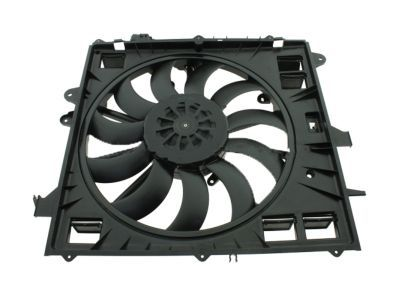

---
hide:
  - toc
tags:
  - product-details
  - engine-systems
  - radiator-fan
---

# 2.6 Radiator Fan {#radiator-fan-system}

/// html | div.product-info
{ loading=lazy }

**Type:** Electric radiator fan

**Model:** GM 84100128

**Manufacturer:** General Motors

**Product Page:** [GM Parts Direct 84100128][gm-fan]

**Mounting:** Radiator shroud

**Power Source:** PMU OUT2+3+4 combined (75A capacity)

///

## Overview

Brushless PWM electric fan with automatic temperature control via PMU24. J1939 CAN bus coolant temp (SPN 110) drives PMU PWM output.

## Specifications

- **Current:** 53A @ full speed, 32A @ 60%, 16A @ 30%
- **Airflow:** 4188 CFM installed, 5690 CFM free air

## Temperature Control

| Coolant Temp | Fan Speed    | PMU Duty Cycle | Current |
| :----------- | :----------- | :------------- | :------ |
| <185°F       | OFF          | 100%           | 0A      |
| 185-195°F    | Low (30%)    | 70%            | ~16A    |
| 195-205°F    | Medium (60%) | 40%            | ~32A    |
| ≥205°F       | Full (100%)  | 10%            | 53A     |

!!! warning "Inverted Duty Cycle"
GM brushless fans use **inverted duty cycle** - high duty cycle = low fan speed. PMU programming must account for this inversion.

## Wiring

| Circuit              | Wire Gauge | Source               | Destination     | Notes                          |
| :------------------- | :--------- | :------------------- | :-------------- | :----------------------------- |
| Fan Power (PMU side) | 12 AWG × 3 | PMU OUT2, OUT3, OUT4 | Splice near PMU | PMU 2.8mm terminals max 12 AWG |
| Fan Power (load side)| 4 AWG      | Splice               | Fan motor (+)   | ~6 ft, ~1.2% drop @ 53A        |
| Fan Ground           | 4 AWG      | Fan motor (-)        | Engine Bay Bus  | Short run                      |

**Wire Transition:** PMU terminals accept max 12 AWG. Three 12 AWG wires from OUT2, OUT3, and OUT4 splice into a single 4 AWG wire **near the PMU** (not the fan) to minimize voltage drop - 4 AWG for the long run is better than 3× 12 AWG in parallel.

See [PMU Outputs][pmu-outputs] for complete configuration and [PMU Programming][pmu-programming] for control logic.

## Outstanding Items

None - design complete. See [installation checklist][install-checklist] for build tasks.

## Related Documentation

- [PMU Outputs][pmu-outputs] - OUT2+3+4 configuration
- [PMU Programming][pmu-programming] - PWM control logic
- [Engine Bay Ground Bus][ground-bus] - Fan ground connection

[gm-fan]: https://www.gmpartsdirect.com/oem-parts/gm-fan-84100128
[install-checklist]: ../09-installation/02-engine-systems-checklist.md
[pmu-outputs]: ../01-power-systems/04-pmu/03-pmu-outputs.md
[pmu-programming]: ../01-power-systems/04-pmu/04-pmu-programming.md
[ground-bus]: ../01-power-systems/05-grounding/01-engine-bay-ground-bus.md
