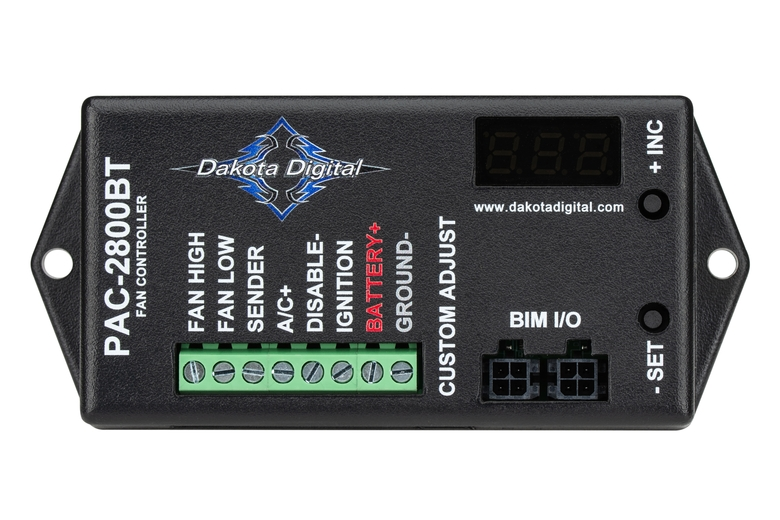

---
hide:
  - toc
---

# 2.6.2 Fan Controller {#fan-controller}

/// html | div.product-info
{ loading=lazy }

**Type:** Bluetooth programmable fan controller with CAN integration

**Model:** PAC-2800BT

**Manufacturer:** Dakota Digital

**Product Page:** [PAC-2800BT][product-link]

**Manual:** [Installation & Programming Guide][manual-link]

///

## Specifications

| Parameter | Specification |
|:----------|:--------------|
| **Input Voltage** | 9-16V DC |
| **Power Consumption** | <1A (control circuit) |
| **Relay Rating** | 70A continuous |
| **Control Method** | Staged relay (on/off) |
| **CAN Protocol** | J1939 (250 kbps) |
| **CAN Adapter Required** | BIM-01-2 (translates J1939 for controller) |
| **Programming Interface** | Bluetooth (iOS/Android app) |
| **Temperature Range** | Programmable setpoints (typically 150-250°F) |
| **Dimensions** | 4" W × 2.25" H × 1" D |
| **Mounting** | TBD - engine bay or firewall |

## Features

- **J1939 CAN Bus Integration:** Reads coolant temperature directly from ECM
- **Bluetooth Programmable:** Set activation/deactivation temps via smartphone
- **70A Relay Included:** High-current relay for direct fan motor control
- **On/Off Control:** Relay operation only (fan runs full speed when active)
- **Hysteresis Control:** Prevents rapid relay cycling

**Note:** GM 84100128 is PWM-capable brushless fan, but PAC-2800BT provides relay control only. Fan runs at full speed (53A) when relay closes.

## Wiring

**PAC-2800BT Controller (Cabin):**

| Connection | Wire Gauge | Source | Destination | Distance | Voltage @ Load | Notes |
|:-----------|:-----------|:-------|:------------|:---------|:---------------|:------|
| **Controller Power** | 16 AWG ✓ | [Critical Cabin PDU][cabin-pdu] Slot 1 (5A) | PAC-2800BT 12V input | <2 ft | ~14.0V | CONSTANT power from cabin PDU |
| **BIM-01-2 Cable** | Included | Dakota Digital control box | PAC-2800BT | <3 ft | - | 3-wire: ground, ignition sense, J1939 data |
| **Relay Trigger** | 18 AWG ✓ | PAC-2800BT output (White) | Through firewall → Relay Terminal 85 | ~8 ft | - | Ground-trigger for relay coil |

**External Relay (Engine Bay):**

| Connection | Wire Gauge | Source | Destination | Distance | Voltage @ Load | Notes |
|:-----------|:-----------|:-------|:------------|:---------|:---------------|:------|
| **Relay Power Input (Green/Terminal 30)** | 4 AWG ✓ | CONSTANT bus via 80A CB | Relay Terminal 30 | ~3 ft | ~14.0V | High-current power input |
| **Relay Output (Black/Terminal 87)** | 4 AWG ✓ | Relay Terminal 87 | Fan motor (+) | ~13 ft | 13.46V | Switched output to fan |
| **Relay Coil Power (Red/Terminal 86)** | 18 AWG ✓ | CONSTANT bus via 80A CB | Relay Terminal 86 | ~3 ft | ~14.0V | Coil +12V (shares power with Terminal 30) |
| **Relay Coil Trigger (White/Terminal 85)** | 18 AWG ✓ | Through firewall ← PAC-2800BT | Relay Terminal 85 | ~8 ft | - | Ground-trigger from controller |

**Relay Operation:**

- Terminal 30/Green (input): Always powered from CONSTANT bus (80A CB)
- Terminal 87/Black (output): Switched to fan motor when relay energized
- Terminal 86/Red (coil +12V): Powered from CONSTANT bus (80A CB, shares same source as Terminal 30)
- Terminal 85/White (coil trigger): Ground-trigger from PAC-2800BT when temp high
- When temp exceeds setpoint: Controller triggers ground → relay closes → fan runs
- When temp drops below setpoint: Controller releases ground → relay opens → fan stops

**CAN Bus Integration:**

- BIM-01-2 adapter taps J1939 CAN bus at Dakota Digital gauge cluster
- BIM-01-2 3-wire cable (included) provides power, ground, and J1939 data to PAC-2800BT
- Coolant temperature read from ECM J1939 broadcast
- No ECM programming required
- No separate controller power/ground wiring needed

## Mounting

**Location:** Cabin side firewall - Dakota Digital HDPE panel

**Details:**

- Mounted on HDPE panel with other Dakota Digital modules (01-2-J1939, GPS-50-2, BIM-22-3, BIM-17-2)
- Accessible for Bluetooth pairing during setup
- Protected from engine bay heat and water spray
- BIM-01-2 adapter mounted on same panel
- See [Dakota Digital Gauge Cluster][gauge-cluster] for HDPE panel details

## Programming

**Via Bluetooth App:**

1. Download Dakota Digital app (iOS or Android)
2. Power on PAC-2800BT controller
3. Enable Bluetooth on smartphone
4. Pair with PAC-2800BT (controller must be powered)
5. Configure temperature setpoints:
   - Activation temperature (fan turns on)
   - Deactivation temperature (fan turns off)
   - Hysteresis (difference between on/off temps)
6. Save configuration
7. Test operation by monitoring coolant temp

**See [Radiator Fan System][radiator-fan] for recommended temperature setpoints**

## Outstanding Items

- [ ] Determine CONSTANT bus 80A CB mounting location
- [ ] Determine CAN tap location at Dakota Digital gauge cluster
- [ ] Test Bluetooth pairing and app configuration
- [ ] Verify BIM-01-2 adapter included or order separately
- [ ] Determine firewall grommet for relay trigger wire (18 AWG)
- [ ] Determine relay mounting location in engine bay

## Related Documentation

- [Radiator Fan System][radiator-fan] - Complete system overview, programming, installation
- [Fan Motor][fan-motor] - Camaro fan specifications
- [Dakota Digital Gauge Cluster][gauge-cluster] - J1939 CAN bus tap location
- [Critical Cabin PDU][cabin-pdu] - Controller power source
- [CONSTANT Bus][constant-bus] - Relay power source (Terminal 30 + Terminal 86)
- [Firewall Ingress][firewall-ingress] - Wire routing through firewall
- [Engine Bay Ground Bus][ground-bus] - Ground connection location

[product-link]: https://www.dakotadigital.com/index.cfm/page/ptype=product/product_id=1207/category_id=403/mode=prod/prd1207.htm
[manual-link]: https://www.dakotadigital.com/index.cfm/page/ptype=product/product_id=1207/category_id=403/mode=prod/prd1207.htm
[radiator-fan]: index.md
[fan-motor]: 01-fan-motor.md
[gauge-cluster]: ../../04-control-interfaces/04-gauge-cluster.md
[cabin-pdu]: ../../01-power-systems/02-starter-battery-distribution/03-critical-cabin-pdu.md
[constant-bus]: ../../01-power-systems/02-starter-battery-distribution/02-constant-bus.md
[firewall-ingress]: ../07-firewall-ingress.md
[ground-bus]: ../../01-power-systems/05-grounding/03-engine-bay-ground-bus.md
