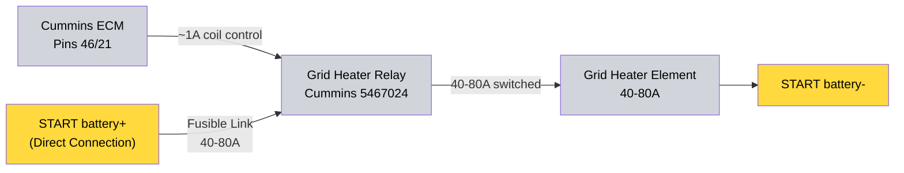

---
hide:
  - toc
tags:
  - product-details
  - engine-systems
  - grid-heater
  - cummins
---

# 2.9 Grid Heater System {#29-grid-heater-system}

/// html | div.product-info

**Type:** Cold-start air intake heater

**Model:** Grid Heater Relay

**Part Number:** Cummins 5467024

**Manufacturer:** Cummins

**Mounting:** Engine bay near intake manifold

**Power Source:** START battery+ direct (via fusible link, 40-80A)

**Control:** Direct ECM control (pins 46/21)

///

## System Architecture

1. **ECM Control (Direct):**
   - ECM triggers grid heater relay directly via pins 46/21 (~0.5-1A)
   - ECM manages timing, temperature thresholds, and duty cycle
   - No PMU involvement - ECM knows engine temperature better than external controller

2. **Grid Heater Relay (Cummins 5467024):**
   - Coil Power: ECM pins 46/21 (~1A) - direct connection
   - Main Power: Direct from START battery+ via fusible link (bypasses all bus bars and PMU)
   - Main Ground: START battery- or NEGATIVE bus
   - Output: 80A to grid heater element (design value - verify via resistance measurement during installation)
   - Protection: Integrated fusible link

3. **Grid Heater Element:**
   - Location: Intake manifold
   - Power: 80A from relay (design value)
   - Duty Cycle: 3-5 seconds during cold start (ECM controlled)

## Wiring Summary

**Two-Stage Design:** ECM pins 46/21 (1A) → relay coil → relay switches high current (40-80A) directly from battery to element.

## Why Direct ECM Control

- ECM has accurate engine temperature data
- ECM knows optimal grid heater timing for cold starts
- Eliminates unnecessary complexity of PMU passthrough
- Frees PMU output slots for other critical systems

## Power Distribution

**Bypasses all distribution systems:**

- Does NOT use CONSTANT bus bar
- Does NOT use PMU outputs
- Direct battery connection with fusible link protection

**Reason:** High current draw (40-80A) for very short duration (3-5 seconds). Direct connection minimizes voltage drop and connection complexity.

## Outstanding Items

None - design complete. See [installation checklist][install-checklist] for build tasks.

## Related Documentation

- [PMU Power Distribution][pmu-power-distribution] - Engine bay power management
- [START Battery Distribution][starter-battery-distribution] - Direct battery connections

[install-checklist]: installation-checklist.md
[pmu-power-distribution]: ../01-power-systems/04-pmu/index.md
[starter-battery-distribution]: ../01-power-systems/02-starter-battery-distribution/index.md
