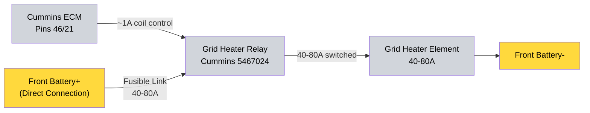

# 2.9 Grid Heater System {#29-grid-heater-system}
**Type:** Cold-start air intake heater

**Relay:** Cummins Part# 5467024 (OEM R2.8 relay)

**Control:** Direct ECM control (no PMU involvement)

**Function:** Cold-start aid for ambient temperatures below ~50°F

## System Architecture

1. **ECM Control (Direct):**
   - ECM triggers grid heater relay directly via pins 46/21 (~0.5-1A)
   - ECM manages timing, temperature thresholds, and duty cycle
   - No PMU involvement - ECM knows engine temperature better than external controller

2. **Grid Heater Relay (Cummins 5467024):**
   - Coil Power: ECM pins 46/21 (~1A) - direct connection
   - Main Power: Direct from Front Battery+ via fusible link (bypasses all bus bars and PMU)
   - Main Ground: Front Battery- or NEGATIVE bus
   - Output: 40-80A to grid heater element
   - Protection: Integrated fusible link

3. **Grid Heater Element:**
   - Location: Intake manifold
   - Power: 40-80A from relay
   - Duty Cycle: 3-5 seconds during cold start (ECM controlled)

## Wiring Summary

**Two-Stage Design:** ECM pins 46/21 (1A) → relay coil → relay switches high current (40-80A) directly from battery to element.

## Why Direct ECM Control

- ECM has accurate engine temperature data
- ECM knows optimal grid heater timing for cold starts
- Eliminates unnecessary complexity of PMU passthrough
- Frees PMU output slots for other critical systems

## Power Distribution

**Bypasses all distribution systems:**
- Does NOT use CONSTANT bus bar
- Does NOT use SWITCHED bus bar
- Does NOT use PMU outputs
- Direct battery connection with fusible link protection

**Reason:** High current draw (40-80A) for very short duration (3-5 seconds). Direct connection minimizes voltage drop and connection complexity.

## Related Documentation

- [PMU Power Distribution][pmu-power-distribution] - Engine bay power management
- [Front Battery Distribution][zone-1-front-battery-tray--primary-distribution-engine-bay] - Direct battery connections

## Outstanding Items

- [ ] Wire ECM pins 46/21 directly to grid heater relay coil (Cummins 5467024)
- [ ] Install fusible link from Front Battery+ to grid heater relay main power terminal
- [ ] Connect grid heater relay ground to Front Battery- or NEGATIVE bus
- [ ] Verify grid heater relay mounting location (engine bay, near intake manifold)
- [ ] Test grid heater operation in cold conditions (below 50°F ambient)
