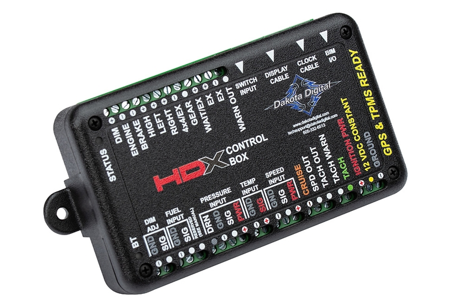

---
hide:
  - toc
tags:
  - product-details
  - gauge-cluster
  - control-module
---

# 4.4.1 HDX Control Module {#hdx-control-module}

/// html | div.product-info
{ loading=lazy }

**Type:** Digital Instrument Control Box

**Model:** HDX Control Module (Black)

**Manufacturer:** Dakota Digital

**Manual:** [HDX System Manual][manual-link]

///

## Overview

Main control box for HDX instrument system. Processes sensor inputs, BIM module data, and J1939 CAN bus signals to drive dashboard cluster display.

**Mounting:** HDPE panel on firewall behind dashboard

**Power:** [PMU OUT9][pmu-outputs] (25A capacity, CONSTANT power)

## Specifications

- **Dimensions:** 5.5" W × 3.5" D × 1" H
- **Power Input:** 12V DC (8-23V operating range)
- **Fuse Requirement:** 5-20A max (per manufacturer specification)
- **Recommended Fuse:** 10A (adequate for entire HDX system including BIM modules)
- **Current Draw:** IGN Off ≈ 0.3mA, IGN On ≈ 250-750mA (confirms 10A fuse sizing)
- **BIM Ports:** 3.5mm headphone jack (supports up to 16 BIM modules via daisy-chain)
- **Display Output:** Proprietary cable to HDX dashboard cluster
- **Configuration:** Bluetooth app (iOS/Android) for setup and diagnostics

**Input Signal Thresholds:**

- **Active High** (HIGH, LEFT, RIGHT, GEAR, WAIT, DIM, EX+): Low ≤4V, High ≥8V
- **Active Low** (Check/ENGINE, BRAKE, CRUISE, 4x4, EX-): Low ≤8V, High ≥9V
- **Tachometer:** Normal mode 3-7.5V, Low-voltage mode 1-4V
- **Speedometer:** Square wave >1.2Vp-p or sine wave >1.4Vp-p

**Output Capabilities:**

- **WARN, SPD outputs:** <600mA max

## Inputs

**Included Sensors:**

- Water temperature sender (100-260°F)
- Oil pressure sender (0-80 psi)

**BIM Module Expansion:**

- J1939 CAN bus interface (BIM-01-2-J1939)
- GPS speed/compass (GPS-50-2)
- TPMS (BIM-22-3)
- Compass/outside temp (BIM-17-2)

**Fuel Level:**

- Factory TJ fuel level sender (variable resistance)

## Wiring

| Connection               | Pin/Wire    | Source                       | Destination             | Notes                                            |
| :----------------------- | :---------- | :--------------------------- | :---------------------- | :----------------------------------------------- |
| DIM ADJ - GND            | -           | -                            | -                       | Not used (dash dimming via DIM input instead)    |
| DIM ADJ - SIG            | -           | -                            | -                       | Not used (dash dimming via DIM input instead)    |
| **FUEL INPUT - GND**     | -           | Factory TJ fuel sender       | HDX fuel GND            | Sender ground                                    |
| **FUEL INPUT - SIG**     | 18 AWG ✓    | Factory TJ fuel sender       | HDX fuel SIG            | Variable resistance sender signal                |
| **PRESSURE INPUT - DRN** | -           | Included oil pressure sender | HDX pressure DRN        | Included sensor - OR use J1939 oil pressure      |
| **PRESSURE INPUT - GND** | -           | Included oil pressure sender | HDX pressure GND        | Included sensor - OR use J1939 oil pressure      |
| **PRESSURE INPUT - SIG** | -           | Included oil pressure sender | HDX pressure SIG        | Included sensor - OR use J1939 oil pressure      |
| **PRESSURE INPUT - PWR** | -           | Included oil pressure sender | HDX pressure PWR        | Included sensor - OR use J1939 oil pressure      |
| **TEMP INPUT - GND**     | -           | Included water temp sender   | HDX temp GND            | Included sensor - OR use J1939 coolant temp      |
| **TEMP INPUT - SIG**     | -           | Included water temp sender   | HDX temp SIG            | Included sensor - OR use J1939 coolant temp      |
| SPEED INPUT - GND        | -           | -                            | -                       | Not used (GPS-50-2 provides speedometer via BIM) |
| SPEED INPUT - SIG        | -           | -                            | -                       | Not used (GPS-50-2 provides speedometer via BIM) |
| SPEED INPUT - PWR        | -           | -                            | -                       | Not used (GPS-50-2 provides speedometer via BIM) |
| CRUISE                   | -           | -                            | -                       | Not used (no cruise control)                     |
| SPD OUT                  | -           | -                            | -                       | Not used                                         |
| TACH OUT                 | -           | -                            | -                       | Not used                                         |
| TACH WARN                | -           | -                            | -                       | Not used (J1939 provides tach via BIM-01-2)      |
| TACH                     | -           | -                            | -                       | Not used (J1939 provides tach via BIM-01-2)      |
| **IGNITION PWR**         | 16 AWG      | Ignition bus bar             | HDX ignition input      | Switched 12V for ignition-controlled features    |
| **12 VDC CONSTANT**      | 16 AWG ✓    | Critical Cabin PDU Slot 2    | HDX power input         | 10A fuse, CONSTANT power, ~2 ft                  |
| **DIM**                  | 18 AWG ✓    | Tail light circuit           | HDX DIM input           | Dash dimming control (variable voltage)          |
| **ENGINE**               | 18 AWG ✓    | ECM harness                  | HDX ENGINE input        | Check engine light / MIL signal (active low)     |
| **BRAKE**                | 18 AWG ✓    | Brake switch or CT4          | HDX BRAKE input         | Brake pedal indicator                            |
| **HIGH**                 | 18 AWG ✓    | CT4 high beam output         | HDX HIGH input          | High beam indicator                              |
| **LEFT**                 | 18 AWG ✓    | CT4 left turn output         | HDX LEFT input          | Left turn indicator                              |
| **RIGHT**                | 18 AWG ✓    | CT4 right turn output        | HDX RIGHT input         | Right turn indicator                             |
| **4x4/EX**               | 18 AWG ✓    | Transfer case switch         | HDX 4x4/EX input        | 4WD/4LO indicators                               |
| GEAR                     | -           | -                            | -                       | Not used (manual transmission)                   |
| **WAIT/EX**              | 18 AWG ✓    | ECM harness                  | HDX WAIT/EX input       | Wait-to-start indicator (active high)            |
| EX                       | -           | -                            | -                       | Reserved                                         |
| EX                       | -           | -                            | -                       | Reserved                                         |
| WARN OUT                 | -           | -                            | -                       | Not used                                         |
| SWITCH INPUT             | -           | -                            | -                       | Not used (capacitive touch buttons on cluster)   |
| **DISPLAY CABLE**        | Proprietary | HDX control                  | Dashboard cluster       | Factory harness included, ~2 ft                  |
| CLOCK CABLE              | -           | -                            | -                       | Not used (GPS-50-2 provides clock sync via BIM)  |
| **BIM I/O**              | Proprietary | HDX 3.5mm jack               | BIM modules             | Daisy-chain to 4 BIM modules (power + data)      |
| **Ground**               | 16 AWG ✓    | HDX ground                   | Critical PDU ground bus | Shared cabin ground, ~1 ft                       |

## BIM Module Integration

All BIM modules connect via single daisy-chain harness from HDX control 3.5mm port:

- HDX Control → BIM-01-2-J1939 → GPS-50-2 → BIM-22-3 → BIM-17-2
- Power and data carried over BIM/IO cables (no separate power wiring)
- Modules auto-detect and configure via Bluetooth app

## Outstanding Items

- [ ] Determine 4WD/4LO indicator signal types (NP241 Rubicon transfer case outputs)
- [ ] Determine brake indicator source (brake switch vs CT4 output)
- [ ] Identify specific ECM harness pins for ENGINE (CEL) and WAIT signals

## Related Documentation

- [Dakota Digital System Overview][gauge-system] - Complete system architecture
- [Dashboard Cluster][dashboard-cluster] - HDX display specifications
- [BIM Modules][bim-j1939] - Expansion module details
- [PMU Outputs][pmu-outputs] - Power source (OUT9)
- [Ignition Signal Distribution][ignition-bus] - Ignition power source
- [Command Touch CT4][ct4] - Lighting signal sources (turn, high beam, etc.)
- [Cummins R2.8 ECM][ecm] - WAIT/EX and ENGINE (CEL) signal sources

[manual-link]: https://www.dakotadigital.com/pdf/HDX_manual_main.pdf
[gauge-system]: index.md
[dashboard-cluster]: 02-dashboard-cluster.md
[bim-j1939]: 03-bim-j1939.md
[pmu-outputs]: ../../01-power-systems/04-pmu/03-pmu-outputs.md
[ignition-bus]: ../../01-power-systems/06-ignition-signal/index.md
[ct4]: ../../05-control-interfaces/03-command-touch-ct4.md
[ecm]: ../index.md
