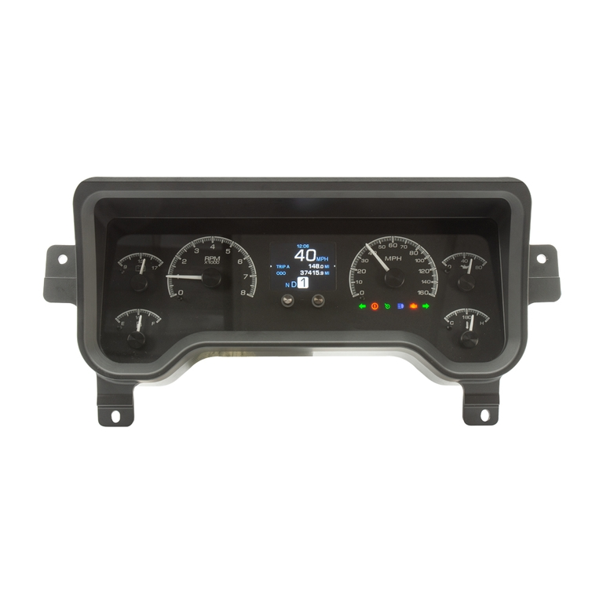

---
hide:
  - toc
tags:
  - product-details
  - gauge-cluster
  - dashboard
---

# 4.4.2 HDX Dashboard Cluster {#hdx-dashboard-cluster}

/// html | div.product-info
{ loading=lazy }

**Type:** Analog/Digital Hybrid Instrument Cluster

**Model:** HDX-96J-TJ (1996-03 Jeep TJ, Black Background)

**Manufacturer:** Dakota Digital

**Product Page:** [HDX-96J-TJ Instrument System][product-link]

///

## Overview

Drop-in replacement for factory TJ gauge cluster. Combines analog gauges with digital message centers for comprehensive vehicle monitoring.

**Mounting:** Factory TJ dash gauge location (direct bolt-in)

**Background:** Black or silver alloy (select at purchase)

## Analog Gauges

| Gauge | Range | Function |
|:------|:------|:---------|
| **Speedometer** | 0-160 MPH | GPS-based (via GPS-50-2 BIM module) |
| **Tachometer** | 0-8,000 RPM | J1939 CAN from Cummins R2.8 ECM |
| **Oil Pressure** | 0-80 psi | J1939 CAN from ECM or included sender |
| **Water Temp** | 100-260°F | J1939 CAN from ECM or included sender |
| **Fuel Level** | E-F | Factory TJ fuel sender |
| **Voltmeter** | 9-17 VDC | Direct battery voltage monitoring |

## BIM Modules

| Module | Data Provided | Notes |
|:-------|:--------------|:------|
| **BIM-01-2-J1939** | Tachometer, oil pressure, coolant temp, check engine light | Cummins R2.8 ECM via J1939 CAN |
| **GPS-50-2** | Speedometer (10 updates/sec), compass, altimeter, digital clock | GPS-based, eliminates mechanical speed sensor |
| **BIM-22-3** | Tire pressure (4 wheels) | Wireless valve stem sensors |
| **BIM-17-2** | Compass (8-direction), outside air temperature | Grille-mounted temperature probe |

## Lamps & Indicators

| Signal Source | Indicator | Notes |
|:--------------|:----------|:------|
| **ECM Harness** | Check engine light, wait-to-start | Active low / active high signals |
| **CT4 Controller** | Turn signals (L/R), high beam, brake | Lighting controller outputs |
| **Tail Light Circuit** | Dash dimming | Variable voltage dimming control |
| **Transfer Case Switch** | 4WD/4LO indicators | Transfer case position sensing |

## Sensors

| Sensor | Range | Mounting | Notes |
|:-------|:------|:---------|:------|
| **Factory TJ Fuel Sender** | E-F | Fuel tank | Variable resistance sender |
| **Oil Pressure Sender** (included) | 0-80 psi | Engine block | OR use J1939 data from ECM |
| **Water Temp Sender** (included) | 100-260°F | Engine block | OR use J1939 data from ECM |

See [HDX Control Module wiring table][hdx-control] for complete signal routing.

!!! warning "Speedometer Required for Legal Operation"
    Speedometer is legally required for on-road vehicle operation. GPS-50-2 module provides speed data - ensure GPS antenna has clear sky view for reliable operation.

## Outstanding Items

- [ ] Verify oil pressure/temp data available via J1939 from Cummins R2.8

## Related Documentation

- [Dakota Digital System Overview][gauge-system] - Complete system architecture
- [HDX Control Module][hdx-control] - Control box specifications
- [BIM-01-2-J1939][bim-j1939] - J1939 CAN interface for ECM data
- [GPS-50-2][bim-gps] - GPS speedometer module
- [BIM-22-3][bim-tpms] - TPMS module
- [BIM-17-2][bim-compass] - Compass/temp module

[product-link]: https://www.dakotadigital.com/index.cfm/page/ptype=product/product_id=1333/category_id=-1/mode=prod/prd1333.htm
[gauge-system]: index.md
[hdx-control]: 01-hdx-control.md
[bim-j1939]: 03-bim-j1939.md
[bim-gps]: 04-bim-gps.md
[bim-tpms]: 05-bim-tpms.md
[bim-compass]: 06-bim-compass.md
