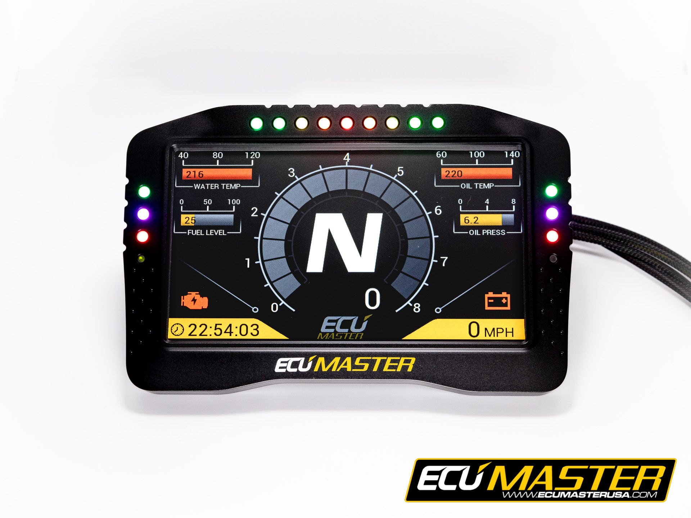

---
hide:
  - toc
tags:
  - product-details
  - gauge-display
  - ecumaster
---

# 2.10 ADU7 Supplemental Display {#adu7-display}

ECUMaster ADU7 auxiliary display for engine and electrical system metrics not covered by Dakota Digital HDX.

/// html | div.product-info
{ loading=lazy }

**Type:** Advanced Display Unit

**Model:** ADU7 Rev 2 (IP65)

**Manufacturer:** ECUMaster

**Product Page:** [ECUMaster ADU7][product-link]

**Mounting:** A-pillar cage (driver side)

**Power Source:** PMU OUT14 (15A, SWITCHED)

///

## Specifications

| Spec | Value |
|:-----|------:|
| Display | 7" TFT |
| Resolution | 800 x 480 |
| Rating | IP65 |
| CAN Interfaces | 2× CAN 2.0B |
| CAN Speeds | 250, 500, 1000 kbps |
| Power Draw | ~1-2A |

## Purpose

Supplemental display for metrics the Dakota Digital doesn't show well:

| Data | Source | Notes |
|:-----|:-------|:------|
| Boost pressure | PMU An 5 | 0-5V transducer |
| EGT | PMU An 6 | Thermocouple + amplifier |
| START battery voltage | PMU internal | Already monitored |
| AUX battery voltage | PMU An 7 | Voltage divider |
| PMU output currents | PMU internal | Per-channel monitoring |
| PMU faults/warnings | PMU internal | Overcurrent, thermal |
| Oil temp | PMU via J1939 | Pass-through from Cummins |
| Coolant temp | PMU via J1939 | Pass-through from Cummins |

## Integration

```text
Cummins ECM ──J1939──► PMU24 ──ECUMaster CAN──► ADU7
                         │
              Analog sensors (boost, EGT, trans temp, AUX voltage)
```

- PMU24 reads J1939 engine data and analog sensor inputs
- PMU24 broadcasts on ECUMaster CAN protocol
- ADU7 receives natively - same manufacturer, no custom templates

## Wiring

| Connection | Wire | Source | Notes |
|:-----------|:-----|:-------|:------|
| Power (12V) | 16 AWG | PMU OUT14 | SWITCHED with ignition |
| Ground | 16 AWG | TBD | A-pillar ground point |
| CAN H | 20 AWG | PMU24 CAN 2 | ECUMaster protocol |
| CAN L | 20 AWG | PMU24 CAN 2 | Twisted pair with CAN H |

## Outstanding Items

- [ ] Confirm PMU24 CAN output configuration for ADU7 data
- [ ] Determine A-pillar ground point location
- [ ] Select boost pressure transducer (0-5V, range TBD based on expected boost)
- [ ] Select EGT probe and amplifier
- [ ] Design AUX battery voltage divider circuit for PMU analog input
- [ ] Configure ADU7 display pages/layout
- [ ] Route CAN wiring from PMU (firewall) to A-pillar

## Related Documentation

- [PMU Inputs][pmu-inputs] - Analog input configuration
- [PMU Outputs][pmu-outputs] - OUT14 power source
- [Dakota Digital HDX][dakota-hdx] - Primary gauge cluster

[product-link]: https://ecumasterusa.com/collections/digital-dash-displays/products/ecumaster-adu7-advanced-display-unit-rev-2-ip65
[pmu-inputs]: ../../01-power-systems/04-pmu/02-pmu-inputs.md
[pmu-outputs]: ../../01-power-systems/04-pmu/03-pmu-outputs.md
[dakota-hdx]: ../09-gauge-cluster/index.md
