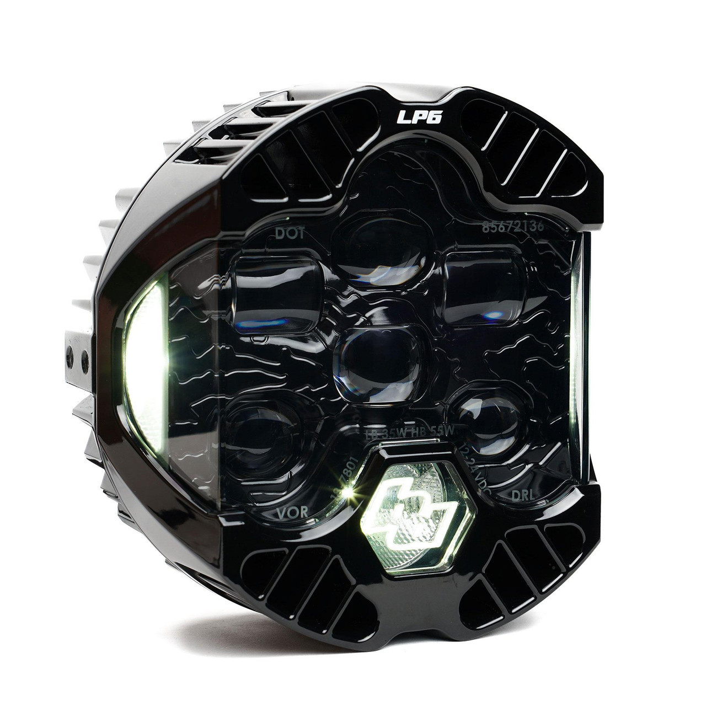

---
hide:
  - toc
tags:
  - product-details
  - lighting
  - headlights
  - led
---

# Headlights {#headlights}

/// html | div.product-info
{ loading=lazy }

**Type:** DOT LED Headlight (complete replacement)

**Model:** LP6 DOT

**Manufacturer:** Baja Designs

**Product Page:** [LP6 Pair Driving/Combo LED][product-link]

**Installation Guide:** [Baja Designs LP6 DOT Wiring][install-link]

**Quantity:** 2 (left and right)

**Mounting:** Factory headlight buckets

**Power Source:** [Command Touch CT4][command-touch-ct4] SW3/SW4

///

## Pin Configuration (Deutsch DT06-4S connector)

| Pin | Function | Connection | Wire Gauge | Current |
|:---:|:---------|:-----------|:-----------|:--------|
| 1 | Low Beam | CT4 SW3 | 14 AWG | 1.8A per light (3.6A total) |
| 2 | Ground | Chassis | 14 AWG | - |
| 3 | DRL | PMU Out 9 | 16 AWG | 0.4A per light (0.8A total) |
| 4 | High Beam | CT4 SW4 | 14 AWG | 2.8A per light (5.6A total) |

## Low Beam

- **Control:** Pull CT4 lever (latching on/off)
- **Power:** START battery (40A) → CT4 → SW3 output (10A internal fusing)
- **Disabled:** When ignition off (via ignition signal)
- **Load:** 3.6A total (both lights in parallel)

## High Beam

- **Control:** Push CT4 lever (momentary or latching - programmable)
- **Power:** START battery (40A) → CT4 → SW4 output (10A internal fusing)
- **Mutual Exclusivity:** CT4 automatically disables low beam when high beam activates
- **Disabled:** When ignition off
- **Load:** 5.6A total (both lights in parallel)

## DRL (Daytime Running Light)

- **Power:** PMU Out 9 (shared with license plate, front/rear markers)
- **Auto-Off Logic:** PMU disables DRL when CT4 SW3 activates headlights
- **Control:** Automatic with ignition (on when ignition on, off when headlights or ignition off)
- **Load:** 0.8A total
- See [DRL/Parking Lights][drl-parking-lights] for complete circuit details

## Outstanding Items

- [ ] Determine exact mounting method in factory headlight buckets
- [ ] Plan wire routing from CT4 to headlight buckets (engine bay, 14 AWG)
- [ ] Verify headlight aim and DOT compliance after installation

## Related Documentation

- [Command Touch CT4][command-touch-ct4] - Controller programming and wiring
- [DRL/Parking Lights][drl-parking-lights] - DRL circuit and auto-off logic
- [PMU24 Power Distribution][pmu-power-distribution] - PMU Out 9 DRL circuit

[product-link]: https://www.bajadesigns.com/products/lp6-pair-driving-combo-led.html
[install-link]: https://www.bajadesigns.com/wp-content/uploads/Installation%20Instructions/FGXX_18-7801-INS_001.pdf
[command-touch-ct4]: ../04-control-interfaces/03-command-touch-ct4.md
[drl-parking-lights]: 05-drl-parking.md
[pmu-power-distribution]: ../01-power-systems/04-pmu/index.md
