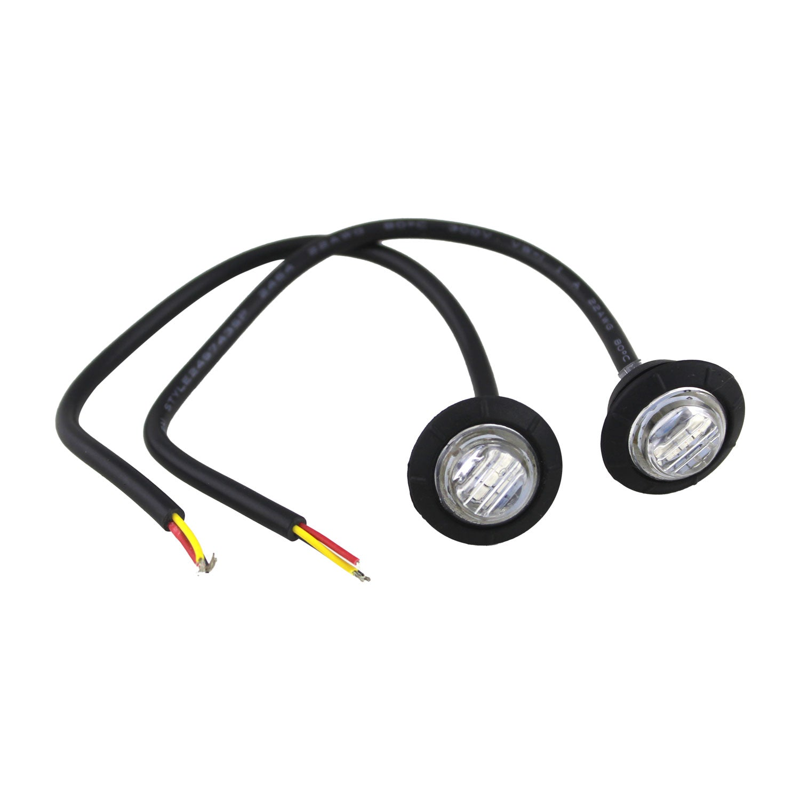

---
hide:
  - toc
tags:
  - product-details
  - lighting
  - turn-signals
---

# Turn Signals {#turn-signals}

**Controller:** [Command Touch CT4][command-touch-ct4] (SW1 = right turn, SW2 = left turn)

**Power Source:** START battery CONSTANT (via CT4 40A fuse)

**Features:** GPS auto-cancel, lane change mode, hazard function

## Front Turn Signals / Side Markers

{ loading=lazy width=200 }

**Type:** 2" LED side markers (amber) - dual function turn signal + marker
**Quantity:** 2 (left and right fenders)
**Functions:**

- **Turn Signal:** CT4 controlled (SW1 right, SW2 left)
- **Side Marker:** PMU Out 9 (DRL/parking circuit)

### Wiring

| Function | Source | Wire | Destination |
|:---------|:-------|:-----|:------------|
| Right Turn | CT4 SW1 | BROWN, 14 AWG | Right side marker |
| Left Turn | CT4 SW2 | RED, 14 AWG | Left side marker |
| Marker | PMU Out 9 | — | Both side markers (via DRL circuit) |

**Dual-Function Notes:**

- Turn signal input overrides marker function when flashing
- Marker remains on steady when turn signal inactive
- Diode isolation may be required to prevent backfeed between CT4 and PMU circuits

## Rear Turn Signals

Rear turn signals are integrated into Maxbilt Trail Tail lights (YELLOW wire).
See [Tail/Brake/Reverse Lights][tail-brake-reverse-lights] for complete wiring.

## Outstanding Items

- [ ] Confirm side marker model supports dual-function (turn + marker)
- [ ] Determine if diode isolation needed between CT4 turn and PMU marker circuits
- [ ] Plan wire routing from CT4 to fender side marker locations
- [ ] Verify turn signal flash rate meets DOT requirements

## Related Documentation

- [Command Touch CT4][command-touch-ct4] - Controller programming and wiring
- [Tail/Brake/Reverse Lights][tail-brake-reverse-lights] - Rear turn signal integration
- [DRL/Parking Lights][drl-parking-lights] - Side marker parking circuit

[command-touch-ct4]: ../04-control-interfaces/03-command-touch-ct4.md
[tail-brake-reverse-lights]: 04-tail-brake-reverse.md
[drl-parking-lights]: 05-drl-parking.md
