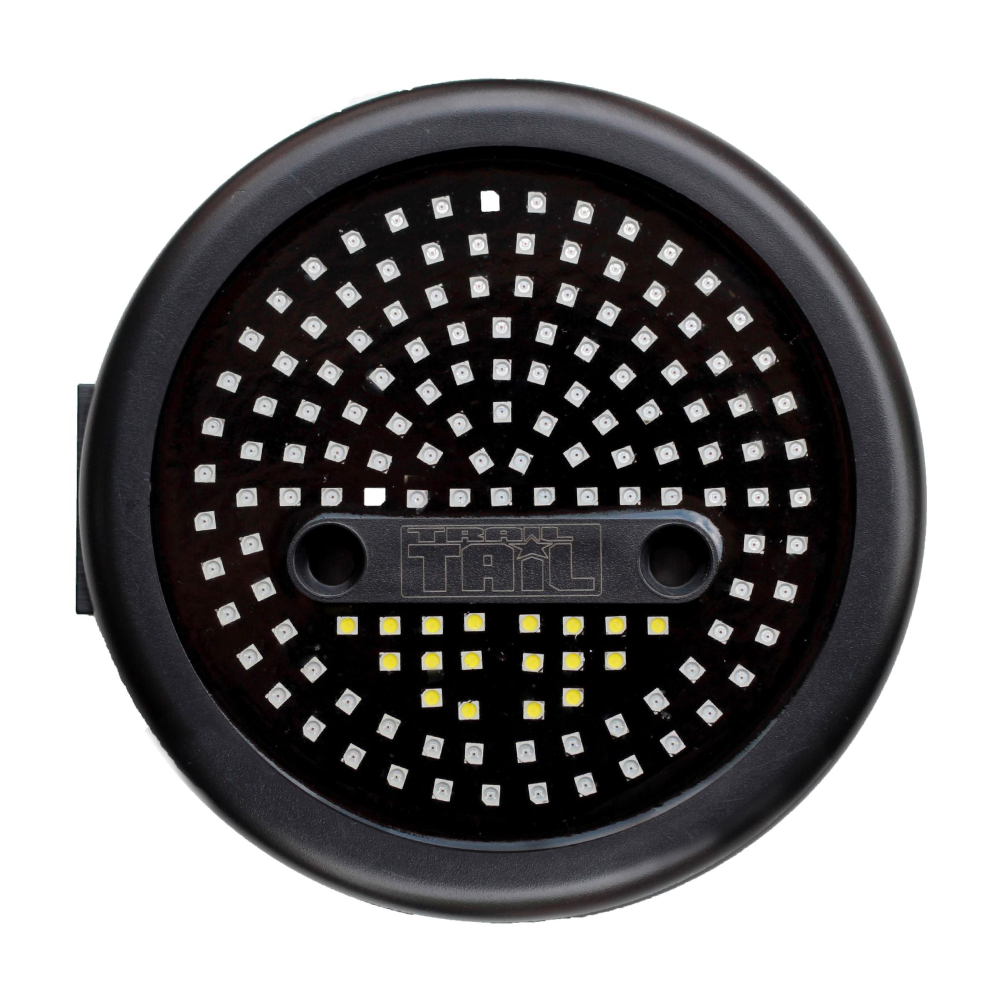

---
hide:
  - toc
tags:
  - product-details
  - lighting
  - tail-lights
  - led
---

# Tail, Brake & Reverse Lights {#tail-brake-reverse-lights}

/// html | div.product-info
{ loading=lazy }

**Type:** LED Tail Light (4-function: Brake, Turn, Marker, Reverse)

**Model:** Round Trail Tail

**Manufacturer:** Maxbilt

**Product Page:** [Maxbilt Round LED Tail Lights][product-link]

**Quantity:** 2

**Mounting:** Rear quarter panels

**Power Source:** CT4 (turn), PMU Out 21 (brake), PMU Out 22 (reverse), PMU Out 23 (marker)

///

## Wire Functions

| Color  | Function       | Connection       | Wire Gauge | Notes                                |
| :----- | :------------- | :--------------- | :--------- | :----------------------------------- |
| BLACK  | Ground         | Chassis ground   | 16 AWG     | Clean metal-to-metal                 |
| WHITE  | Reverse        | PMU Out 22       | 16 AWG     | Parallel with Squadron Sport reverse |
| YELLOW | Brake/Turn     | CT4 + PMU Out 21 | 16 AWG     | Combined function, internal diodes   |
| RED    | Marker/Parking | PMU Out 23       | 16 AWG     | DRL/parking circuit                  |

## Reverse Lights

**Power:** PMU Out 22 (~5A load, 16 AWG)
**Trigger:** Transmission reverse switch → PMU In 3
**Circuits:** Maxbilt WHITE + Squadron Sport reverse + WolfBox camera trigger (parallel)

**Wiring:**

1. Transmission reverse signal → PMU In 3
2. PMU Out 22 → Maxbilt WHITE + [Squadron Sport reverse lights][reverse-lights] + WolfBox trigger (parallel)
3. Chassis ground

**Load Breakdown:**

- Maxbilt WHITE: ~2A (LED, 130 red + 18 white LEDs total)
- Squadron Sport pair (557805): 2.8A (1.4A × 2)
- WolfBox trigger: negligible
- **Total: ~5A** (PMU Out 22 capacity: 7A, 71% utilization)

## Brake Lights

**Power:** PMU Out 21 (~3A load, 16 AWG)
**Trigger:** Brake pedal switch → PMU In 2
**Third Brake Light:** [Rear Chase Light][rear-chase] (SwitchPros-controlled, activates with brake input)

**Wiring:**

1. Brake pedal switch → PMU In 2
2. PMU Out 21 → Maxbilt YELLOW (both tail lights)
3. Chassis ground

**Load:** ~3A (PMU Out 21 capacity: 7A, 43% utilization)

## Brake/Turn Signal Integration

Maxbilt Round Trail Tail lights have **internal diode isolation** for combined brake/turn function. No external diodes required.

**Operation:**

- Right turn active → right tail light flashes
- Brake pressed → both tail lights solid
- Right turn + brake → right flashes, left stays solid

## Marker/Parking Lights

**Power:** PMU Out 23 (DRL/parking circuit)
**Maxbilt Connection:** RED wire
**Control:** Automatic with ignition
**Shared Circuit:** LP6 DRL

See [DRL/Parking Lights][drl-parking-lights] for circuit details.

## Outstanding Items

- [ ] Plan wire routing from CT4 to rear tail lights
- [ ] Plan wire routing from PMU Out 21/22 to rear tail lights

## Related Documentation

- [PMU Power Distribution][pmu-power-distribution] - PMU Out 21, Out 22 circuits
- [Command Touch CT4][command-touch-ct4] - Turn signal control
- [DRL/Parking Lights][drl-parking-lights] - Marker/parking circuit (RED wire)
- [Communication & Camera][communication-systems] - WolfBox camera reverse trigger

[product-link]: https://shop.maxbilt.com/collections/trail-tail-lighting/products/jeep-wrangler-round-led-tail-lights-jeep-cj-yj-tj
[pmu-power-distribution]: ../01-power-systems/04-pmu/index.md
[command-touch-ct4]: ../05-control-interfaces/03-command-touch-ct4.md
[drl-parking-lights]: 05-drl-parking.md
[communication-systems]: ../07-communication-systems/index.md
[reverse-lights]: ../04-offroad-lighting/10-reverse-lights.md
[rear-chase]: ../04-offroad-lighting/09-rear-chase.md
