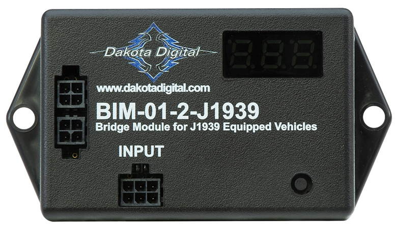

---
hide:
  - toc
tags:
  - product-details
  - gauge-cluster
  - bim-module
  - j1939
---

# 4.4.3 BIM-01-2-J1939 (J1939 CAN Interface) {#bim-j1939-interface}

/// html | div.product-info
{ loading=lazy }

**Type:** J1939 CAN Bus Interface Module

**Model:** BIM-01-2-J1939

**Manufacturer:** Dakota Digital

**Product Page:** [J-1939 CAN Interface][product-link]

**Manual:** [BIM-01-2-J1939 Manual][manual-link]

///

## Overview

Interfaces Cummins R2.8 ECM J1939 CAN bus data with HDX instrument system. Provides engine parameters directly from ECM to dashboard cluster.

**Mounting:** HDPE panel on firewall (behind dashboard)

**Power:** Via BIM/IO cable from HDX control box (no separate power wiring)

## Specifications

- **Protocol:** J1939 CAN bus only
- **Compatible ECUs:** Cummins R2.8, Mercury Racing SBF, BIGStuff EFI
- **Wiring:** CAN High, CAN Low (twisted pair)
- **Power:** Via BIM harness from HDX control
- **Current Draw:** TBD (powered via BIM cable)

## J1939 Data Available

**Standard Parameters (Most Vehicles):**

- Tachometer (RPM)
- Engine coolant temperature
- Check engine light / MIL indicator

**Cummins R2.8 Specific (Expected):**

- Oil pressure (SPN 100)
- Coolant temperature (SPN 110)
- Engine oil temperature (SPN 175)
- Engine hours
- Diagnostic trouble codes (DTCs)

**Potentially Available:**

- Intake air temperature
- Transmission temperature
- Gear position
- Fuel pressure
- Boost/MAP
- Air/fuel ratio

!!! info "ECM Data Availability"
    Specific J1939 parameters vary by ECM configuration and vehicle application. Cummins R2.8 ECM should provide tachometer, coolant temp, oil pressure, and check engine light at minimum. Additional parameters depend on ECM programming and connected sensors.

## Wiring

| Connection | Source | Destination | Wire Gauge | Notes |
|:-----------|:-------|:------------|:-----------|:------|
| **CAN High** | Cummins body harness (cabin side) | BIM-01-2 CAN H | 18-22 AWG ✓ | Twisted pair with CAN Low |
| **CAN Low** | Cummins body harness (cabin side) | BIM-01-2 CAN L | 18-22 AWG ✓ | Twisted pair with CAN High |
| **Constant** | Critical Cabin PDU Slot 3 | BIM-01-2 power | 18 AWG ✓ | BIM CONSTANT power |
| **BIM/IO** | HDX control box | BIM-01-2 input | Proprietary | Daisy-chain to other BIM modules |

**J1939 Connection:**

- Cummins R2.8 body harness passes through firewall from engine bay to cabin
- CAN High/Low wires spliced on cabin side (non-invasive tap connectors)
- Short wire run from splice to BIM-01-2 on HDPE panel

## Integration with Cummins R2.8

**Available Signals:**

- RPM → Tachometer
- Coolant temp (SPN 110) → Water temp gauge
- Oil pressure (SPN 100) → Oil pressure gauge
- Engine oil temp (SPN 175) → Available for display or logic (radiator fan control via PAC-2800BT)
- Check engine light / MIL → Dashboard warning indicator

**Firewall Routing:**

- Cummins body harness routes through firewall (engine bay → cabin)
- Tap J1939 CAN wires on cabin side of firewall
- See [Firewall Ingress][firewall-ingress] for Cummins harness routing details

## Outstanding Items

- [ ] Confirm all J1939 parameters available from Cummins R2.8 ECM configuration

## Related Documentation

- [Dakota Digital System Overview][gauge-system] - Complete system architecture
- [Dashboard Cluster][dashboard-cluster] - Displays J1939 data on gauges
- [Cummins R2.8 ECM][ecm] - J1939 CAN bus specifications
- [Firewall Ingress][firewall-ingress] - J1939 wire routing through firewall
- [Radiator Fan System][radiator-fan] - PMU uses J1939 data for radiator fan PWM control

[product-link]: https://www.dakotadigital.com/index.cfm/page/ptype=product/product_id=1328/category_id=646/mode=prod/prd1328.htm
[manual-link]: https://www.dakotadigital.com/pdf/BIM-01-2-J1939.pdf
[gauge-system]: index.md
[dashboard-cluster]: 02-dashboard-cluster.md
[ecm]: ../../02-engine-systems/index.md
[firewall-ingress]: ../../02-engine-systems/07-firewall-ingress.md
[radiator-fan]: ../../02-engine-systems/06-radiator-fan/index.md
