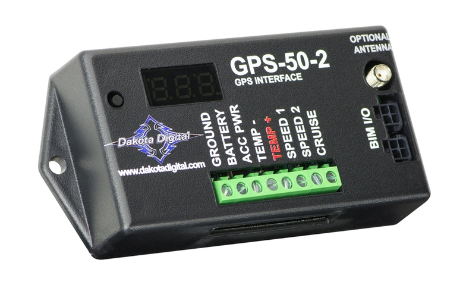

---
hide:
  - toc
tags:
  - product-details
  - gauge-cluster
  - bim-module
  - gps
---

# 4.4.4 GPS-50-2 (GPS Speed/Compass Module) {#bim-gps-module}

/// html | div.product-info
{ loading=lazy }

**Type:** GPS Speed Sender / Compass / BIM Module

**Model:** GPS-50-2

**Manufacturer:** Dakota Digital

**Product Page:** [GPS Speed/Compass Sender/BIM][product-link]

**Manual:** [GPS-50-2 Manual][manual-link]

///

## Overview

GPS-based speedometer, compass, altimeter, and clock sync module. Eliminates need for transmission speed sensor - works with any transmission, transfer case, or gear ratio.

**Mounting:** HDPE panel on firewall (behind dashboard)

**Power:** Via BIM/IO cable from HDX control box (no separate power wiring)

## Specifications

- **Dimensions:** 4.75" W × 2.75" D × 1" H
- **Speed Range:** 0-158 MPH (255 km/h)
- **Update Rate:** 10 times per second
- **Accuracy:** ±0.1 MPH (GPS-dependent)
- **Output Signals:** 4k, 8k, 16k PPM (selectable)
- **Signal Types:** Sine wave or square wave (configurable)
- **Current Draw:** TBD (powered via BIM cable)
- **Antenna:** Integrated omni-directional (optional external antenna available)
- **Warranty:** 2 years

## GPS Antenna

**Integrated Antenna:**

- Built-in omni-directional antenna
- Requires clear sky view for reliable operation
- Mounting: Dash top or windshield area

**Optional External Antenna:**

- Part Number: 600041
- Use if integrated antenna location has poor sky view
- Extended cable for remote mounting

!!! warning "Critical System - Sky View Required"
    GPS speedometer is legally required for on-road operation. Ensure antenna has clear view of sky for reliable GPS signal. Obstructions (metal dash, windshield tint, etc.) may degrade signal quality.

## Wiring

| Connection | Source | Destination | Wire Gauge | Notes |
|:-----------|:-------|:------------|:-----------|:------|
| **Constant** | Critical Cabin PDU Slot 4 | GPS-50-2 power | 18 AWG ✓ | BIM CONSTANT power |
| **BIM/IO** | HDX control box | GPS-50-2 input | Proprietary | Data via daisy-chain |
| **GPS Antenna** | GPS-50-2 module | Dash/windshield mount | Coax cable | Included antenna cable |
| **Outside Temp** | GPS-50-2 (optional) | SEN-15-1 probe | Sensor wire | If used instead of BIM-17-2 |

**Antenna Routing:**

- GPS-50-2 on firewall HDPE panel → antenna cable → dash top or windshield mount
- Route cable through dash for clean installation
- Avoid routing near high-current wires or ignition system

## Outstanding Items

- [ ] Determine GPS antenna mounting location (dash top vs windshield)
- [ ] Determine if using SEN-15-1 temp probe with GPS-50-2 or separate BIM-17-2

## Related Documentation

- [Dakota Digital System Overview][gauge-system] - Complete system architecture
- [Dashboard Cluster][dashboard-cluster] - Displays GPS speed and compass data
- [BIM-17-2 Compass/Temp][bim-compass] - Alternative compass/temp source
- [Firewall Ingress][firewall-ingress] - GPS antenna cable routing

[product-link]: https://www.dakotadigital.com/index.cfm/page/ptype=product/product_id=837/category_id=646/mode=prod/prd837.htm
[manual-link]: https://www.dakotadigital.com/pdf/GPS-50-2.pdf
[gauge-system]: index.md
[dashboard-cluster]: 02-dashboard-cluster.md
[bim-compass]: 06-bim-compass.md
[firewall-ingress]: ../../01-power-systems/07-wire-routing/02-firewall-ingress.md
