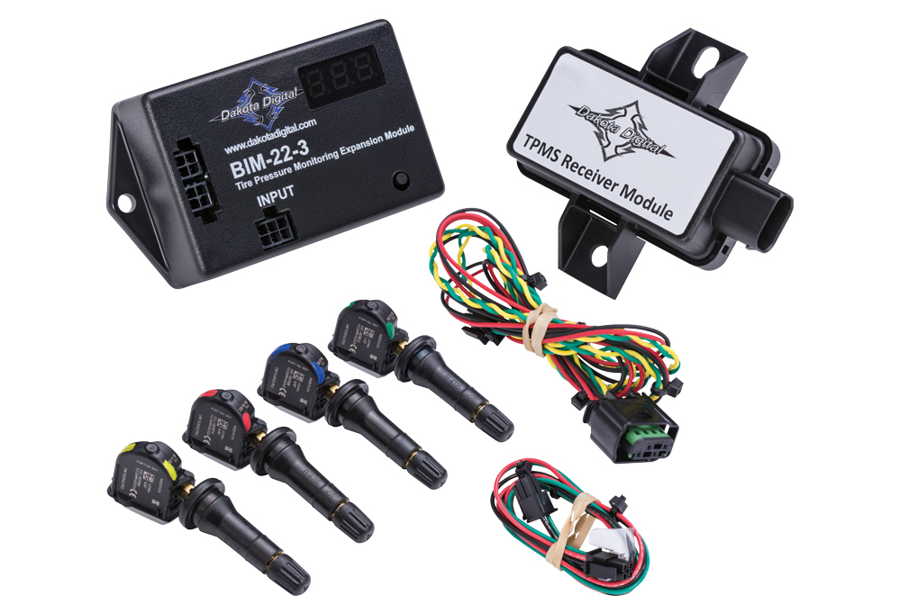

---
hide:
  - toc
tags:
  - product-details
  - gauge-cluster
  - bim-module
  - tpms
---

# 4.4.5 BIM-22-3 (Tire Pressure Monitoring System) {#bim-tpms-module}

/// html | div.product-info
{ loading=lazy }

**Type:** Tire Pressure Monitoring System (TPMS)

**Model:** BIM-22-3

**Manufacturer:** Dakota Digital

**Product Page:** [Tire Pressure Monitoring System][product-link]

**Manual:** [BIM-22-3 Manual][manual-link]

///

## Overview

Wireless TPMS module displaying real-time tire pressure for all four wheels on HDX dashboard message center. Includes 4 wireless valve stem sensors.

**Mounting:** HDPE panel on firewall (behind dashboard)

**Power:** Via BIM/IO cable from HDX control box (no separate power wiring)

## Specifications

- **Sensors Included:** 4x wireless valve stem sensors
- **Maximum Sensors:** 4 (fixed - cannot add spares)
- **Sensor Type:** Dismount-to-install valve stem replacement
- **Communication:** Wireless RF (sensors → BIM-22-3 receiver)
- **Display:** Dashboard message center shows all 4 tire pressures
- **Programming:** Sensors easily reprogrammed via Bluetooth app
- **Current Draw:** TBD (powered via BIM cable)
- **Compatibility:** HDX, RTX, GRFX systems (limited VFD3/VHX compatibility)

## Display Integration

**Dashboard Message Center:**

- Displays all 4 tire pressures simultaneously
- Pressure units: PSI (configurable)
- Low pressure threshold: User-configurable via Bluetooth app
- Visual warnings for low pressure conditions

**Tire Rotation:**

- Sensors remain with wheels during rotation
- Reprogram sensor assignments via Bluetooth app after rotation

## Wiring

| Connection | Source | Destination | Wire Gauge | Notes |
|:-----------|:-------|:------------|:-----------|:------|
| **Constant** | Critical Cabin PDU Slot 5 | BIM-22-3 power | 18 AWG ✓ | BIM CONSTANT power |
| **BIM/IO** | HDX control box | BIM-22-3 input | Proprietary | Data via daisy-chain |
| **Sensors** | Wireless | BIM-22-3 receiver | - | No wiring - RF communication |

**No External Wiring:**

- Sensors communicate wirelessly with BIM-22-3 receiver module
- BIM-22-3 powered via BIM harness from HDX control
- Clean installation - no wiring to wheels or suspension

## Outstanding Items

- [ ] Confirm TPMS sensor compatibility with wheel/tire setup (valve stem hole size)
- [ ] Determine sensor battery life and replacement procedure

## Related Documentation

- [Dakota Digital System Overview][gauge-system] - Complete system architecture
- [Dashboard Cluster][dashboard-cluster] - Displays TPMS data in message center
- [HDX Control Module][hdx-control] - Bluetooth app for sensor programming

[product-link]: https://www.dakotadigital.com/index.cfm/page/ptype=product/product_id=1108/category_id=646/mode=prod/prd1108.htm
[manual-link]: https://www.dakotadigital.com/pdf/BIM-22-3.pdf
[gauge-system]: index.md
[dashboard-cluster]: 02-dashboard-cluster.md
[hdx-control]: 01-hdx-control.md
