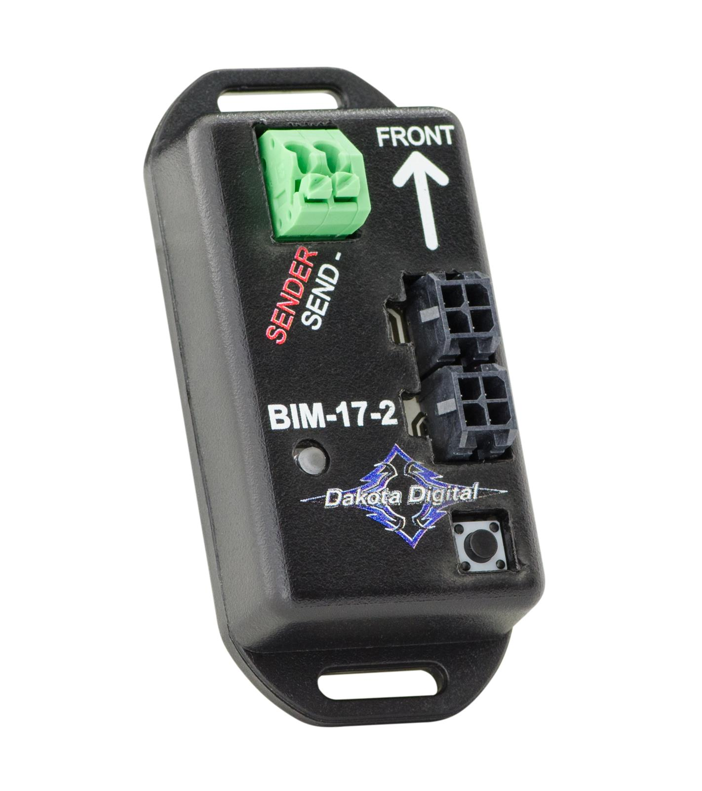

---
hide:
  - toc
tags:
  - product-details
  - gauge-cluster
  - bim-module
  - compass
  - temperature
---

# 4.4.6 BIM-17-2 (Compass/Outside Temperature Module) {#bim-compass-temp-module}

/// html | div.product-info
{ loading=lazy }

**Type:** Digital Compass / Outside Air Temperature Module

**Model:** BIM-17-2

**Manufacturer:** Dakota Digital

**Product Page:** [Compass w/Outside Temperature Module][product-link]

///

## Overview

8-direction digital compass with outside air temperature sensor. Displays compass heading and outside temperature in dashboard message center.

**Mounting:** HDPE panel on firewall (behind dashboard)

**Power:** Via BIM/IO cable from HDX control box (no separate power wiring)

## Specifications

**Compass:**

- Directions: 8-point (N, NE, E, SE, S, SW, W, NW)
- Internal Resolution: 1° (displayed as 8 directions)
- Calibration: Automatic via internal accelerometers
- Current Draw: TBD (powered via BIM cable)

**Temperature (SEN-15-1 Sender Included):**

- Range: -40°F to 255°F
- Resolution: 1°F
- Warning Threshold: Configurable (-24°F to 40°F for low temp warning)
- Sensor Mounting: Grille area (behind grille, out of direct airflow)

## Wiring

| Connection | Wire Gauge | Source | Destination | Distance | Notes |
|:-----------|:-----------|:-------|:------------|:---------|:------|
| **Constant** | 18 AWG ✓ | Critical Cabin PDU Slot 6 | BIM-17-2 power | ~1-2 ft | BIM CONSTANT power |
| **BIM/IO** | Proprietary | HDX control box | BIM-17-2 input | Varies | Data via daisy-chain |
| **Temp Probe** | Sensor wire | BIM-17-2 | SEN-15-1 (grille area) | ~6-8 ft | Through firewall Grommet 6 |

**Firewall Penetration:**

- Temperature probe wire from BIM-17-2 (HDPE panel, cabin side) → Grommet 6 → grille area
- See [Firewall Ingress][firewall-ingress] for Grommet 6 routing details

## Display Integration

**Dashboard Message Center:**

- Compass heading: 8-direction display (N, NE, E, SE, S, SW, W, NW)
- Outside temperature: Numeric display with degree symbol
- Low temperature warning: Configurable threshold (ice warning)

## Compass vs. GPS-50-2 Comparison

**Note:** GPS-50-2 also provides compass functionality. Redundant with BIM-17-2 compass if both modules are used.

| Feature | BIM-17-2 Compass | GPS-50-2 Compass |
|:--------|:-----------------|:-----------------|
| Directions | 8-point (N, NE, E, etc.) | Digital heading |
| Source | Internal compass module | GPS satellite-based |
| Accuracy | 1° internal resolution | GPS-dependent |
| Stationary | Works when stopped | Requires vehicle movement |
| Calibration | Automatic | Automatic |

**Recommendation:**

- Use **BIM-17-2** for primary compass (works at standstill)
- Use **GPS-50-2** compass as backup or if BIM-17-2 not installed

## Outstanding Items

- [ ] Determine outside temperature probe mounting location in grille area
- [ ] Determine primary compass source (BIM-17-2 vs GPS-50-2)

## Related Documentation

- [Dakota Digital System Overview][gauge-system] - Complete system architecture
- [Dashboard Cluster][dashboard-cluster] - Displays compass and temp data
- [GPS-50-2][bim-gps] - Alternative compass source (GPS-based)
- [Firewall Ingress][firewall-ingress] - Grommet 6 routing for temperature probe

[product-link]: https://www.dakotadigital.com/index.cfm?ptype=product&product_id=760&category_id=646&mode=prod
[gauge-system]: index.md
[dashboard-cluster]: 02-dashboard-cluster.md
[bim-gps]: 04-bim-gps.md
[firewall-ingress]: ../../02-engine-systems/07-firewall-ingress.md
