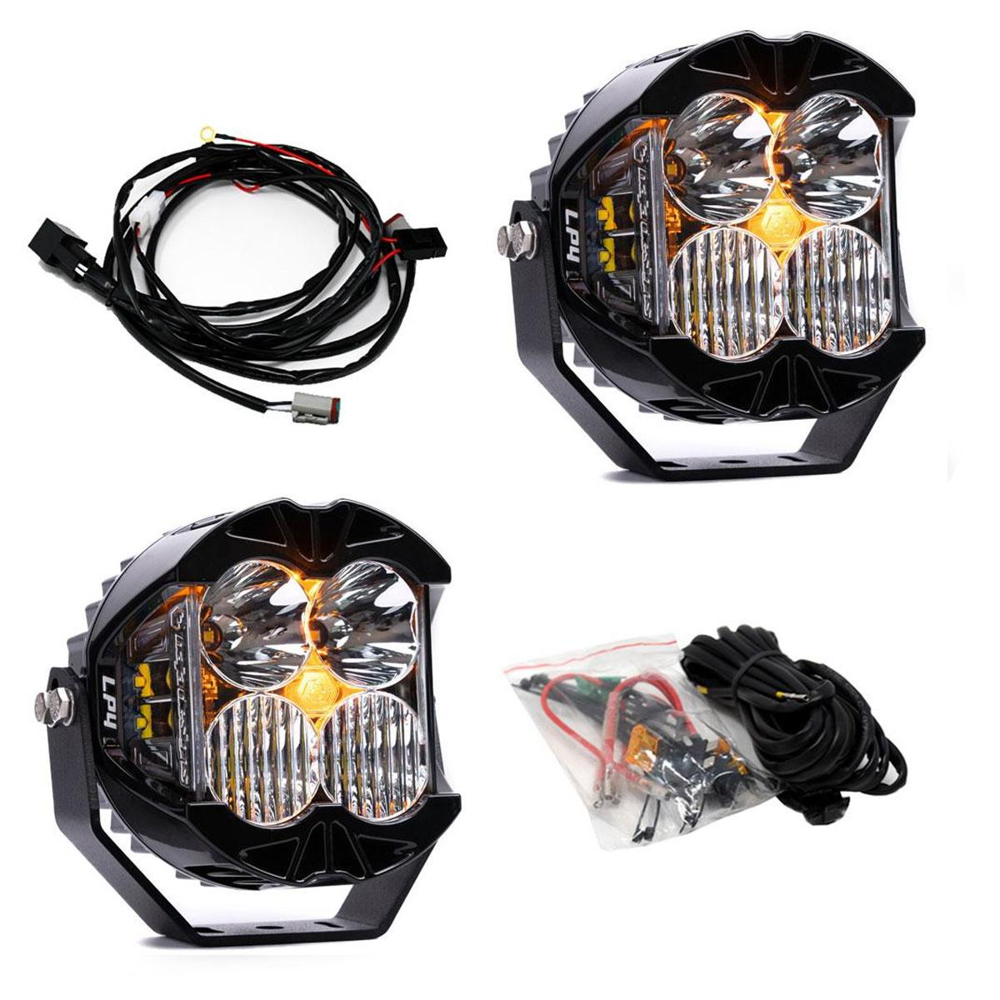

---
hide:
  - toc
tags:
  - product-details
  - lighting
  - offroad
  - switchpros-controlled
  - baja-designs
---

# 4.1 Ditch Lights {#ditch-lights}

A-pillar mounted lights for peripheral and side illumination (Baja Designs Zone 2).

/// html | div.product-info
{ loading=lazy }

**Type:** LED Pod Light

**Model:** LP4 Pro Driving/Combo

**Part Number:** 297803

**Manufacturer:** Baja Designs

**Product Page:** [LP4 Pro Driving/Combo][product-link]

**Quantity:** 2 (left and right A-pillars)

**Mounting:** Motobilt A-pillar light mounts

**Power Source:** SwitchPros OUTPUT-2

///

## Specifications

| Spec         |                           Value |
| :----------- | ------------------------------: |
| Beam Pattern |                   Driving/Combo |
| Lens         |                           Clear |
| Output       | 4,400 lumens each (8,800 total) |
| Draw         |              4A each (8A total) |

## Control

**Controller:** SwitchPros Button 2 (OUTPUT-2)

See [SwitchPros SP-1200][switchpros-sp-1200] for wiring details.

## Zone 2 Purpose

Driving/Combo pattern provides peripheral illumination for:

- Trail obstacle visibility on sides
- Ditch and shoulder illumination
- Tight maneuvering situations

## Outstanding Items

- [ ] Plan wire routing from SwitchPros to A-pillars

## Related Documentation

- [Offroad Lighting Overview][offroad-overview]
- [SwitchPros SP-1200][switchpros-sp-1200]

[offroad-overview]: index.md
[switchpros-sp-1200]: ../05-control-interfaces/02-switchpros-sp1200.md
[product-link]: https://www.bajadesigns.com/products/lp4-pro-led-auxiliary-light-pod-pair/297803/?sku=297803
