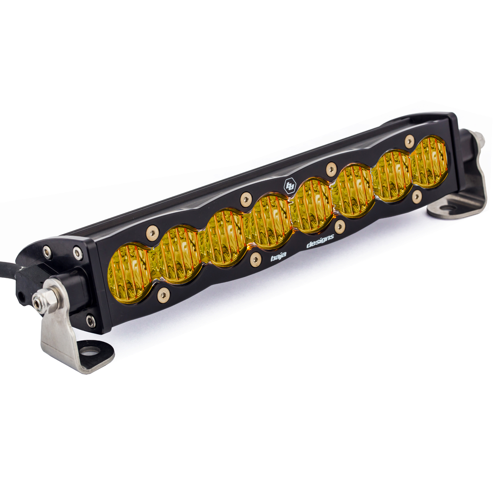

---
hide:
  - toc
tags:
  - product-details
  - lighting
  - offroad
  - switchpros-controlled
  - baja-designs
---

# 4.2 Fog Light {#fog-light}

Amber fog/dust light for improved visibility in poor conditions (Baja Designs Zone 1).

/// html | div.product-info
{ loading=lazy }

**Type:** LED Light Bar

**Model:** S8 10" Wide Cornering Amber

**Part Number:** 701014

**Manufacturer:** Baja Designs

**Quantity:** 1

**Mounting:** Top of Motobilt bumper, centered

**Power Source:** SwitchPros OUTPUT-3

///

## Specifications

| Spec | Value |
|:-----|------:|
| Lens | Amber |
| Beam Pattern | Wide Cornering (42°) |
| Output | 8,000 lumens |
| Draw | 6A |
| Profile | 2.13" slim |

## Control

**Controller:** SwitchPros Button 3 (OUTPUT-3)

See [SwitchPros SP-1200][switchpros-sp-1200] for wiring details.

## Outstanding Items

- [ ] Determine mounting hardware for Motobilt bumper

## Related Documentation

- [Offroad Lighting Overview][offroad-overview]
- [SwitchPros SP-1200][switchpros-sp-1200]

[offroad-overview]: index.md
[switchpros-sp-1200]: ../05-control-interfaces/02-switchpros-sp1200.md
