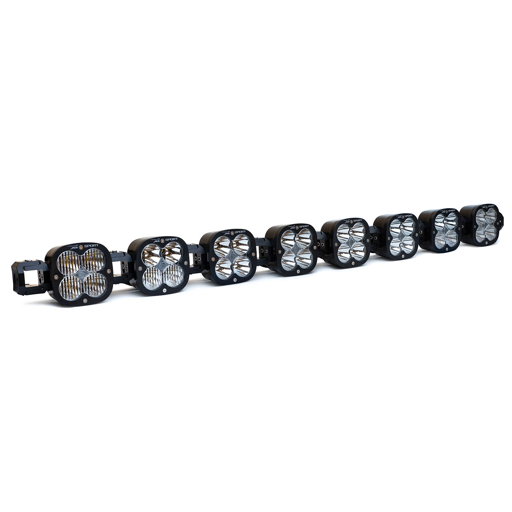

---
hide:
  - toc
tags:
  - product-details
  - lighting
  - offroad
  - switchpros-controlled
  - baja-designs
---

# 4.3 Roof Lights {#roof-lights}

Primary forward illumination mounted on roof rack (Baja Designs Zone 3 + Zone 4).

/// html | div.product-info
{ loading=lazy }

**Type:** LED Pod Light (Linkable)

**Model:** XL Sport Linkable

**Part Number:** 740006

**Manufacturer:** Baja Designs

**Product Page:** [XL Sport Linkable 8-Pod][product-link]

**Quantity:** 8 pods total

**Mounting:** Roof rack - physically linked, electrically split

**Power Source:** SwitchPros OUTPUT-1 (6 pods) + OUTPUT-5 (2 pods)

///

## Wiring

All 8 pods physically linked on roof rack. Split into two circuits for load distribution:

| Circuit | Pods | Lens | Pattern | Draw | Control |
|:--------|-----:|:-----|:--------|-----:|:--------|
| Zone 3 (OUTPUT-1) | 4 center | Driving/Combo | Forward | 24A | Button 1 |
| Zone 3 (OUTPUT-1) | 2 mid | Wide Cornering | Peripheral | 12A | Button 1 |
| Zone 4 (OUTPUT-5) | 2 outer | Spot | Distance | 12A | Button 5 |

## Specifications

| Spec | Value |
|:-----|------:|
| Output | 9,000 lumens each |
| Draw | 6A each |
| Total Output | 72,000 lumens |
| Total Draw | 48A (split across 2 circuits) |

See [SwitchPros SP-1200][switchpros-sp-1200] for wiring details.

## Outstanding Items

- [ ] Confirm XL Linkable harness length and connector type
- [ ] Determine roof rack mounting method for 8 pods
- [ ] Plan wire routing from dash to roof (A-pillar vs B-pillar)
- [ ] Plan weatherproofing at roof penetration

## Related Documentation

- [Offroad Lighting Overview][offroad-overview]
- [SwitchPros SP-1200][switchpros-sp-1200]

[offroad-overview]: index.md
[switchpros-sp-1200]: ../05-control-interfaces/02-switchpros-sp1200.md
[product-link]: https://www.bajadesigns.com/products/xl-sport-linkable-led-light-bar-universal/?sku=740006
