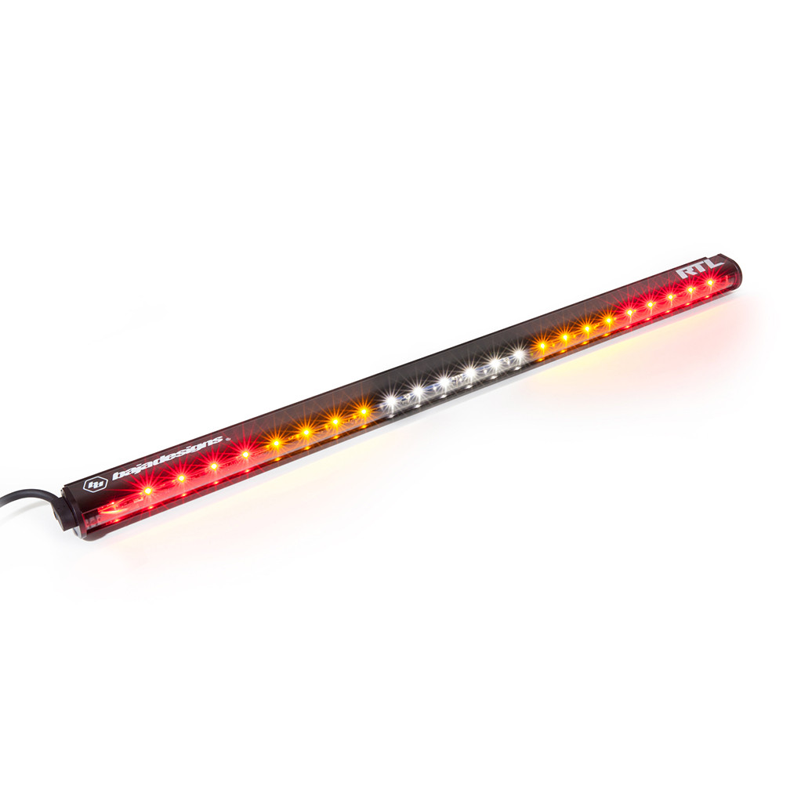

---
hide:
  - toc
tags:
  - product-details
  - lighting
  - offroad
  - switchpros-controlled
  - baja-designs
---

# 4.4 Chase Light {#chase-light}

Multi-function rear safety light for convoy visibility, plus integrated brake, turn, and work lighting.

/// html | div.product-info
{ loading=lazy }

**Type:** LED Chase Light Bar

**Model:** RTL-S 30"

**Part Number:** 103004

**Manufacturer:** Baja Designs

**Product Page:** [RTL-S 30"][product-link]

**Quantity:** 1

**Mounting:** Baja Designs tube mounts on rear roll cage

**Power Source:** Multiple (see Functions table)

**Harness:** RTL-S wiring harness (Part #: 640134)

///

## Wiring

### 4-Wire Connector (Main Functions)

| Wire   | Function     | Draw   | Source                                       |
| :----- | :----------- | :----- | :------------------------------------------- |
| Black  | Ground       | -      | Chassis ground                               |
| Red    | Running      | 0.8A   | [Running light splice][drl-parking]          |
| Yellow | Brake        | 1.45A  | [Brake light splice][tail-brake-reverse]     |
| Blue   | Work (White) | 1.3A   | [Running light splice][drl-parking] (shared) |

### 2-Wire Connector (Amber Sections)

| Wire   | Function    | Draw   | Source                                      |
| :----- | :---------- | :----- | :------------------------------------------ |
| Yellow | Right Amber | 0.36A  | [Turn signal splice][turn-signals] OR SwitchPros OUTPUT-7 (via diode) |
| Blue   | Left Amber  | 0.36A  | [Turn signal splice][turn-signals] OR SwitchPros OUTPUT-7 (via diode)  |

**Max Draw:** ~4A

**Light Bar Layout:** Solid Red | Flashing Amber | White Center | Flashing Amber | Solid Red

## Control

- **Turn Signals:** Via [turn signal splice][turn-signals] - synced with all turn signals for on-road use
- **Chase Mode:** SwitchPros Button 7 (OUTPUT-7) - both amber sections flash together
- **Isolation:** Diodes prevent backfeed between CT4 and SwitchPros circuits
- **Brake (Red):** Via [brake light splice][tail-brake-reverse]
- **Running + Work (Red/White):** Via [running light splice][drl-parking]

```
CT4 Right Turn ──|>|──┬── Yellow (Right Amber)
                      │
SwitchPros OUT7 ─|>|──┘

CT4 Left Turn ───|>|──┬── Blue (Left Amber)
                      │
SwitchPros OUT7 ─|>|──┘
```

## Related Documentation

- [Offroad Lighting Overview][offroad-overview]
- [SwitchPros SP-1200][switchpros-sp-1200]
- [Tail/Brake/Reverse Lights][tail-brake-reverse]

[offroad-overview]: index.md
[switchpros-sp-1200]: ../05-control-interfaces/02-switchpros-sp1200.md
[tail-brake-reverse]: ../03-lighting-systems/04-tail-brake-reverse.md#brake-lights
[turn-signals]: ../03-lighting-systems/03-turn-signals.md
[drl-parking]: ../03-lighting-systems/05-drl-parking.md
[product-link]: https://www.bajadesigns.com/products/rtl-led-rear-light-bar/?sku=103004
