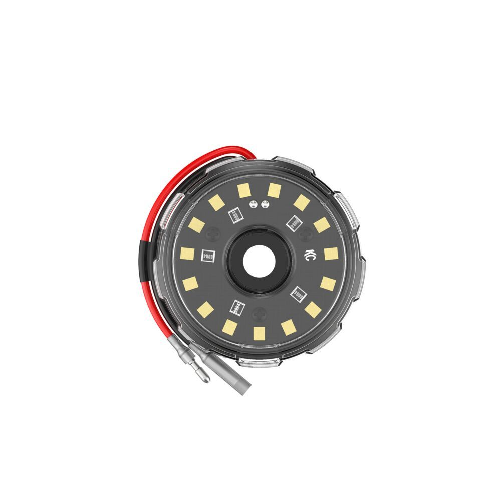

---
hide:
  - toc
tags:
  - product-details
  - lighting
  - offroad
  - switchpros-controlled
  - kc-hilites
---

# 4.6 Rock Lights {#rock-lights}

Underbody lighting for wheel wells and frame rails (Baja Designs Zone 6).

/// html | div.product-info
{ loading=lazy }

**Type:** LED Rock Light

**Model:** Cyclone V2

**Part Number:** 1352 (single light)

**Manufacturer:** KC HiLiTES

**Product Page:** [Cyclone V2][product-link]

**Quantity:** 6 pods

**Mounting:** Wheel wells and frame rails (4 front, 2 rear)

**Power Source:** SwitchPros OUTPUT-6

///

## Specifications

| Spec | Value |
|:-----|------:|
| Output | 200 lumens each (1,200 total) |
| Draw | 0.5A each (3A total) |
| Size | 2.4" diameter round |

## Control

**Controller:** SwitchPros Button 6 (OUTPUT-6)

See [SwitchPros SP-1200][switchpros-sp-1200] for wiring details.

**Protection:** Conduit or protective sleeving in exposed areas.

## Physical Switch Override

Physical switch at rear left wheel well for rock light control independent of SwitchPros panel. Wired in parallel with SwitchPros output.

## Outstanding Items

- [ ] Determine exact mounting locations (6 positions)
- [ ] Plan wire routing from SwitchPros to wheel wells
- [ ] Determine protection method for exposed wiring
- [ ] Source physical switch for wheel well override

## Related Documentation

- [Offroad Lighting Overview][offroad-overview]
- [SwitchPros SP-1200][switchpros-sp-1200]

[offroad-overview]: index.md
[switchpros-sp-1200]: ../05-control-interfaces/02-switchpros-sp1200.md
[product-link]: https://www.kchilites.com/cyclone-v2-cyclone-v2-led-single-light.html?attr_pim_lenscolor=5730
