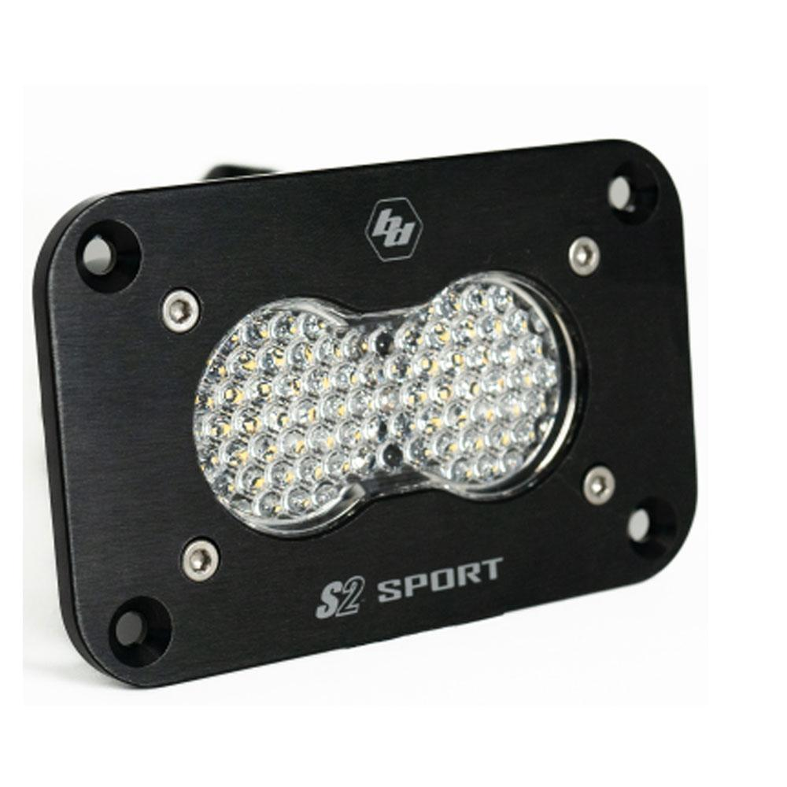

---
hide:
  - toc
tags:
  - product-details
  - lighting
  - offroad
  - baja-designs
---

# 4.7 Cargo Lights {#cargo-lights}

Interior cargo area lighting controlled by physical switch (Baja Designs Zone 7).

/// html | div.product-info
{ loading=lazy }

**Type:** LED Flush Mount Light

**Model:** S2 Sport Black Flush Mount

**Part Number:** 541006

**Manufacturer:** Baja Designs

**Product Page:** [S2 Sport Black Flush Mount][product-link]

**Quantity:** 2 pods

**Mounting:** TBD - cargo area (flush mount)

**Power Source:** Physical switch (not SwitchPros)

///

## Specifications

| Spec | Value |
|:-----|------:|
| Beam Pattern | Work/Scene |
| Lens | Clear |
| Draw | ~2A each (4A total) |

## Control

**Controller:** Physical switch (rocker switch in cargo area)

Rocker switch in cargo area for convenient access when loading/unloading from tailgate.

## Outstanding Items

- [ ] Determine cargo light mounting location
- [ ] Determine switch mounting location (accessible from tailgate)
- [ ] Source SPST rocker switch
- [ ] Determine power source for switch (SafetyHub or fused circuit)

## Related Documentation

- [Offroad Lighting Overview][offroad-overview]

[offroad-overview]: index.md
[product-link]: https://www.bajadesigns.com/products/s2-sport-black-flush-mount-led-auxiliary-light-pod/?sku=541006
