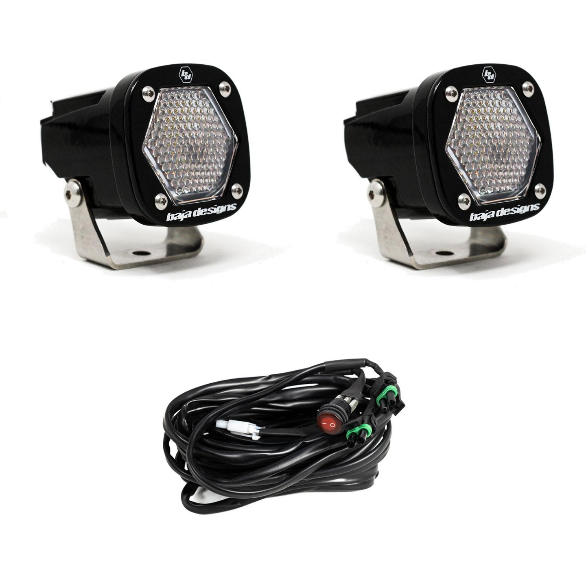

---
hide:
  - toc
tags:
  - product-details
  - lighting
  - offroad
  - switchpros-controlled
  - baja-designs
---

# 4.8 Rear Work Lights {#rear-work-lights}

Rear-facing auxiliary work lights mounted at license plate area (Baja Designs Zone 8).

/// html | div.product-info
{ loading=lazy }

**Type:** LED Pod Light

**Model:** S1 Black LED

**Part Number:** 387806

**Manufacturer:** Baja Designs

**Product Page:** [S1 Black LED Work/Scene][product-link]

**Quantity:** 2 pods

**Mounting:** Above license plate or spare tire carrier

**Power Source:** SwitchPros OUTPUT-12

///

## Specifications

| Spec | Value |
|:-----|------:|
| Beam Pattern | Work/Scene |
| Lens | Clear |
| Output | 1,900 lumens each (3,800 total) |
| Draw | 2.5A each (5A total) |
| Size | 2" square |

## Control

**Controller:** SwitchPros Button 12 (OUTPUT-12)

See [SwitchPros SP-1200][switchpros-sp-1200] for wiring details.

## Outstanding Items

- [ ] Determine exact mounting location (license plate vs spare tire carrier)
- [ ] Verify mounting does not interfere with WolfBox rear camera

## Related Documentation

- [Offroad Lighting Overview][offroad-overview]
- [SwitchPros SP-1200][switchpros-sp-1200]
- [Reverse Lights][reverse-lights] - Separate PMU-controlled reverse lights

[offroad-overview]: index.md
[switchpros-sp-1200]: ../05-control-interfaces/02-switchpros-sp1200.md
[reverse-lights]: 10-reverse-lights.md
[product-link]: https://www.bajadesigns.com/products/s1-black-led-auxiliary-light-pod-pair/387806/?sku=387806
