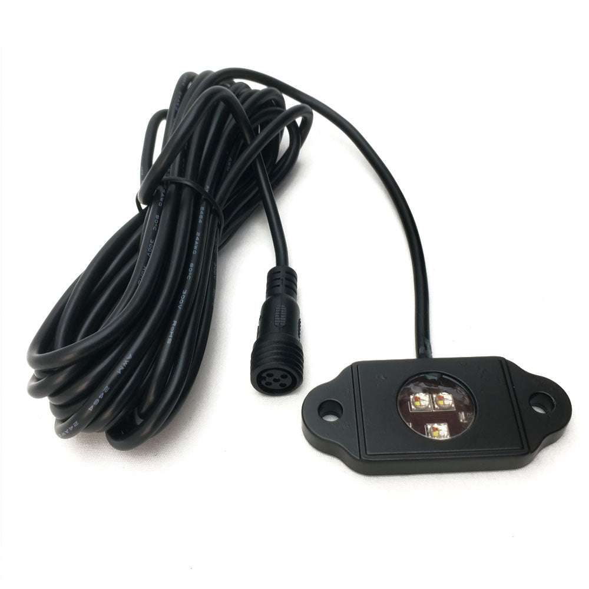

---
hide:
  - toc
tags:
  - product-details
  - lighting
  - offroad
  - audio-integrated
---

# 4.9 Party Lights {#party-lights}

RGB footwell lighting synced with stereo speaker LEDs via JL Audio MLC-RW controller.

/// html | div.product-info
{ loading=lazy }

**Type:** RGBW LED Rock Light Pod

**Model:** RGBW LED Rock Light Single Pod

**Part Number:** N/A (sold individually)

**Manufacturer:** LED4Life

**Product Page:** [LED4Life RGBW Rock Light Single Pod][led4life-pod]

**Quantity:** 4 pods

**Mounting:** Footwells (2 front, 2 rear)

**Power Source:** JL Audio MLC-RW controller

///

## Specifications

| Spec | Value |
|:-----|------:|
| Wiring | Common anode (5-pin RGBW) |
| Waterproof | IP68 |
| Construction | Epoxy filled, aluminum body |
| Wire Length | 14.5' per pod |
| Price | ~$15 each |

## Wiring

Pods wire directly to MLC-RW outputs in parallel with JL Audio speaker LEDs:

| LED4Life Wire | MLC-RW Wire | Function |
|:--------------|:------------|:---------|
| +12V | White | Common anode (+12V) |
| R | Red | Red LED (−) |
| G | Green | Green LED (−) |
| B | Blue | Blue LED (−) |
| W | *Not connected* | White LED (unused) |

W channel capped off - MLC-RW is RGB only. RGB can produce white when all channels on.

## Control

**Controller:** JL Audio MLC-RW (rotary encoder + WiFi app)

- Press & hold 2 sec: Power ON
- Press & hold 5 sec: Power OFF
- Rotate: Color/brightness/speed

See [Audio Systems][audio-systems] for MLC-RW details.

## Outstanding Items

- [ ] Confirm LED4Life pod wire colors match table above
- [ ] Plan wire routing from MLC-RW to footwells

## Related Documentation

- [Offroad Lighting Overview][offroad-overview]
- [Audio Systems][audio-systems]

[offroad-overview]: index.md
[audio-systems]: ../06-audio-systems/01-audio.md
[led4life-pod]: https://www.led4lifellc.com/products/rgbw-led-rock-light-single-pod
