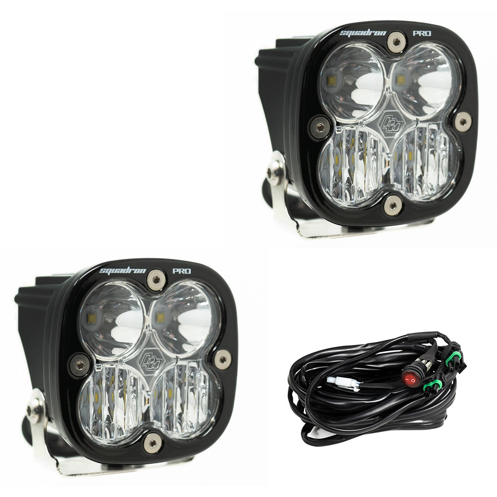

---
hide:
  - toc
tags:
  - product-details
  - lighting
  - offroad
  - pmu-controlled
  - baja-designs
---

# 4.10 Reverse Lights {#reverse-lights}

High-output reverse lights that activate automatically via PMU reverse circuit (Baja Designs Zone 8).

/// html | div.product-info
{ loading=lazy }

**Type:** LED Pod Light

**Model:** Squadron Pro Black

**Part Number:** 497803

**Manufacturer:** Baja Designs

**Product Page:** [Squadron Pro Black][product-link]

**Quantity:** 2 pods

**Mounting:** Rear bumper or spare tire carrier

**Power Source:** PMU Out 18 (automatic with reverse gear)

///

## Specifications

| Spec         |                           Value |
| :----------- | ------------------------------: |
| Beam Pattern |                   Driving/Combo |
| Lens         |                           Clear |
| Output       | 4,900 lumens each (9,800 total) |
| Draw         |            3.5A each (7A total) |

## Control

**Controller:** PMU Out 18 (automatic with reverse gear)

Wired in parallel with Maxbilt WHITE (reverse) and WolfBox camera trigger.

See [Tail/Brake/Reverse Lights][tail-brake-reverse] for PMU reverse circuit details.

## Outstanding Items

- [ ] Confirm Squadron Pro mounting location
- [ ] Verify PMU Out 18 capacity handles combined load

## Related Documentation

- [Offroad Lighting Overview][offroad-overview]
- [Tail/Brake/Reverse Lights][tail-brake-reverse] - PMU Out 18 reverse circuit
- [Rear Work Lights][rear-lights] - Separate SwitchPros-controlled rear lights

[offroad-overview]: index.md
[tail-brake-reverse]: ../03-lighting-systems/04-tail-brake-reverse.md
[rear-lights]: 08-rear-lights.md
[product-link]: https://www.bajadesigns.com/products/squadron-pro-black-led-auxiliary-light-pod-pair-universal/?sku=497803
