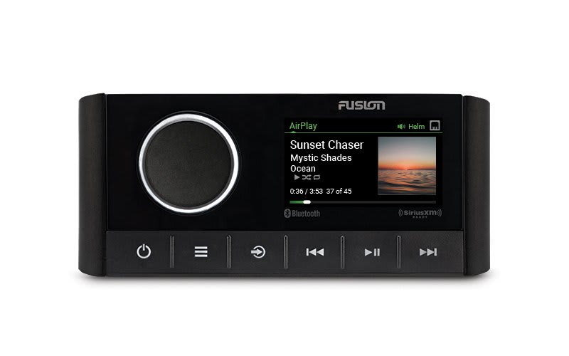

---
hide:
  - toc
tags:
  - product-details
  - audio-systems
  - fusion
---

# 6.1 Head Unit {#head-unit}

Marine-grade entertainment system with multi-zone audio, Bluetooth, and NMEA 2000 integration.

/// html | div.product-info
{ loading=lazy }

**Type:** Marine Entertainment System

**Model:** MS-RA670

**Manufacturer:** Fusion (Garmin)

**Product Page:** [Fusion MS-RA670][product-link]

**Manual:** [Installation Manual][manual-link]

**Mounting:** Dashboard center console (factory radio location)

**Power Source:** BODY PDU F2 (20A fuse)

///

## Specifications

| Spec | Value |
|:-----|------:|
| Display | 2.7" full-color TFT |
| Speaker Output | 4x 50W RMS (not used) |
| Max Current | 15A |
| Waterproof | IPX7 |

## Features

- AM/FM radio with RDS
- Bluetooth audio streaming and hands-free calling
- Multi-zone audio (3 zones + subwoofer)
- DSP with presets
- NMEA 2000 integration
- PartyBus networking
- USB audio playback

## RCA Pre-Outs

| Output | Destination | Amplifier |
|:-------|:------------|:----------|
| Zone 1 L+R | Front dash speakers | Ch 3+4 |
| Zone 2 L+R | Rear roll bar speakers | Ch 5+6 |
| Zone 3 L+R | Available | — |
| Subwoofer | Subwoofer | Ch 1+2 bridged |

## Wiring

| Connection | Wire | Source | Notes |
|:-----------|:-----|:-------|:------|
| Constant (Yellow) | 18 AWG | BODY PDU F2 | Memory/clock |
| Switched (Red) | 18 AWG | BODY PDU F2 | Ignition on/off |
| Ground (Black) | 18 AWG | Dash ground | Clean ground critical |
| Antenna | Motorola | Factory antenna | Fender or windshield |
| Remote Out | 18 AWG | To amplifier | Turn-on signal |

## Power Configuration

BODY PDU F2 requires both constant and switched power:

**Option 1 (Recommended):** F2 provides dual power

- Constant input from CONSTANT bus → Yellow wire (memory)
- Switched input from SWITCHED bus → Red wire (ignition)
- Single 20A fuse protects both (15A draw within capacity)

**Option 2:** Separate circuits

- F2 (SWITCHED, 20A) → Red wire only
- Spare BODY PDU circuit (CONSTANT, 15A) → Yellow wire

## Outstanding Items

- [ ] Verify radio ignition trigger wire connection
- [ ] Determine ground connection point (firewall stud or dash ground)
- [ ] Plan Bluetooth microphone mounting location
- [ ] Configure DSP settings for subwoofer crossover (80-120 Hz)
- [ ] Configure Zone 1/2/3 RCA output assignments

## Related Documentation

- [Audio Systems Overview][audio-overview]
- [Amplifier][amplifier]
- [BODY PDU][body-pdu]

[audio-overview]: index.md
[amplifier]: 02-amplifier.md
[body-pdu]: ../01-power-systems/03-aux-battery-distribution/03-body-pdu.md
[product-link]: https://www.garmin.com/en-US/p/635318/
[manual-link]: https://static.garmin.com/pumac/MS-RA670_OM_EN.pdf
