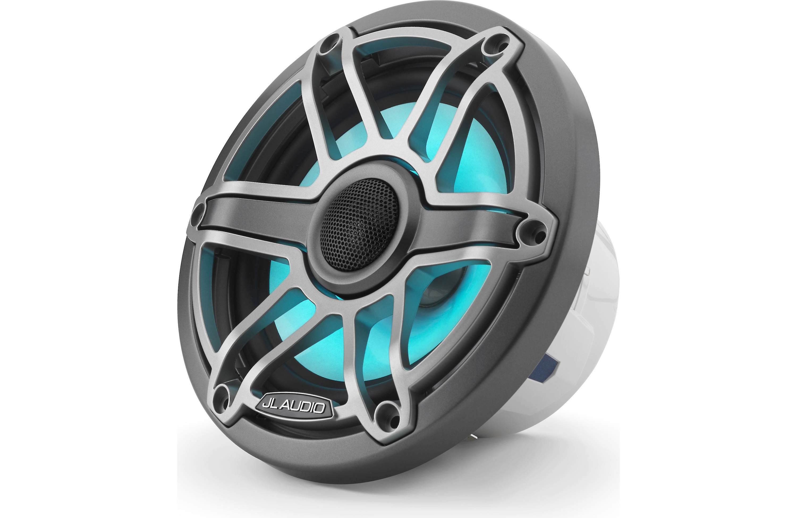
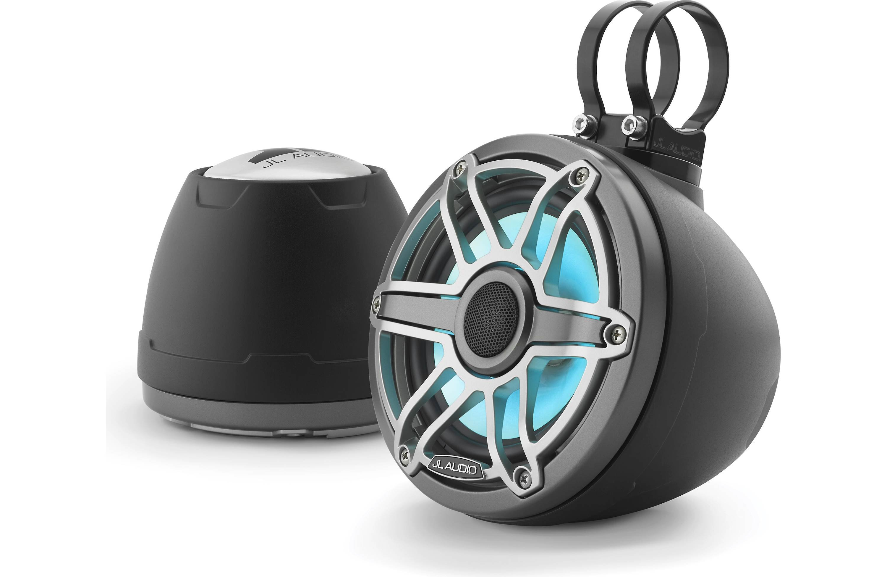

---
hide:
  - toc
tags:
  - product-details
  - audio-systems
  - jl-audio
---

# 6.3 Speakers {#speakers}

Marine-grade coaxial speakers with integrated RGB LED lighting for front dash and rear roll bar positions.

## Front Dash Speakers

/// html | div.product-info
{ loading=lazy }

**Type:** 6.5" 2-Way Coaxial Marine Speaker

**Model:** M6-650X-S-GmTi-i

**Manufacturer:** JL Audio

**Product Page:** [M6-650X-S-GmTi-i][front-product-link]

**Quantity:** 2 (pair)

**Mounting:** Dashboard (custom 6.5" cutouts)

**Power Source:** Amplifier Channels 3+4

///

### Front Speaker Specifications

| Spec               |                       Value |
| :----------------- | --------------------------: |
| Power Handling     |                75W RMS @ 4Ω |
| Amplifier Output   |     150W RMS (2:1 headroom) |
| Impedance          |                          4Ω |
| Frequency Response |         55-25,000 Hz (±3dB) |
| Sensitivity        |             89.5 dB @ 1W/1m |
| Tweeter            | 0.8" silk dome (integrated) |

### Front Speaker Features

- Integrated 0.8" pure silk dome tweeter (no separate install)
- Multi-order 2-way passive crossover (built-in)
- Automatic solid-state tweeter protection
- Transflective RGB LED lighting
- Mica-filled polypropylene woofer
- Gunmetal trim ring with titanium sport grille

---

## Rear Roll Bar Speakers

/// html | div.product-info
{ loading=lazy }

**Type:** 6.5" 2-Way Enclosed Marine Tower Speaker

**Model:** M6-650VEX-Mb-S-GmTi-i

**Manufacturer:** JL Audio

**Product Page:** [M6-650VEX-Mb-S-GmTi-i][rear-product-link]

**Quantity:** 2 (pair)

**Mounting:** Roll bar/cage (wakeboard tower style clamps)

**Power Source:** Amplifier Channels 5+6

///

### Rear Speaker Specifications

| Spec               |                      Value |
| :----------------- | -------------------------: |
| Power Handling     |               75W RMS @ 4Ω |
| Amplifier Output   |    150W RMS (2:1 headroom) |
| Impedance          |                         4Ω |
| Frequency Response |              100-25,000 Hz |
| Sensitivity        |                    89.5 dB |
| Dimensions         | 7-1/16" × 7-5/16" × 6-1/4" |

### Rear Speaker Features

- Built-in RGB LED lights
- 3/4" silk dome tweeters
- Mica-filled polypropylene woofers
- Enclosed weather-resistant design
- Roll bar clamp mounting

## Wiring

All speakers use JL Audio XM-WHTMFC integrated cable:

| Wire          | Gauge      | Function     |
| :------------ | :--------- | :----------- |
| Speaker leads | 16 AWG OFC | Audio signal |
| LED leads     | 20 AWG OFC | RGB + common |

Single cable run per speaker carries both audio and LED control.

## Outstanding Items

- [ ] Determine front dash mounting locations (dash end caps or kick panels)
- [ ] Plan custom speaker pods or dash modification for flush mount
- [ ] Calculate XM-WHTMFC cable lengths for each speaker
- [ ] Plan speaker wire routing from amplifier to dash and roll bar

## Related Documentation

- [Audio Systems Overview][audio-overview]
- [Amplifier][amplifier]
- [LED Controller][led-controller]

[audio-overview]: index.md
[amplifier]: 02-amplifier.md
[led-controller]: 05-led-controller.md
[front-product-link]: https://www.jlaudio.com/products/m6-650x-s-gmti-i-marine-audio-coaxial-speakers-93715
[rear-product-link]: https://www.jlaudio.com/products/m6-650vex-mb-s-gmti-i-marine-audio-enclosed-speaker-systems-vex-93411
