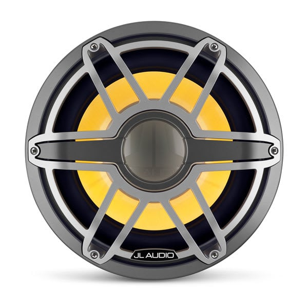

---
hide:
  - toc
tags:
  - product-details
  - audio-systems
  - jl-audio
---

# 6.4 Subwoofer {#subwoofer}

12" infinite baffle marine subwoofer with RGB LED lighting, designed for large air volume installations.

/// html | div.product-info
{ loading=lazy }

**Type:** 12" Infinite Baffle Marine Subwoofer

**Model:** M7-12IB-S-GmTi-i-4

**Part Number:** 010-03288-00

**Manufacturer:** JL Audio

**Product Page:** [M7-12IB-S-GmTi-i-4][product-link]

**Quantity:** 1

**Mounting:** Cargo area wall (infinite baffle)

**Power Source:** Amplifier Channels 1+2 (bridged)

///

## Specifications

| Spec               |                Value |
| :----------------- | -------------------: |
| Power Handling     |        600W RMS @ 4Ω |
| Amplifier Output   | 580W RMS (97% match) |
| Impedance          |                   4Ω |
| Sensitivity        |      86.7 dB @ 1W/1m |
| Free Air Resonance |             35.34 Hz |
| Sealed -3dB        |             35.52 Hz |
| Ported -3dB        |             20.96 Hz |
| Voice Coil         |           4" (102mm) |
| Weight             |            25.35 lbs |
| Warranty           |              3 years |

## Dimensions

| Measurement       |            Value |
| :---------------- | ---------------: |
| Overall Diameter  |      14" (356mm) |
| Overall Depth     |       9.39-9.42" |
| Mounting Depth    |    7.94" (202mm) |
| Cutout Diameter   | 12.0625" (306mm) |
| Bolt Hole Circle  |  12.813" (325mm) |
| Grille Protrusion |       1.45-1.48" |

## Infinite Baffle Requirements

- **Minimum air volume:** 3 cu. ft. (84.95 liters) behind mounting surface
- **Installation type:** No dedicated enclosure required
- **Ideal locations:** Cargo area wall, rear seat/tub wall
- **Jeep LJ cargo area:** Provides ideal infinite baffle environment

## Features

- Transflective RGB LED lighting (via MLC-RW)
- Gunmetal trim ring with titanium sport grille
- Marine-grade construction
- Mica-filled polypropylene cone
- Synthetic rubber surround

## Wiring

| Connection  | Wire   | Notes                   |
| :---------- | :----- | :---------------------- |
| Speaker (+) | 12 AWG | From amp Ch 1+2 bridged |
| Speaker (−) | 12 AWG | From amp Ch 1+2 bridged |
| LED         | 20 AWG    | RGB from MLC-RW         |

Standard speaker wire (no XM-WHTMFC needed for subwoofer audio).

## Outstanding Items

- [ ] Determine subwoofer mounting location and orientation

## Related Documentation

- [Audio Systems Overview][audio-overview]
- [Amplifier][amplifier]
- [LED Controller][led-controller]

[audio-overview]: index.md
[amplifier]: 02-amplifier.md
[led-controller]: 05-led-controller.md
[product-link]: https://www.jlaudio.com/products/m7-12ib-s-gmti-i-4-marine-audio-subwoofer-drivers-93723
