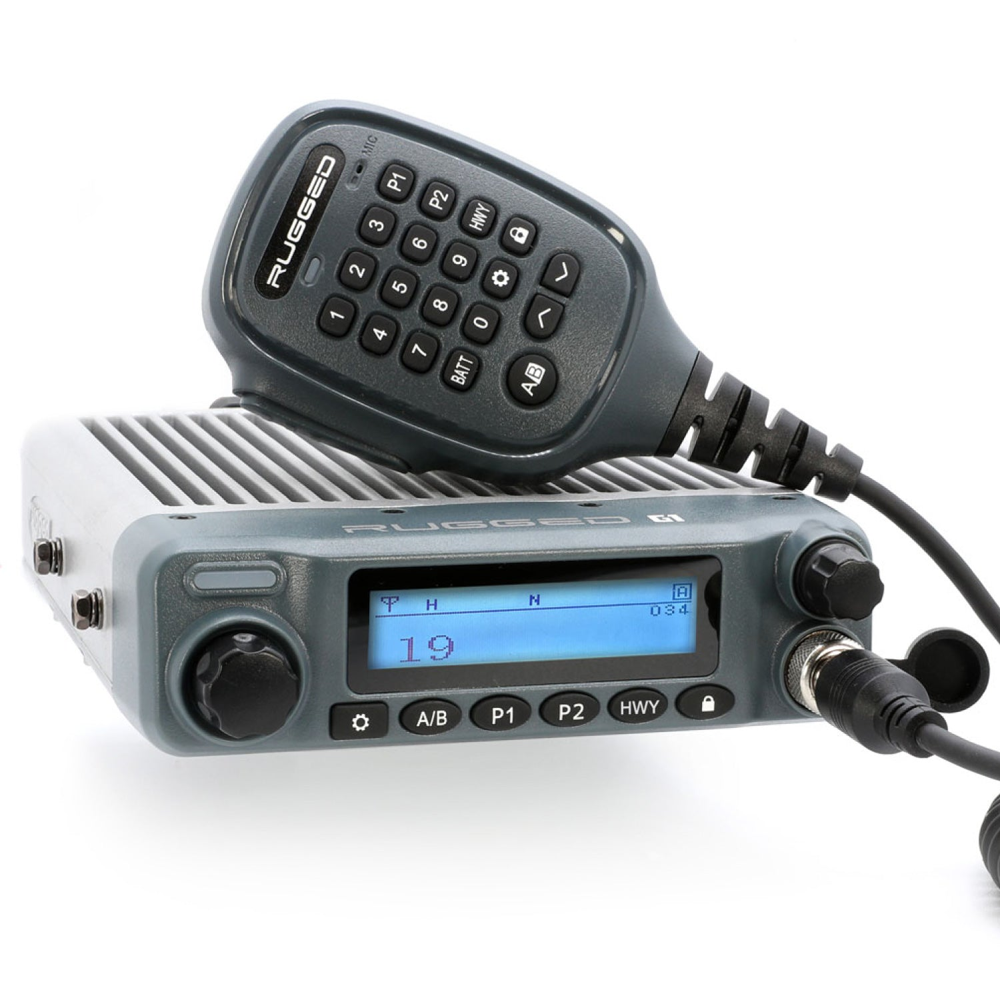

---
hide:
  - toc
tags:
  - product-details
  - communication-systems
  - rugged-radio
  - gmrs
---

# 7.1 GMRS Radio {#gmrs-radio}

50W GMRS two-way radio for vehicle-to-vehicle communication and group coordination.

/// html | div.product-info
{ loading=lazy }

**Type:** GMRS Mobile Radio

**Model:** G1-GMRS

**Manufacturer:** Rugged Radios

**Product Page:** [Rugged Radio G1][product-link]

**Manual:** [User Manual][manual-link]

**Mounting:** Behind dash, next to STX intercom

**Power Source:** PMU OUT6 (25A capacity, CONSTANT)

///

## Specifications

| Spec         |                              Value |
| :----------- | ---------------------------------: |
| Output Power |         50W (max allowed for GMRS) |
| Frequency    |                  462-467 MHz (UHF) |
| Channels     |          16 GMRS + repeater inputs |
| Current Draw |         1-2A receive, 15A transmit |
| Waterproof   |                               IP67 |
| FCC License  | Required (family license, no exam) |

## Features

- CTCSS/DCS privacy codes
- VOX (voice-activated transmission)
- Channel scan function
- All-aluminum chassis
- RFI protection

## Antenna

| Spec      | Value                                         |
| :-------- | :-------------------------------------------- |
| Model     | Rugged Radios Stealth UHF-GP (ground plane)   |
| Type      | Low-profile tuned antenna (3.25" tall)        |
| Frequency | 450-480 MHz                                   |
| Gain      | 2.0 dBi                                       |
| Mount     | A-pillar ditch light adapter (MT-ANT-ADPT)    |
| Connector | NMO                                           |
| Cable     | RG58 or LMR-400 (50Ω impedance)               |

## Wiring

| Connection | Wire              | Source            | Notes                                |
| :--------- | :---------------- | :---------------- | :----------------------------------- |
| Power (+)  | 14 AWG            | PMU OUT6          | Via firewall grommet                 |
| Ground (−) | 14 AWG            | START battery neg | Direct connection for RF performance |
| Antenna    | RG58 coax         | Roof antenna      | Route away from power leads          |
| Intercom   | Integration cable | STX RADIO port    | Audio/PTT/mute                       |

## Installation Notes

- Direct battery ground required for best RF performance
- Route antenna coax away from power leads
- Keep coax length <25 ft for minimal signal loss

## Outstanding Items

None - all specifications determined.

## Related Documentation

- [Communication Systems Overview][comm-overview]
- [Intercom][intercom]
- [PMU Outputs][pmu-outputs]
- [START Battery Distribution][starter-battery]

[comm-overview]: index.md
[intercom]: 02-intercom.md
[pmu-outputs]: ../01-power-systems/04-pmu/03-pmu-outputs.md
[starter-battery]: ../01-power-systems/02-starter-battery-distribution/index.md
[product-link]: https://www.ruggedradios.com/products/rugged-g1-waterproof-gmrs-mobile-radio
[manual-link]: https://cdn.shopify.com/s/files/1/0240/3280/4960/files/G1_Manual.pdf
