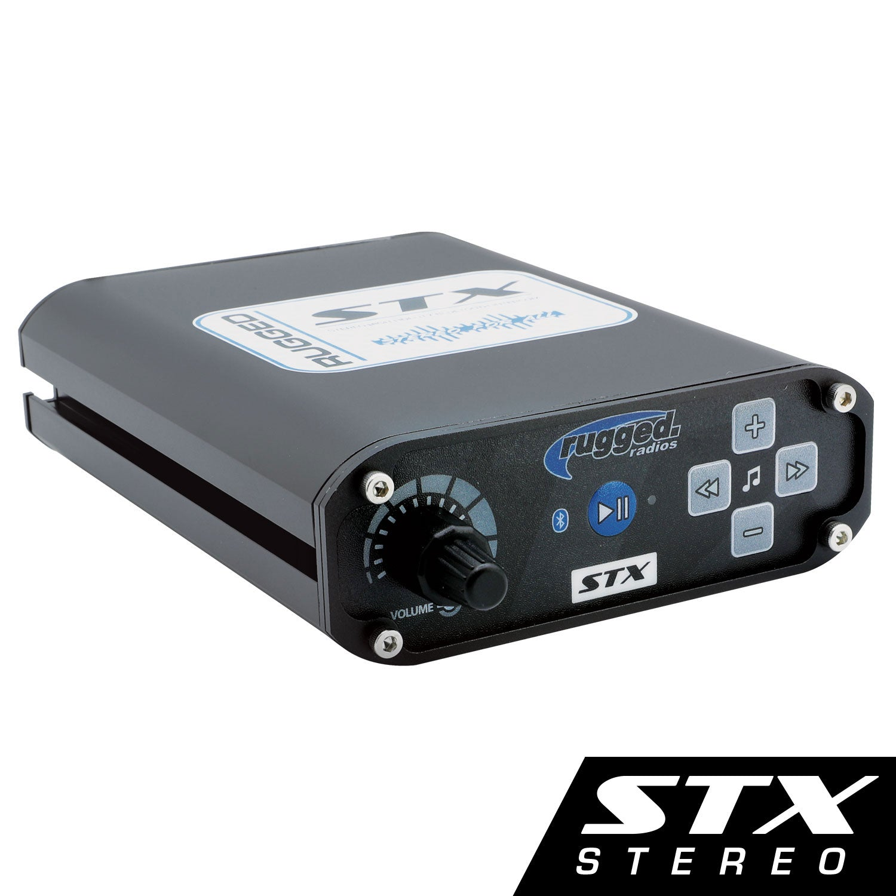

---
hide:
  - toc
tags:
  - product-details
  - communication-systems
  - rugged-radio
---

# 7.2 Intercom {#intercom}

4-place intercom system for driver and passenger communication with radio and audio integration.

/// html | div.product-info
{ loading=lazy }

**Type:** 4-Place Intercom

**Model:** STX

**Manufacturer:** Rugged Radios

**Product Page:** [Rugged Radio STX][product-link]

**Manual:** [Quick Start Guide][manual-link]

**Mounting:** TBD - under dash or center console

**Power Source:** PMU OUT20 (5A capacity, CONSTANT)

///

## Specifications

| Spec | Value |
|:-----|------:|
| Headset Ports | 4 (expandable to 8 via EXT port) |
| Input Voltage | 9-16V DC |
| Current Draw | <2A typical |
| Dimensions | 5.5" × 3.5" × 1.5" |

## Features

- VOX or PTT mode per headset
- Individual volume controls per headset
- RADIO port for G1 GMRS integration
- AUX port for Fusion head unit audio
- EXT port for expansion modules
- Music auto-mute when radio transmits

## Ports

| Port | Function | Connection |
|:-----|:---------|:-----------|
| RADIO | Two-way radio integration | G1 GMRS via integration cable |
| AUX | External audio input | Fusion MS-RA670 (3.5mm or RCA) |
| EXT | Expansion modules | Optional 4-place expansion |
| Headset 1-4 | Headset connections | Push-to-connect jacks |

## Headset Configuration

| Port | Position | Cable Length |
|:-----|:---------|:-------------|
| Port 1 | Driver | 6 ft (included) |
| Port 2 | Front passenger | 6 ft (included) |
| Port 3 | Rear left | Custom extended |
| Port 4 | Rear right | Custom extended |

## Wiring

| Connection | Wire | Source | Notes |
|:-----------|:-----|:-------|:------|
| Power (+) | 10 AWG | PMU OUT20 | Via firewall Grommet 1 |
| Ground (−) | 10 AWG | START battery neg | Direct for audio quality |
| G1 Radio | Integration cable | G1 RADIO port | Audio/PTT/mute |
| Aux Audio | 3.5mm or RCA | Fusion MS-RA670 | Music to headsets |

## Installation Notes

- **Do NOT mount near ignition box** - RF interference
- Direct battery ground recommended for best audio quality
- PMU output has integrated 5A protection - no inline fuse needed
- Do NOT connect to ignition or switched power (causes ground loop noise)

## Outstanding Items

- [ ] Determine STX mounting location (under dash or center console)
- [ ] Ensure STX is NOT mounted near ignition box
- [ ] Plan headset port access (all on STX or extend rear ports to grab handles)
- [ ] Determine if external PTT buttons will be used
- [ ] Plan PTT button mounting locations if used
- [ ] Order Rugged Radio integration cable for G1 to STX
- [ ] Determine aux input cable type (3.5mm or RCA)
- [ ] Plan aux cable routing from Fusion to STX

## Related Documentation

- [Communication Systems Overview][comm-overview]
- [GMRS Radio][gmrs-radio]
- [Audio Systems][audio-systems]
- [PMU Outputs][pmu-outputs]

[comm-overview]: index.md
[gmrs-radio]: 01-gmrs-radio.md
[audio-systems]: ../06-audio-systems/index.md
[pmu-outputs]: ../01-power-systems/04-pmu/03-pmu-outputs.md
[product-link]: https://www.ruggedradios.com/products/stx-stereo-high-fidelity-bluetooth-intercom
[manual-link]: https://cdn.shopify.com/s/files/1/0240/3280/4960/files/STX_-_Quick_Start_Guide.pdf?v=1724339126
