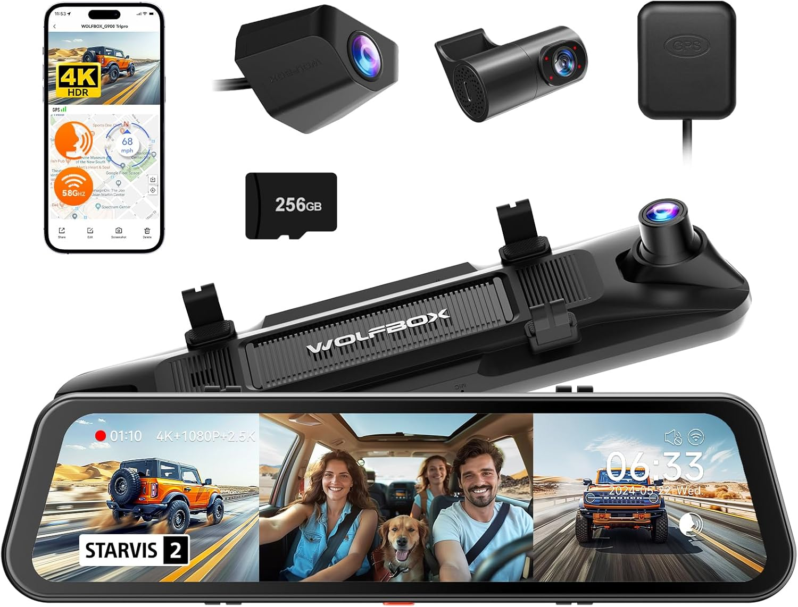

---
hide:
  - toc
tags:
  - product-details
  - communication-systems
  - camera
---

# 7.4 Dash Camera {#dash-camera}

Rearview mirror replacement with integrated front dash camera and rear backup camera display.

/// html | div.product-info
{ loading=lazy }

**Type:** Mirror Dash Camera System

**Model:** G900 TriPro

**Manufacturer:** WolfBox

**Product Page:** [WolfBox G900 TriPro][product-link]

**Mounting:** Windshield (replaces factory rearview mirror)

**Power Source:** BODY PDU CB39 (10A, CONSTANT)

///

## Specifications

| Spec         |                      Value |
| :----------- | -------------------------: |
| Front Camera |  Integrated in mirror unit |
| Rear Camera  |   Above license plate      |
| Display      |         12" touchscreen    |
| Current Draw |               2-5A typical |
| Storage      |   SD card (loop recording) |

## Features

- Front-facing dash cam (always recording when powered)
- Rear camera display on reverse
- Loop recording to SD card
- G-sensor collision detection
- Night vision (front and rear)
- Lane departure warnings (model dependent)
- Parking mode (with CONSTANT power)

## Components

**Main Unit (Mirror):**

- Replaces factory rearview mirror
- Integrated front camera
- Touchscreen for settings/playback
- CONSTANT power enables parking mode recording

**Rear Camera:**

- Mounts above license plate
- Powered via cable from main unit
- Auto-displays when reverse gear engaged

## Wiring

| Connection      | Wire           | Source                | Notes                     |
| :-------------- | :------------- | :-------------------- | :------------------------ |
| Power (+)       | 18 AWG         | BODY PDU CB39         | 10A, CONSTANT             |
| ACC Trigger     | 18 AWG         | Ignition SWITCHED bus | Parking mode vs driving   |
| Ground (−)      | 18 AWG         | Dash ground           | Firewall stud or local    |
| Reverse Trigger | 18 AWG         | Reverse light circuit | Auto-display rear camera  |
| Rear Camera     | Included cable | Main unit             | Power + video combined    |

## Cable Routing

**Main Unit to Rear Camera:**

Windshield → along inside tub corner (bundled with other rear wiring) → up to license plate area

**Reverse Trigger:**

Tap into reverse light circuit → route to WolfBox trigger input

## Outstanding Items

None - all specifications determined.

## Related Documentation

- [Communication Systems Overview][comm-overview]
- [BODY PDU][body-pdu]

[comm-overview]: index.md
[body-pdu]: ../01-power-systems/03-aux-battery-distribution/03-body-pdu.md
[product-link]: https://wolfbox.com/products/wolfbox-g900tripro-bumper-version-4k-sony-starvis-2-mirror-dash-cam
