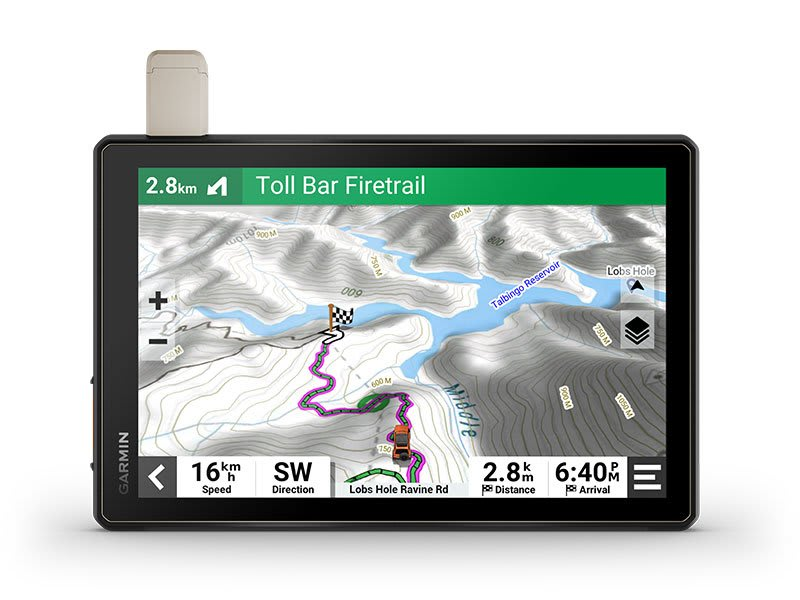

---
hide:
  - toc
tags:
  - product-details
  - communication-systems
  - navigation
  - garmin
---

# 7.5 Navigation {#navigation}

10-inch offroad GPS navigator with topographic maps and satellite imagery for trail navigation.

/// html | div.product-info
{ loading=lazy }

**Type:** Offroad GPS Navigator

**Model:** Tread XL - Overland Edition

**Part Number:** 010-02509-00

**Manufacturer:** Garmin

**Product Page:** [Garmin Tread XL][product-link]

**Mounting:** Dash mount

**Power Source:** SwitchPros OUTPUT-8 (15A capacity)

///

## Specifications

| Spec         | Value                           |
| :----------- | :------------------------------ |
| Display      | 10" ultrabright touchscreen     |
| GPS          | 10 Hz receiver                  |
| Rating       | IP67 (dust/water)               |
| Connectivity | Bluetooth, Wi-Fi                |
| Maps         | North/South America topographic |

## Features

- Turn-by-turn trail navigation
- Topographic maps with elevation data
- Satellite imagery (downloadable via Wi-Fi)
- US Forest Service Motor Vehicle Use Maps
- Trail difficulty ratings
- Glove-friendly touchscreen
- Extreme temperature rated

## Integration

| Feature          | Connection       | Notes                                               |
| :--------------- | :--------------- | :-------------------------------------------------- |
| Smartphone       | Bluetooth        | Live weather, Tread app                             |
| Headsets         | Bluetooth        | Audio navigation prompts                            |
| inReach          | Bluetooth        | Satellite communication                             |
| Group Ride Radio | Garmin accessory | Vehicle-to-vehicle tracking                         |
| PowerSwitch      | Garmin accessory | Digital switch control (not used - have SwitchPros) |

## Wiring

| Connection | Wire   | Source           | Notes                    |
| :--------- | :----- | :--------------- | :----------------------- |
| Power (+)  | 18 AWG | SwitchPros OUT-8 | ~2A load                 |
| Ground (−) | 18 AWG | Chassis          | Local ground near mount  |

## Outstanding Items

None - all specifications determined.

## Related Documentation

- [Communication Systems Overview][comm-overview]
- [Intercom][intercom] - Bluetooth audio integration
- [BODY PDU][body-pdu] - Potential power source

[comm-overview]: index.md
[intercom]: 02-intercom.md
[body-pdu]: ../01-power-systems/03-aux-battery-distribution/03-body-pdu.md
[product-link]: https://www.garmin.com/en-US/p/732617/pn/010-02509-00/
