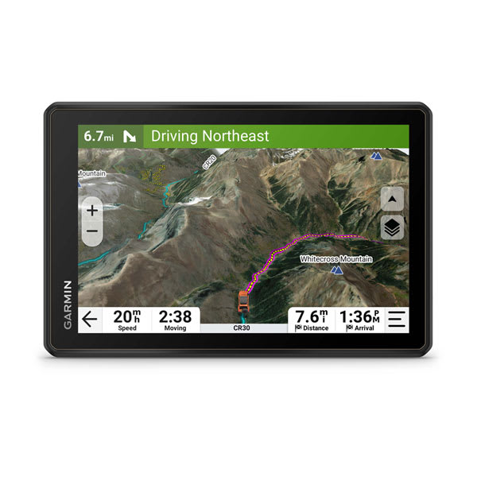

---
hide:
  - toc
tags:
  - product-details
  - communication-systems
  - navigation
  - garmin
---

# 7.5 Navigation {#navigation}

8-inch offroad GPS navigator with topographic maps and satellite imagery for trail navigation.

/// html | div.product-info
{ loading=lazy }

**Type:** Offroad GPS Navigator

**Model:** Tread 2 - Overland Edition

**Part Number:** 010-03021-00

**Manufacturer:** Garmin

**Product Page:** [Garmin Tread 2 Overland][product-link]

**Mounting:** Dash mount via included magnet-assist locking cradle (AMPS plate, 1.5" RAM B-ball)

**Power Source:** SwitchPros OUTPUT-8 (15A capacity) — 12V cig plug cut off, hardwired

///

## Specifications

| Spec         | Value                                                  |
| :----------- | :----------------------------------------------------- |
| Display      | 8" ultrabright touchscreen (1280×800)                  |
| GNSS         | Multi-band: GPS, GLONASS, Galileo, BeiDou              |
| Rating       | IP67 (dust/water)                                      |
| Connectivity | Bluetooth, Wi-Fi, USB-C                                |
| Battery      | Up to 20 hr internal                                   |
| Maps         | North/South America topographic, OpenStreetMap, USFS MVUM |
| Dimensions   | 8.1"W × 6.7"H × 1.2"D                                  |
| Weight       | 22.8 oz (646 g)                                        |

## Features

- Turn-by-turn trail navigation
- Topographic maps with elevation data
- Satellite imagery (downloadable via Wi-Fi)
- US Forest Service Motor Vehicle Use Maps
- Trail difficulty ratings
- Glove-friendly touchscreen
- Extreme temperature rated

## Integration

| Feature          | Connection       | Notes                                                                   |
| :--------------- | :--------------- | :---------------------------------------------------------------------- |
| Smartphone       | Bluetooth        | Live weather, Tread app                                                 |
| Headsets         | Bluetooth        | Audio navigation prompts                                                |
| inReach          | Bluetooth        | Pair with existing external inReach (uses existing subscription)        |
| Group Ride Radio | Garmin accessory | Vehicle-to-vehicle tracking                                             |
| PowerSwitch      | Garmin accessory | Digital switch control (not used - have SwitchPros)                     |

The Tread 2 Overland has built-in inReach hardware but it is not activated — satellite messaging and SOS route through the paired external inReach device on its existing subscription, avoiding a second Garmin satellite plan.

## Wiring

| Connection | Wire   | Source           | Notes                                   |
| :--------- | :----- | :--------------- | :-------------------------------------- |
| Power (+)  | 18 AWG | SwitchPros OUT-8 | ~2A load; cig-plug cut from OEM cable   |
| Ground (−) | 18 AWG | Chassis          | Local ground near mount                 |

## Outstanding Items

None - all specifications determined.

## Related Documentation

- [Communication Systems Overview][comm-overview]
- [Intercom][intercom] - Bluetooth audio integration
- [BODY PDU][body-pdu] - Potential power source

[comm-overview]: index.md
[intercom]: 02-intercom.md
[body-pdu]: ../01-power-systems/03-aux-battery-distribution/03-body-pdu.md
[product-link]: https://www.garmin.com/en-US/p/1623137/pn/010-03021-00/
